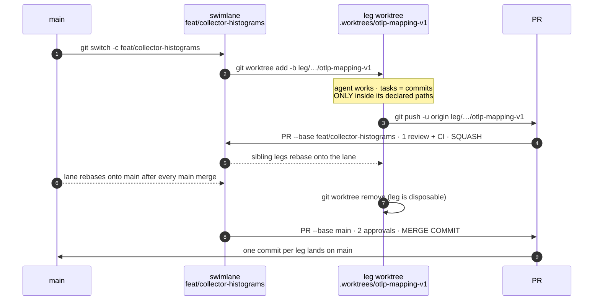

# Agentic gitflow — practical guide

> The mechanics of [ADR-0009](../../docs/adr/0009-agentic-gitflow.md).
> The ADR says *why* and *what the rules are*; this file is *how you run it*.
> Last updated: 2026-08-18

## The model in one line

**Seam** (ownership boundary) → **swimlane** (`feat/…`, one effort) → **legs**
(`leg/…`, one worktree per agent, disjoint paths) → **tasks** (commits).

## What a worktree is (the part everyone asks about)

`git worktree` gives one clone **several working directories at once**, each with a different
branch checked out, all sharing the same `.git`. That is the whole trick: two agents editing
"the same repo" are really editing **different files on disk**, so they cannot collide — while
still sharing every commit, ref and object.

```text
sentinel/                              ← the MAIN worktree · branch feat/collector-histograms · you
├── .git/                              ← ONE object store + refs, shared by everything below
├── services/ contracts/ infra/ …      ← your files
└── .worktrees/                        ← gitignored
    ├── otlp-mapping-v1/               ← a LEG worktree · branch leg/…/otlp-mapping-v1 · agent A1
    │   └── services/ contracts/ …     ←   a COMPLETE second checkout, its own files
    └── exporter-rows-v1/              ← a LEG worktree · branch leg/…/exporter-rows-v1 · agent A2
        └── services/ contracts/ …     ←   a COMPLETE third checkout, its own files
```

Each leg directory is a full working copy — the agent `cd`s into it and never leaves. Three
facts that follow, and that trip people up:

| Fact | Consequence |
|---|---|
| A worktree is **local** — nothing on `origin` | To open a PR you must `git push -u origin <leg-branch>` first |
| Git **refuses** the same branch in two worktrees | That is the guardrail, not a bug |
| Each worktree has **its own** `target/`, `.venv/` | Share the build caches, or N agents = N cold Rust builds (see below) |

See [ADR-0009](../../docs/adr/0009-agentic-gitflow.md) for the diagram version of this.

## Lifecycle



## Commands

### 1 · Open the swimlane

```sh
git switch main && git pull --ff-only
git switch -c feat/collector-histograms
git push -u origin feat/collector-histograms
```

### 2 · Fan out a leg (one per agent)

```sh
git worktree add  -b <new-branch>  <new-directory>  <start-point>

git worktree add  -b leg/collector-histograms/otlp-mapping-v1  .worktrees/otlp-mapping-v1  feat/collector-histograms
```

One command, two things created: the **branch** and the **directory**. Verify:

```sh
git worktree list
# /home/you/sentinel                             abc1234 [feat/collector-histograms]
# /home/you/sentinel/.worktrees/otlp-mapping-v1  abc1234 [leg/collector-histograms/otlp-mapping-v1]
```

The agent runs with `.worktrees/otlp-mapping-v1` as its working directory and never leaves it —
`cd`-ing back to the parent puts it on someone else's branch.

**Declare the paths first.** Before opening a leg, write down what it owns. Two open legs
in the same swimlane must not overlap (ADR-0009 R1):

| Leg | Declared paths |
|---|---|
| `otlp-mapping-v1` | `services/collector-rust/src/otlp.rs` |
| `exporter-rows-v1` | `services/collector-rust/src/clickhouse_exporter.rs` |

If two legs need the same file, they are one leg — or the shared change lands first as its
own leg and the others rebase onto it.

### 3 · Fan in

Worktrees are **local**; a PR needs the branch on `origin`:

```sh
cd .worktrees/otlp-mapping-v1
git push -u origin leg/collector-histograms/otlp-mapping-v1
gh pr create --base feat/collector-histograms \
  --title "feat(collector): map OTLP histogram data points" \
  --body "Declared paths: services/collector-rust/src/otlp.rs"
```

Gate: **1 reviewer** (may be the `code-reviewer` agent) + full CI. Merge style: **squash** —
one commit per leg, attribution trailers preserved.

### 4 · Sync (the step everyone skips)

After each fan-in, every surviving leg rebases onto the lane:

```sh
cd .worktrees/exporter-rows-v1
git fetch origin
git rebase origin/feat/collector-histograms
```

After every merge to `main`, the lane rebases onto `main`:

```sh
git switch feat/collector-histograms
git fetch origin && git rebase origin/main
git push --force-with-lease
```

`--force-with-lease`, never `--force`: it refuses if someone else pushed meanwhile.

### 5 · Retire the leg

```sh
git worktree remove .worktrees/otlp-mapping-v1
git branch -d leg/collector-histograms/otlp-mapping-v1
git worktree prune          # clean stale admin files
git worktree list           # verify
```

A leg that went wrong is not salvaged — close it and open `-v2`.

### 6 · Close the swimlane

```sh
gh pr create --base main --title "feat(collector): bronze exporter" --body "…"
```

Gate: **2 approvals** (peer + Captain) + full CI. Merge style: **merge commit**, so `main`
keeps one commit per leg with its trailers intact. This is the one place we deviate from the
WoW's "squash-merge to main" — see [ADR-0009 § Trade-offs](../../docs/adr/0009-agentic-gitflow.md#trade-offs).

## Shared build caches — do this before running agents

Each worktree gets its own `target/`. The collector's is multiple GB and rebuilds cold, so
N worktrees without a shared cache make parallel agents **slower** than serial. Export before
launching the fleet:

```sh
export CARGO_TARGET_DIR="$HOME/.cache/sentinel-cargo-target"   # one build cache, all worktrees
export UV_CACHE_DIR="$HOME/.cache/sentinel-uv"                 # same idea for the generator
```

Cargo locks the target dir, so concurrent builds queue rather than corrupt — slower than N
independent caches at peak, but vastly cheaper than N cold builds. Prefer `sccache` if the
fleet grows past ~4 agents.

## Worked example — two swimlanes end to end

Two real open items, run concurrently by four agents. Follow it top to bottom.

### The seam check, before anything is created

| Swimlane | Seam (owner) | Leg | Declared paths |
|---|---|---|---|
| **A** `feat/collector-histograms` | `services/collector-rust/**` (Pod 2) | `otlp-mapping-v1` | `services/collector-rust/src/otlp.rs` |
| | | `exporter-rows-v1` | `services/collector-rust/src/clickhouse_exporter.rs` |
| **B** `feat/silver-rolling-stats` | `infra/clickhouse/**` (Pod 3) | `silver-ddl-v1` | `infra/clickhouse/init.d/02-silver.sql` |
| | | `read-models-v1` | `infra/clickhouse/silver/models/**` |

Every cell in the last column is disjoint from every other — **within** a lane (R1) and
**across** the two lanes. That is the whole authorization to run all four agents at once. Do
this table first; if two rows collide, you do not have two legs, you have one.

### Step 1 — open both lanes from `main`

```sh
git switch main && git pull --ff-only
git switch -c feat/collector-histograms && git push -u origin feat/collector-histograms
git switch main
git switch -c feat/silver-rolling-stats  && git push -u origin feat/silver-rolling-stats
git switch main     # ← REQUIRED: a branch checked out here cannot be checked out in a worktree
```

### Step 2 — fan out four legs

Worktrees are flat: lanes and legs all live side by side under `.worktrees/`. Since you can
only stand in one directory at a time, give each **lane** a worktree too — otherwise you
cannot hold both open.

```sh
git worktree add .worktrees/lane-histograms feat/collector-histograms
git worktree add .worktrees/lane-silver     feat/silver-rolling-stats

# lane A's legs — note the start-point is lane A, not main
git worktree add -b leg/collector-histograms/otlp-mapping-v1 \
    .worktrees/otlp-mapping-v1   feat/collector-histograms
git worktree add -b leg/collector-histograms/exporter-rows-v1 \
    .worktrees/exporter-rows-v1  feat/collector-histograms

# lane B's legs
git worktree add -b leg/silver-rolling-stats/silver-ddl-v1 \
    .worktrees/silver-ddl-v1     feat/silver-rolling-stats
git worktree add -b leg/silver-rolling-stats/read-models-v1 \
    .worktrees/read-models-v1    feat/silver-rolling-stats
```

On disk:

```text
sentinel/                            ▸ main                                 👤 you
├── .git/                            ← ONE store, shared by all seven
└── .worktrees/
    ├── lane-histograms/             ▸ feat/collector-histograms            👤 integrator A
    ├── otlp-mapping-v1/             ▸ leg/collector-histograms/otlp-…      🤖 agent A1
    ├── exporter-rows-v1/            ▸ leg/collector-histograms/exporter-…  🤖 agent A2
    ├── lane-silver/                 ▸ feat/silver-rolling-stats            👤 integrator B
    ├── silver-ddl-v1/               ▸ leg/silver-rolling-stats/silver-ddl… 🤖 agent B1
    └── read-models-v1/              ▸ leg/silver-rolling-stats/read-models…🤖 agent B2
```

`git worktree list` prints exactly these seven lines. Four agents now edit four disjoint sets
of files simultaneously.

### Step 3 — fan in, with the rebase that everyone forgets

Agent A1 finishes first:

```sh
cd .worktrees/otlp-mapping-v1
git push -u origin leg/collector-histograms/otlp-mapping-v1
gh pr create --base feat/collector-histograms \
  --title "feat(collector): map OTLP histogram data points" \
  --body "Declared paths: services/collector-rust/src/otlp.rs"
# 1 review + full CI → SQUASH
```

**The moment it merges, A2 is stale.** Rebase it before it goes anywhere near a PR:

```sh
cd ../exporter-rows-v1
git fetch origin && git rebase origin/feat/collector-histograms
```

B1 and B2 do the same inside lane B — and they are unaffected by anything in lane A, which is
the payoff of the seam check in the first place.

### Step 4 — lane A closes; lane B pays the rebase

```sh
cd ../lane-histograms
gh pr create --base main --title "feat(collector): histogram metric support" --body "…"
# 2 approvals (peer + Captain) + full CI → MERGE COMMIT
```

`main` now carries **two** commits from lane A — one per leg, each with its own
`Co-Authored-By` trailers — under one merge commit. That is exactly what the merge-commit rule
buys.

Lane B is now behind `main`:

```sh
cd ../lane-silver
git fetch origin && git rebase origin/main
git push --force-with-lease
```

Then lane B closes the same way.

### Step 5 — clean up

```sh
cd ~/sentinel
git worktree remove .worktrees/otlp-mapping-v1
git worktree remove .worktrees/exporter-rows-v1
git worktree remove .worktrees/lane-histograms
git worktree prune && git worktree list      # verify only live ones remain
```

### The counterexample — when two lanes are *not* independent

Histogram support is the honest version of this story: the collector cannot emit a histogram
the **input contract has no type for**. So the work also touches `contracts/generator/` — a
**third seam, jointly owned by Pod 1 and Pod 2**.

That crossing is neither a leg of lane A nor a sibling lane. It is a **predecessor**:

```text
feat/contract-v2-histograms   ──lands first──▶   feat/collector-histograms   ──▶ main
        (seam: contracts/, Pod 1 + Pod 2)              (rebases onto it)
```

**Work that crosses a seam gets sequenced, never fanned out.** If your path table shows a leg
reaching into a seam another Pod owns, stop: that is a separate swimlane, and it goes first.

## Naming

| Thing | Pattern | Example |
|---|---|---|
| Swimlane branch | `feat/<area>-<short>` (also `fix/`, `chore/`, `docs/`) | `feat/collector-histograms` |
| Leg branch | `leg/<area>/<task>-v<n>` | `leg/collector-histograms/otlp-mapping-v1` |
| Worktree directory | `.worktrees/<task>-v<n>` | `.worktrees/otlp-mapping-v1` |

Branch names describe the **work**, never the mechanism — `worktree/logo-v1` bakes a tool
into a permanent record and lies as soon as the same task runs without a worktree.

## Checklist before opening a leg

- [ ] Declared paths written down, and disjoint from every other open leg
- [ ] Work is genuinely parallel — if it depends on another leg, **stack** it (branch from that leg, PR into it) instead of fanning out
- [ ] ≥2 agents will actually run concurrently — otherwise work directly in the swimlane
- [ ] `CARGO_TARGET_DIR` / `UV_CACHE_DIR` exported
- [ ] Commits will carry `Co-Authored-By:` for both the human and the model (WoW)

## Gotchas

- **`git worktree remove` fails on a dirty worktree.** Inspect before `--force`; that's uncommitted agent work.
- **Deleting the directory by hand leaves stale admin state.** Use `git worktree remove`, or `git worktree prune` afterwards.
- **Merging the swimlane to `main` retargets open leg PRs on GitHub.** Close legs before closing the lane.
- **`.worktrees/` must be gitignored** — otherwise a worktree gets committed into the repo it lives in.

## See also

- [ADR-0009](../../docs/adr/0009-agentic-gitflow.md) — the decision and its rules
- [ADR-0008](../../docs/adr/0008-contracts-registry-by-producing-pod.md) — the ownership seams R1 rides on
- [Crew B WoW](../kb/process/crew-b-wow/index.md) — branching, commits, attribution, CI gates
- `git worktree` — <https://git-scm.com/docs/git-worktree>
