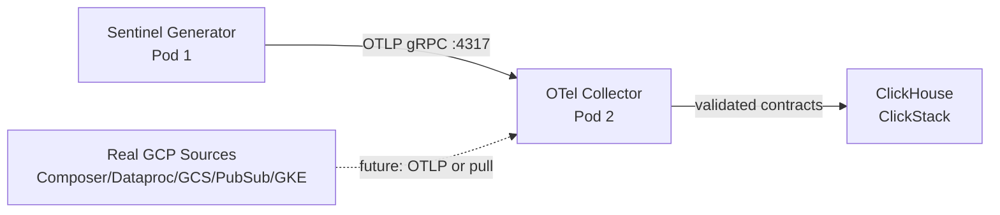

# GCP Telemetry Schemas

> **MCP Validated:** 2026-06-01
> **Confidence:** 0.85 — MCP-only. GCP resource attribute specs confirmed against official OTel semantic conventions and Cloud Operations docs. Pod 1 gcp.yaml not yet committed to upstream; component list derived from Sync 02 + Luan's Crew B briefing.

GCP is Sentinel's **first cloud target**, decided by crew vote at Sync 02 (2026-05-26). This KB covers the telemetry shapes Sentinel must ingest and eventually replace with real GCP connections — one cloud at a time, contracts first.

---

## GCP Telemetry Surfaces

GCP exposes three native telemetry surfaces. All three map cleanly to OTel signal types.

| OTel Signal | GCP Surface | API Product |
|---|---|---|
| Logs | Cloud Logging | `logging.googleapis.com` |
| Metrics | Cloud Monitoring | `monitoring.googleapis.com` |
| Traces | Cloud Trace | `cloudtrace.googleapis.com` |

All three surfaces are part of the **Cloud Operations Suite** (formerly Stackdriver). OTLP support is available via the **OpenTelemetry Collector's `googlecloud` exporter** (the `opentelemetry-collector-contrib` distribution) and via the **GCP-managed OTLP endpoint** in Cloud Monitoring (preview as of 2025).



The dotted arrow is the Phase 2 connection. Phase 1 uses synthetic data that faithfully mimics GCP telemetry shapes.

---

## GCP Component Types (Pod 1 Profiles)

Pod 1's `gcp.yaml` provider profile defines five component types. Each has distinct resource attributes, metric namespaces, and OTel signal relevance.

### 1. Cloud Composer (Orchestration)

Managed Apache Airflow. Emits workflow-level metrics and logs from DAG runs.

**Resource attributes:**

| Attribute | Example value |
|---|---|
| `cloud.provider` | `gcp` |
| `cloud.platform` | `gcp_composer` |
| `cloud.region` | `us-central1` |
| `gcp.composer.environment.name` | `sentinel-composer-dev` |
| `gcp.composer.environment.version` | `2.8.0` |
| `service.name` | `composer` |
| `service.namespace` | `data-pipelines` |

**Key metric descriptors:**

- `composer.googleapis.com/environment/dag_processing/total_parse_time` — DAG parse latency (Latency Watcher W05)
- `composer.googleapis.com/environment/healthy` — 1/0 health gauge (Arrival Watcher W01)
- `composer.googleapis.com/environment/unfinished_task_instances` — queue depth (Volume Watcher W03)
- `composer.googleapis.com/environment/zombie_task_killed` — task failures (Parse Watcher W02)

---

### 2. Dataproc (Compute)

Managed Spark/Hadoop clusters. Emits job-level and cluster-level metrics.

**Resource attributes:**

| Attribute | Example value |
|---|---|
| `cloud.provider` | `gcp` |
| `cloud.platform` | `gcp_dataproc` |
| `cloud.region` | `us-central1` |
| `gcp.dataproc.cluster.name` | `sentinel-spark-cluster` |
| `gcp.dataproc.cluster.uuid` | `<uuid>` |
| `service.name` | `dataproc` |

**Key metric descriptors:**

- `dataproc.googleapis.com/cluster/yarn/allocated_memory_percentage` — cluster saturation (Volume Watcher W03)
- `dataproc.googleapis.com/cluster/hdfs/storage_utilization` — storage pressure (Storage Watcher W06)
- `dataproc.googleapis.com/cluster/job/failed_count` — failure signal (Parse Watcher W02)
- `dataproc.googleapis.com/cluster/job/completion_time` — batch latency (Latency Watcher W05)

---

### 3. GCS (Storage)

Cloud object storage. Emits storage-class metrics and request counts.

**Resource attributes:**

| Attribute | Example value |
|---|---|
| `cloud.provider` | `gcp` |
| `cloud.platform` | `gcp_gcs` |
| `gcs.bucket.name` | `sentinel-landing-zone` |
| `service.name` | `gcs` |

**Key metric descriptors:**

- `storage.googleapis.com/storage/object_count` — object accumulation (Volume Watcher W03, Storage Watcher W06)
- `storage.googleapis.com/storage/total_bytes` — capacity (Storage Watcher W06)
- `storage.googleapis.com/api/request_count` — request rate by response code (Parse Watcher W02)
- `storage.googleapis.com/storage/object_age` — staleness of landing zone objects (Arrival Watcher W01)

---

### 4. Pub/Sub (Messaging)

Managed message queue. Emits subscription lag, message counts, and delivery latency — the primary Volume signal.

**Resource attributes:**

| Attribute | Example value |
|---|---|
| `cloud.provider` | `gcp` |
| `cloud.platform` | `gcp_pubsub` |
| `gcp.pubsub.subscription.name` | `sentinel-events-sub` |
| `gcp.pubsub.topic.name` | `sentinel-events` |
| `service.name` | `pubsub` |

**Key metric descriptors:**

- `pubsub.googleapis.com/subscription/num_undelivered_messages` — backlog depth (Volume Watcher W03 — primary signal)
- `pubsub.googleapis.com/subscription/oldest_unacked_message_age` — consumer lag (Latency Watcher W05)
- `pubsub.googleapis.com/topic/send_message_operation_count` — publish rate (Volume Watcher W03)
- `pubsub.googleapis.com/subscription/dead_letter_message_count` — poison messages (Parse Watcher W02)

---

### 5. GKE (Kubernetes)

Managed Kubernetes. Emits pod, node, and workload metrics. Also produces distributed traces from instrumented workloads.

**Resource attributes:**

| Attribute | Example value |
|---|---|
| `cloud.provider` | `gcp` |
| `cloud.platform` | `gcp_kubernetes_engine` |
| `cloud.region` | `us-central1` |
| `k8s.cluster.name` | `sentinel-gke-dev` |
| `k8s.namespace.name` | `data-pipelines` |
| `k8s.deployment.name` | `pipeline-worker` |
| `k8s.pod.name` | `pipeline-worker-xyz` |
| `service.name` | `gke-workload` |

**Key metric descriptors:**

- `kubernetes.io/container/cpu/limit_utilization` — CPU saturation
- `kubernetes.io/container/memory/limit_utilization` — memory pressure (Volume Watcher W03)
- `kubernetes.io/pod/volume/used_bytes` — persistent volume usage (Storage Watcher W06)
- Traces from workloads: `cloud.trace` signal maps to Latency Watcher W05

---

## Watcher-to-GCP Signal Routing

Quick-reference for which Watcher cares about which GCP signal:

| Watcher | Signal class | Primary GCP sources |
|---|---|---|
| W01 Arrival | Log arrival, data freshness | Cloud Logging (Composer), `storage/object_age` |
| W02 Parse | Log parse errors, failed ops | Cloud Logging parse errors, `api/request_count` 4xx/5xx, `job/failed_count` |
| W03 Volume | Message counts, queue depth | Pub/Sub `num_undelivered_messages`, Dataproc `yarn/allocated_memory`, GCS `object_count` |
| W04 Schema | Field drift, type mismatches | Cloud Logging structured log schemas, BigQuery (future) |
| W05 Latency | End-to-end pipeline latency | Cloud Trace + Composer `total_parse_time`, Pub/Sub `oldest_unacked_message_age`, Dataproc `completion_time` |
| W06 Storage | Capacity and object accumulation | GCS `total_bytes`, Dataproc `hdfs/storage_utilization`, GKE `volume/used_bytes` |

---

## OTLP Support in GCP

### Current state (2025-2026)

GCP does not natively accept OTLP pushes from arbitrary exporters on a public endpoint for all products. The current integration paths are:

1. **OTel Collector `googlecloud` exporter** (production-ready): runs inside your infra, translates OTLP to GCP APIs. Requires `monitoring.metricDescriptors.create` + `monitoring.timeSeries.create` IAM roles.
2. **Cloud Monitoring managed OTLP endpoint** (`monitoring.googleapis.com:443`): available for metrics only, in preview as of late 2025. Accepts OTLP/gRPC with a bearer token. Not yet GA — do not depend on it for Phase 1.
3. **Cloud Trace OTLP exporter**: available via `opentelemetry-exporter-gcp-trace` (Python) or the Collector's `googlecloudtrace` exporter. Stable.

For Sentinel Phase 1, the Collector exports to **ClickHouse**, not back to GCP. The OTLP path matters when transitioning from synthetic to real GCP sources.

### Connecting to real GCP (Phase 2 path)

When replacing the synthetic generator with real GCP metrics:

```
Option A: Pull mode (recommended for metrics)
  Cloud Monitoring API → OTel Receiver (prometheus_receiver or googlecloudmonitoring_receiver) → Collector pipeline → ClickHouse

Option B: Push mode (for logs + traces)
  GCP Logs Router → Pub/Sub topic → Sentinel Pub/Sub receiver → Collector pipeline → ClickHouse
```

**Authentication**: use **Workload Identity Federation** (WIF) for GKE-hosted Collectors or **Service Account JSON key** for local/VM deployments. The required OAuth scopes for Cloud Monitoring read are:

- `https://www.googleapis.com/auth/monitoring.read` — list + read time series
- `https://www.googleapis.com/auth/logging.read` — read log entries
- `https://www.googleapis.com/auth/cloudplatformprojects.readonly` — project enumeration

There is no "Application Insights equivalent" on GCP — that is an Azure product. GCP's equivalent layer is the **Cloud Operations Suite** (Monitoring + Logging + Trace + Profiler).

---

## Gotchas

| Gotcha | Detail |
|---|---|
| **Resource attribute case sensitivity** | GCP resource labels are `snake_case` and lowercase. OTel semantic conventions mix camelCase and dot-notation. The Collector must normalize: `gcp.resource_type` not `GCP.ResourceType`. |
| **Cloud Monitoring write rate limit** | 1 metric write per time series per second. Burst to 100k writes/min per project. Exceeding it returns `RESOURCE_EXHAUSTED`. |
| **Metric descriptor creation lag** | First `timeSeries.create` call for a new metric descriptor takes ~30s. Subsequent calls are fast. Synthetic generators hitting this in rapid succession will see transient 404s. |
| **OAuth token lifetime** | Service account tokens expire after 1 hour. The `googlecloud` exporter and the GCP auth libraries handle refresh automatically, but misconfigured short-lived tokens can cause silent export failures. |
| **Metric retention** | Cloud Monitoring retains data for 24 months for standard metrics but only 6 weeks for some GKE metrics. Design ClickHouse as the long-term store, not Cloud Monitoring. |
| **Label cardinality limit** | Cloud Monitoring enforces a 100-key limit per metric descriptor and a 1000-series limit for custom metrics per project. Standard GCP metrics are exempt. |
| **Pub/Sub delivery ordering** | Pub/Sub ordering keys guarantee in-order delivery per key but add latency. If Sentinel consumes from Pub/Sub in Phase 2, disable ordering for Volume signal reads (throughput > order). |

---

## Pod 1 Contract Alignment

The gcp.yaml provider profile (contract/provider_profiles/gcp.yaml on branch `001-otel-data-generator`) defines synthetic resource attributes that must match the real attributes listed above. Key required Sentinel-specific resource attrs set by the generator (per the JSON Schema contract v1.0.0):

| Attribute | Purpose |
|---|---|
| `sentinel.synthetic` | Boolean; `true` in generator, `false` when real GCP connected |
| `sentinel.scenario` | Scenario name (e.g., `latency_spike`, `volume_drop`) |
| `sentinel.run_id` | UUID per generator run; correlates golden dataset baseline_seed42.jsonl |

When Pod 2's Collector receives these, it must preserve them as resource attributes in the OTLP export to ClickHouse. They are the primary key for Sentinel's own test harness.

---

## See also

- `.claude/CLAUDE.md` — GCP section under lookup policy table
- `../../telemetry/opentelemetry/index.md` — OTel signal types, OTLP gRPC `:4317`, contract model
- `../../telemetry/otel-collector/index.md` — Collector architecture; this is Pod 2's primary KB
- `../../storage/clickhouse/index.md` — ClickHouse schema for OTel signals
- `.claude/docs/CREW_B_GLOSSARY.md` — Watcher definitions, blast radius terminology
- `docs/adr/` — ADR-0004 (Collector language bake-off), ADR-001/002/003 (blast radius, baseline, user)
- GCP Cloud Operations: https://cloud.google.com/products/operations
- OTel GCP integrations: https://opentelemetry.io/ecosystem/integrations/
- OTel semantic conventions (resource): https://opentelemetry.io/docs/specs/semconv/resource/cloud/
