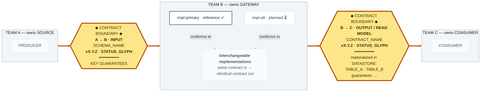

# Pattern: Contract-Gate + Ownership-Zone Diagram

> **Purpose**: A reusable Mermaid encoding that makes contracts the visual hero, ownership explicit, and implementations visibly interchangeable.
> **Confidence**: 0.90 (first-party; proven on the Sentinel Pod 2 README)
> **Added**: 2026-06-09
> **First production use**: Sentinel README §1, `feat/rust-otel-collector`, 2026-06-09

## When to Use

- A system where multiple teams hand work across versioned interfaces.
- A component with multiple/interchangeable implementations behind one contract.
- A README or review deck where contracts and ownership are the message.

## When NOT to Use

This pattern is **only** for the *flow/boundary* row of the [diagram-type rubric](../concepts/diagram-type-rubrics.md). Do **not** reach for it when:

- **The subject is the implementation, not the boundary** — a language/runtime bake-off (Sentinel ADR-0004), build-vs-buy (ADR-0005), or a performance argument. Gold-plating a contract here buries the actual decision; let the implementation be the hero (see the [contract-primacy safeguard](../index.md#the-contract-primacy-safeguard)).
- **The diagram type is non-boundary** — sequence/timing (use `sequenceDiagram`; messages belong on edges), state machine, ER/data model, dependency graph. Forcing nodes-not-edges here is anti-pattern **A8 Diagram-Type Mismatch**.
- **The decisive boundary is trust/network, not ownership** — use a deployment/trust render with a distinct perimeter line (see [boundary-types](../concepts/boundary-types.md)); contract gates won't show where untrusted input enters.
- A **single-owner, single-implementation** internal module (no handoff to show).
- An **exec one-liner** where even zones are too much detail (show only the gates).

## The encoding

| Element | Mermaid construct | Style class |
|---|---|---|
| Ownership zone | `subgraph` labeled `POD/TEAM — owns <X>` | muted slate |
| Contract gate | hexagon node `{{...}}` on the seam | gold, 4px border, bold |
| Implementation | rectangle, pale | white, faint border |
| Reference impl | rectangle, dark **outline** only | outline = "current" |
| Conformance | dashed edge `-. conforms to .->` | faint grey |
| Contract flow | thick edge `==>` | gold via `linkStyle` |
| Status | glyph ✅ 🔶 ⏳ in the label | never color |

## Template (copy, then fill the ALL-CAPS slots)

## Configuration

| Setting | Default | Description |
|---|---|---|
| Orientation | `LR` | left→right reads as a value stream (Receive → Deliver) |
| Contract shape | `{{...}}` hexagon | reads as a gate/checkpoint, not a component |
| Contract color | `#fde68a` / `#b45309` | reserved gold; the only saturated color |
| `linkStyle` indices | count edges in source order | dashed conformance first, gold flow after |

> **Gotcha — `linkStyle` indices.** Edges are numbered by order of appearance in the source, across subgraph boundaries. Declare the dashed `conforms to` edges first so they are indices `0..k-1`, then the gold flow. Recount after adding/removing any edge.

## Trade-offs

| Pro | Con |
|---|---|
| Contracts unmistakably the hero | Hexagon labels get tall with many guarantees |
| Interchangeability shown structurally | More verbose than a plain pipeline |
| Status decoupled from color (stable visuals) | Requires a legend for first-time readers |

## Alternatives

| Alternative | When to prefer it |
|---|---|
| C4 model (Structurizr) | Formal, multi-level system documentation |
| Plain `flowchart` with edge labels | Throwaway sketch where contracts aren't the point |
| `sequenceDiagram` | The message is timing/ordering, not boundaries |

## See Also

- [`../index.md`](../index.md) — the seven principles
- [`../concepts/contract-first-visualization.md`](../concepts/contract-first-visualization.md) — the why
- [`../quick-reference.md`](../quick-reference.md) — legend + checklist

## Sources

- First-use: Sentinel README §1 architecture diagram, `feat/rust-otel-collector`, 2026-06-09
