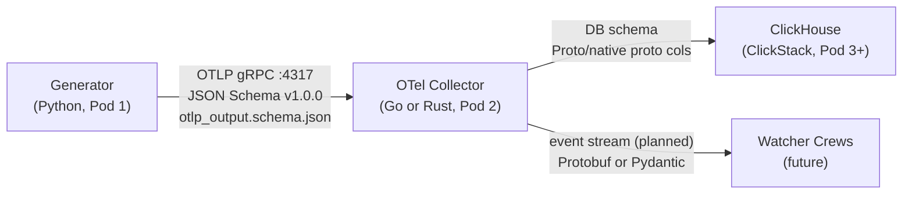
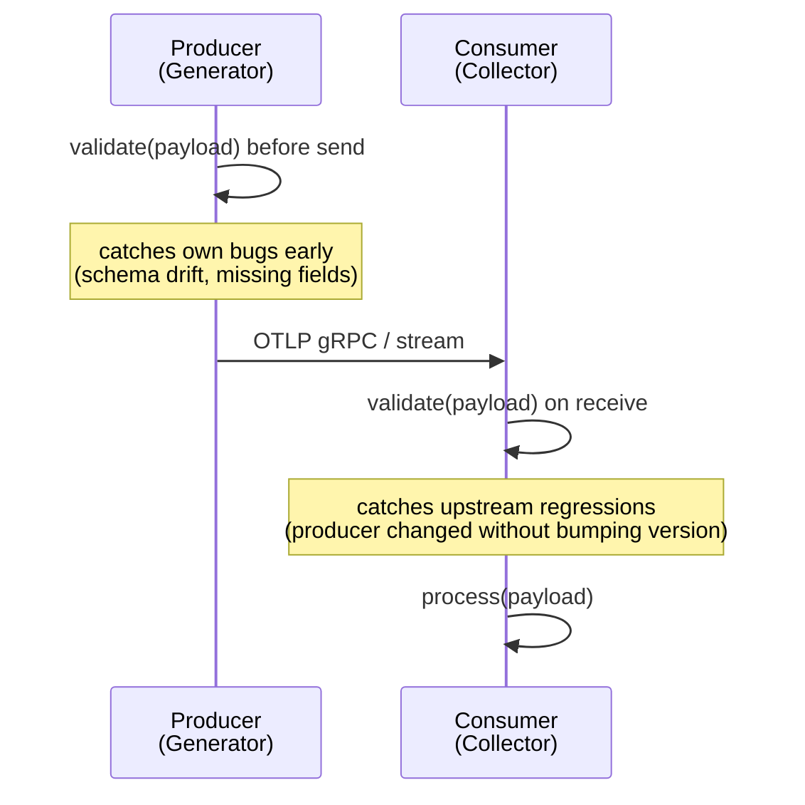

> **MCP Validated:** 2026-06-01

# Contracts — Pydantic + Protobuf for Sentinel Boundaries

Contracts are the spine of Sentinel's "Lego principle" (Sync 02, 2026-05-26): every component declares its input/output shape. Swap the internals of any block; the contract holds. Components talk to each other through typed, versioned boundaries — not through convention or tribal knowledge.

---

## Why contracts are the spine

The Lego principle (quoted directly from Sync 02 and the Glossary) means:

- A component may change its internal logic freely.
- It may NOT change what it accepts or emits without a version bump and a migration window.
- Every consumer can trust that what it receives today is what the spec says it will receive.

Without contracts, the 8-stage pipeline breaks silently. With contracts, breakage is loud, early, and attributable to the boundary that changed — not to some mystery downstream failure.

---

## Sentinel's active boundaries



| Boundary | Status | Contract format | Owner |
|---|---|---|---|
| Generator → Collector | Active (Sprint 1) | JSON Schema Draft 2020-12 + Pydantic models | Pod 1 (Vinícius), Pod 2 (Victor / Alex) |
| Collector → ClickHouse | In design | DB schema (SQL DDL) + optional Protobuf wire | Pod 2 + infra |
| Collector → Watcher | Planned | TBD — likely Protobuf events | Pod 2 + Pod 3 |

---

## Contract formats and when to use each

Sentinel uses three contract formats. They cover different layers and are complementary, not competing.

| Format | Layer | Use for | Human-readable? | Machine-enforceable? |
|---|---|---|---|---|
| **JSON Schema** | API / integration | Cross-language boundaries, HTTP payloads, golden datasets | Yes | Yes (validators in every language) |
| **Protobuf** | Wire | High-throughput binary streams (gRPC, event buses) | No (needs .proto source) | Yes (generated types) |
| **Pydantic** | Runtime (Python) | In-process validation, config parsing, LLM output parsing | Via `.model_json_schema()` | Yes — raises `ValidationError` at runtime |

Rule of thumb: use JSON Schema to document and test the boundary (humans can read it in a PR), Protobuf to carry data at speed, and Pydantic to validate on the Python side.

---

## Pydantic in Python (Pod 1)

Pod 1 uses Pydantic v2. The canonical reference is `src/otelgen/contract/models.py` in the `001-otel-data-generator` branch.

### VersionedContract base pattern

```python
from pydantic import BaseModel, field_validator, model_validator
import re

SEMVER_RE = re.compile(r"^\d+\.\d+\.\d+$")

class VersionedContract(BaseModel):
    """Base for all Sentinel contracts. Enforces semver on schema_version."""

    schema_version: str  # e.g. "1.0.0"

    @field_validator("schema_version")
    @classmethod
    def validate_semver(cls, v: str) -> str:
        if not SEMVER_RE.match(v):
            raise ValueError(f"schema_version must be semver X.Y.Z, got: {v!r}")
        return v
```

### Cross-field rules via model_validator

```python
from pydantic import model_validator
from typing import Self

class OTLPSignal(VersionedContract):
    signal_type: Literal["log", "span", "metric"]
    body: dict | None = None
    span_id: str | None = None
    metric_name: str | None = None

    @model_validator(mode="after")
    def check_type_fields(self) -> Self:
        if self.signal_type == "span" and not self.span_id:
            raise ValueError("span signals require span_id")
        if self.signal_type == "metric" and not self.metric_name:
            raise ValueError("metric signals require metric_name")
        return self
```

`model_validator(mode="after")` runs after all field validators, giving access to the fully-populated model. Use it for invariants that span multiple fields — exactly what discriminated unions (log/span/metric) need.

### Key Pydantic v2 points

- `model_json_schema()` exports a JSON Schema Draft 2020-12 blob — useful for sharing the contract with Go/Rust consumers.
- `model_validate()` vs `parse_obj()`: use `model_validate()` (v2 API). `parse_obj` is v1 and removed.
- `.model_dump(mode="json")` serializes to JSON-safe dicts. Prefer over `.dict()` (deprecated).
- `ConfigDict(strict=True)` prevents silent coercions (string "1" accepted as int 1) — use it on wire contracts.

Reference: <https://docs.pydantic.dev/latest/>

---

## Protobuf in Go and Rust (Pod 2)

Protobuf is the wire format for gRPC (OTLP is itself Protobuf). Pod 2 receives an OTLP gRPC stream and may emit Protobuf events downstream.

### Core wire-compatibility rules

1. **Field numbers are forever.** Once a field number is used in a published `.proto`, its meaning is frozen. Renaming the field name is OK (it's documentation). Changing its type or reusing its number is a breaking change.
2. **Reserve removed fields.** When you drop a field, add it to `reserved` so it cannot be accidentally reused:

   ```protobuf
   message OTLPEvent {
     string signal_type = 1;
     string run_id      = 2;
     // field 3 was "legacy_tag", removed in v1.1
     reserved 3;
     reserved "legacy_tag";
   }
   ```

3. **Additive changes are safe.** New optional fields in a MINOR release do not break existing consumers — unknown fields are ignored in proto3.
4. **Required fields do not exist in proto3.** All fields are optional at the wire level. Enforce presence in your Pydantic/Go validation layer, not in the `.proto`.

### Rust: prost

`prost` compiles `.proto` to Rust types via `build.rs`. The generated structs implement `prost::Message`.

```rust
// build.rs
fn main() -> Result<(), Box<dyn std::error::Error>> {
    prost_build::compile_protos(
        &["proto/sentinel/v1/otlp_event.proto"],
        &["proto/"],
    )?;
    Ok(())
}
```

```rust
// generated use
use sentinel::v1::OtlpEvent;
use prost::Message;

let event = OtlpEvent::decode(&mut bytes)?;
```

### Go: protoc + protoc-gen-go

```bash
protoc \
  --go_out=. --go_opt=paths=source_relative \
  --go-grpc_out=. --go-grpc_opt=paths=source_relative \
  proto/sentinel/v1/otlp_event.proto
```

Generated types live in the package declared in the `.proto` `option go_package`. Import and use directly; no runtime reflection needed.

References: <https://protobuf.dev/>, <https://github.com/tokio-rs/prost>

---

## JSON Schema as the human contract (Pod 1 canonical)

Pod 1 ships `contract/schema/otlp_output.schema.json` (JSON Schema Draft 2020-12). It is the human-readable truth for the Generator → Collector boundary.

### Key features of Pod 1's v1.0.0 schema

- **`$schema`**: `https://json-schema.org/draft/2020-12/schema`
- **Top-level `$defs`** for signal subtypes; the root uses `oneOf` over a `signal_type` discriminator.
- **`if/then` discrimination**: each branch constrains which fields are required for `log`, `span`, and `metric` signals — the same invariant that Pydantic's `model_validator` enforces at runtime.
- **Required Sentinel-specific resource attributes**: `sentinel.synthetic`, `sentinel.scenario`, `sentinel.run_id` — these are not part of the OpenTelemetry standard; they are Sentinel additions that identify synthetic test runs.
- **Golden dataset**: `contract/testdata/baseline_seed42.jsonl` — a seed-42 deterministic dataset that every consumer can use to smoke-test a new parser.

### if/then discrimination example

```json
{
  "if":   { "properties": { "signal_type": { "const": "span" } } },
  "then": { "required": ["span_id", "trace_id"] }
}
```

This pattern validates cross-field constraints without a custom vocabulary — compatible with any Draft 2020-12 validator.

Reference: <https://json-schema.org/draft/2020-12>

---

## Versioning policy

Sentinel contracts follow [Semantic Versioning](https://semver.org/) with this mapping:

| Change | Version bump | Example |
|---|---|---|
| Remove a required field | MAJOR | `1.0.0` → `2.0.0` |
| Change field type (e.g. `string` → `int`) | MAJOR | `1.0.0` → `2.0.0` |
| Add a new required field | MAJOR | `1.0.0` → `2.0.0` |
| Add a new optional field | MINOR | `1.0.0` → `1.1.0` |
| Change default value | MINOR | (review carefully) |
| Fix documentation, clarify descriptions | PATCH | `1.0.0` → `1.0.1` |
| Add an example | PATCH | `1.0.0` → `1.0.1` |

MAJOR bumps require a migration window: both contract versions must be simultaneously supported by the consumer for at least one sprint before the old version is dropped.

---

## Validation at the boundary: both sides matter

From Sync 02: both the producer and the consumer must validate. This is not optional — it catches two different failure classes.



- **Producer validates on send**: Generator validates each emitted record against `otlp_output.schema.json` before writing to the stream. A failed validation is a test failure, not a runtime error.
- **Consumer validates on receive**: Collector validates the OTLP payload against its expected contract before passing it downstream. A failed validation produces a structured error event (audit log), not a panic.

"Fail loud" is the rule. Silent coercion (accepting a malformed record and guessing at intent) is worse than a loud rejection — it poisons downstream statistics.

---

## Case study: Pod 1 → Pod 2 contract (v1.0.0)

Vinícius (Pod 1) delivered `otlp_output.schema.json` v1.0.0 on the `001-otel-data-generator` branch with a golden dataset (`baseline_seed42.jsonl`). Pod 2's review is documented at:

`../../../docs/research/contract-review-pod1-v1.0.0.md`

That review captures blockers B1–B4 that Pod 2 found when parsing the schema from the Rust/Go side. Reference it before implementing the Collector's ingestion path — several field-level decisions depend on resolving those blockers.

The key tension: JSON Schema describes the Generator's output shape, but the Collector receives OTLP gRPC (binary Protobuf). The JSON Schema is the test oracle; the actual wire is OTLP. Pod 2 must validate that the Generator's OTLP stream matches the JSON Schema contract, not just that it is valid OTLP.

---

## Schema design checklist

Before publishing or updating a contract:

- [ ] `schema_version` field present, semver format enforced
- [ ] All required fields documented with description and example
- [ ] Discriminated unions handled (if/then for JSON Schema, oneOf + model_validator for Pydantic, oneof for Protobuf)
- [ ] At least one golden example per signal type / branch
- [ ] Max bounds set where relevant (string lengths, array sizes, numeric ranges)
- [ ] Removed fields reserved (Protobuf) or `deprecated: true` annotated (JSON Schema)
- [ ] Both producer and consumer validation wired into CI
- [ ] CHANGELOG entry or ADR cross-reference if MAJOR or MINOR bump

---

## See also

- [`.claude/CLAUDE.md`](../../CLAUDE.md) — project context, architecture, Pod assignments
- [`.claude/docs/CREW_B_GLOSSARY.md`](../../docs/CREW_B_GLOSSARY.md) — Lego principle, blast radius, Watcher definitions
- [`kb/telemetry/opentelemetry/index.md`](../telemetry/opentelemetry/index.md) — OTLP signal types, gRPC transport
- [`kb/telemetry/otel-collector/index.md`](../telemetry/otel-collector/index.md) — Collector receiver/processor/exporter model
- [`kb/languages/rust/index.md`](../languages/rust/index.md) — prost, tonic, Rust async patterns
- [`kb/languages/go/index.md`](../languages/go/index.md) — Go concurrency, protoc-gen-go
- [`kb/process/crew-b-wow/index.md`](../process/crew-b-wow/index.md) — CI gates, ADR workflow, PR attribution
- [`docs/research/contract-review-pod1-v1.0.0.md`](../../../docs/research/contract-review-pod1-v1.0.0.md) — Pod 2 review of Pod 1's schema (B1–B4 blockers)
- External: [Pydantic v2 docs](https://docs.pydantic.dev/latest/) · [Protobuf language guide](https://protobuf.dev/programming-guides/proto3/) · [JSON Schema Draft 2020-12](https://json-schema.org/draft/2020-12)
