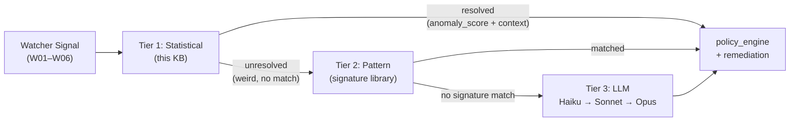

# Anomaly Detection — Statistical Foundations

> **MCP Validated:** 2026-06-01
> Confidence: 0.85 — Core algorithms are well-established; Sentinel-specific rolling-window parameters and hand-off thresholds are project-defined, not yet validated against real traffic.

Tier 1 of the Sentinel 3-tier detection cascade. Statistical methods are the cheapest, fastest, and most interpretable. The goal is to resolve as many anomalies as possible here before escalating to Tier 2 (Pattern) or Tier 3 (LLM).

---

## Position in the Cascade



**Rule:** cheapest tier that can make a confident decision wins. Tier 1 must not escalate everything upward — that defeats the cost model. Tier 1 escalates when its anomaly score is above a configurable `uncertainty_threshold` and the context is insufficient to classify.

Tier 1 runs inside `tiered_engine` (spine stage 3). Rolling stats are computed in `rolling_stats` (stage 2), making them available as pre-computed features by the time the signal reaches detection.

---

## Baseline Question (ADR-002, open)

Before any detection algorithm runs, Sentinel needs to know what *normal* looks like. Three candidate approaches are on the table:

| Approach | Pros | Cons |
|---|---|---|
| **Rolling window (7-day default)** | No training step, adapts to trend drift, zero external dependency | Cold-start problem for new pipelines; sensitive to anomalies corrupting the baseline itself |
| **Pre-trained offline model** | Stable baseline immune to contamination, captures seasonality | Requires historical data, retraining cadence, storage; lags operational changes |
| **OTel stream from Oteru (Crew C)** | Leverages cross-crew telemetry, richer signal | Tight coupling to external crew delivery, latency on stream consumption |

**Current default (spec):** rolling 7-day window. ADR-002 is open. The recommendation here is to ship with rolling window for Sprint 1 and defer model-based baselines until there is real traffic to train on — consistent with the *memory → context → intelligence* sequencing principle.

Edge cases that any baseline approach must address:
- **Cold start**: first N observations have no baseline. Default: use global population stats for the first 24h, then switch to per-pipeline rolling window.
- **Gap handling**: pipeline paused for a weekend; window has no data. Default: extend last valid window rather than fill with zeros.
- **Anomaly contamination**: an ongoing incident poisons the rolling mean. Mitigation: use median-based statistics (see MAD below) and cap contamination window at 20% of lookback period.

---

## Z-Score Detection

The standard z-score measures how many standard deviations an observation is from the mean of its baseline window:

```
z = (x - mean) / sigma
```

Flag as anomaly if `|z| > k`. Typical default `k = 3` (covers 99.7% of a Gaussian distribution).

**Problem:** the mean and sigma in that formula are highly sensitive to outliers. A single prior spike inflates sigma, masking subsequent real anomalies.

### Robust Variant: Modified Z-Score (MAD)

Use the Median Absolute Deviation instead:

```
MAD  = median(|x_i - median(x)|)
z_m  = 0.6745 * (x - median(x)) / MAD
```

The constant 0.6745 scales MAD to be consistent with sigma for a normal distribution. Flag when `|z_m| > 3.5` (Iglewicz–Hoaglin threshold).

**When to prefer MAD over standard z-score:**
- Baseline window is short (< 30 observations).
- Signal is known to have occasional large spikes (e.g., Volume W03 on ETL day).
- Cold-start period where mean is unstable.

### Tukey Fences (IQR method)

A non-parametric alternative that makes no distributional assumption:

```
Q1, Q3 = 25th and 75th percentile of baseline window
IQR    = Q3 - Q1
lower  = Q1 - k * IQR
upper  = Q3 + k * IQR
```

Flag if `x < lower` or `x > upper`. Conservative: `k = 1.5`. Strict: `k = 3.0`.

**When to prefer IQR:** multimodal distributions (e.g., Latency W05 with bimodal batch vs. streaming values), or when interpretability for alert messages matters more than sensitivity.

### Quick-Reference Decision Table

| Situation | Method | Default `k` |
|---|---|---|
| Normal-ish, sufficient history (≥ 168 samples / 7 days hourly) | Standard z-score | 3.0 |
| Short window or outlier-heavy history | Modified z-score (MAD) | 3.5 |
| Multimodal or non-Gaussian distribution | Tukey IQR fences | 1.5 (alert) / 3.0 (page) |
| Need interpretable bounds for dashboards | Percentile thresholds (1st/99th) | — |

---

## Rolling-Window Baselines

The rolling window is the state that each Watcher maintains to represent *recent normal*.

**Spec default:** 7 days. Rationale: covers a full weekly seasonality cycle for most data pipelines (weekday vs. weekend batch behavior diverges significantly).

### Window Parameters

| Parameter | Default | Notes |
|---|---|---|
| `window_days` | 7 | Increase to 14 for pipelines with fortnightly patterns |
| `granularity` | hourly | Daily is too coarse for latency; hourly is the minimum useful unit |
| `update_cadence` | on-write | Update the rolling stats when a new observation arrives, not on a timer |
| `min_observations` | 24 | Require at least 24 hourly samples before z-score is meaningful |
| `max_gap_hours` | 48 | If gap exceeds this, treat as cold start for the affected window |

### On-Write vs. Timed Update

On-write update (recalculate rolling stats whenever a new signal arrives) is preferred over timed batch because:
- Detects rapid drift within an hour, not the next scheduled run.
- Consistent with the `rolling_stats` spine stage running inline with ingestion.
- Trade-off: slightly higher compute per ingested event; acceptable at Sentinel's data volumes.

### Seasonality Decomposition

A 7-day rolling mean is not enough for seasonal signals. Volume on Monday morning is legitimately higher than Sunday night; comparing them with the same baseline produces false positives.

**Approach:** maintain separate sub-windows per time-of-week bucket (e.g., Monday 08:00–09:00). With hourly granularity and 7-day lookback, each bucket has 7 observations — sufficient for MAD but too few for standard z-score. Use MAD for seasonal sub-windows.

**Black Friday example (from Sync 02):** a 10x volume spike on a known high-traffic day should not trigger an alert. Mitigation options:
1. Pre-annotate known high-traffic windows as `suppressed_anomaly_check = True` in the pipeline metadata.
2. Dynamically expand `k` threshold when the rolling window itself shows a trend (e.g., if the last 3 same-day-of-week values are all higher, widen the fence).

The spec does not define a holiday calendar yet. ADR-002 should address this. For Sprint 1, option 1 (manual suppression annotation) is the pragmatic default.

---

## Drift Detection

Drift detection answers a different question than z-score: not "is this observation unusual?" but "has the *distribution* of observations shifted over time?". Relevant for Watcher signals that are themselves distributions (e.g., Schema W04 field-type histograms, Volume W03 daily row-count distributions).

Three techniques on the Sentinel shortlist:

### Kolmogorov–Smirnov (KS) Test

Compares two empirical CDFs. Non-parametric, works on any continuous distribution.

```
D = max|F_baseline(x) - F_current(x)|
```

Flag drift when D exceeds critical value at chosen significance level (0.05 default). Sensitive to small shifts in the tails. Good for: numeric column distributions (row counts, byte sizes, latency values).

Limitation: requires minimum sample size (~30 per window) to be meaningful.

### Wasserstein Distance (Earth Mover's Distance)

Measures the minimum cost to transform one distribution into another. Interpretable as "how many units of mass must move, and how far."

Preferred over KS when: magnitude of shift matters (not just presence), or when comparing distributions that may have no overlap.

### Population Stability Index (PSI)

```
PSI = sum((Actual% - Expected%) * ln(Actual% / Expected%))
```

Threshold conventions: PSI < 0.1 = stable, 0.1–0.25 = moderate shift (warn), > 0.25 = significant drift (alert).

Good for: categorical distributions (e.g., Schema W04 null-rate per column bucket, or Parse W02 format-type distribution). Widely used in ML model monitoring; directly applicable here.

**When to use which:**

| Signal type | Preferred method |
|---|---|
| Numeric continuous (latency, volume) | KS test or Wasserstein |
| Categorical / binned (schema types, null rates) | PSI |
| Tail-sensitivity required | Wasserstein |
| Interpretable threshold for alerting | PSI (0.1/0.25 convention) |

---

## Multivariate Signals and Cross-Watcher Correlation

Single-Watcher anomalies can fire independently. However, in stage 04 (`cross_watcher`) of the Sentinel spine, correlated signals across Watchers are evaluated together.

**Key insight:** a volume spike (W03) and a latency spike (W05) firing simultaneously are almost certainly the same root cause. Double-firing alerts compounds alert fatigue.

**Correlation suppression rule (to implement in `cross_watcher`):**
1. If two or more Watchers fire within the same 5-minute window, emit one correlated event with both Watcher contexts attached.
2. Route the correlated event to the policy engine as a single anomaly with higher blast-radius weighting.
3. Do not suppress either Watcher's individual score — preserve both in the audit log.

The correlation matrix itself can be computed from the rolling-stats window. If `corr(W03_volume, W05_latency) > 0.7` historically, tag them as a correlated pair in the pipeline metadata, and apply cross-Watcher deduplication automatically.

---

## False-Positive Control

Alert fatigue is explicitly named in the Sentinel spec (Act 2) as one of the three mission-critical problems. Tier 1 is the most dangerous source of false positives because it runs on every signal.

**Design principles:**

1. **Default to lower sensitivity.** Ship with `k = 3.5` (MAD) rather than `k = 2.5`. Ramp down after 2 weeks of real-world calibration.
2. **Per-Watcher tuning.** Each Watcher has its own threshold config. Volume (W03) and Latency (W05) have different noise profiles and should not share `k`.
3. **Suppression windows.** Allow pipeline operators to annotate known-noisy windows (maintenance, deploys, Black Friday). Sentinel does not alert during suppression.
4. **Alert consolidation.** A single pipeline should not emit more than N alerts per hour for the same signal type. Default N = 3; configurable.
5. **Feedback loop (stage 8).** False-positive markings from human operators must flow back to recalibrate `k` and baseline window parameters. This is not a Sprint 1 feature, but the schema for it must be designed now so the audit log captures the right fields.

---

## Hand-off to Tier 2 (Pattern)

Tier 1 outputs a structured anomaly event when escalating:

```python
class StatisticalAnomalyEvent(BaseModel):
    watcher_id: str                  # "W03_volume"
    pipeline_id: str
    observed_value: float
    baseline_mean: float
    baseline_sigma: float            # or MAD-equivalent
    anomaly_score: float             # z-score or modified z-score
    detection_method: str            # "z_score" | "mad" | "iqr" | "ks" | "psi"
    window_days: int
    timestamp: datetime
    context: dict                    # raw window stats, seasonality bucket, etc.
    escalation_reason: str           # "score_exceeds_uncertainty_threshold"
```

Tier 2 receives this and asks: "I see an anomaly with score X and this context. Does this match a known failure signature in the library?" If yes, Tier 2 enriches with the signature name and recommended remediation. If no match, Tier 3 is invoked.

The `anomaly_score` field is the primary routing signal. Tier 1 must not escalate with a score below `uncertainty_threshold` — if the score is high but the method is confident (e.g., clear z > 5 with 7 days of clean history), Tier 1 can route directly to policy without Tier 2.

---

## Implementation Notes

- All statistical computation lives in the `rolling_stats` stage (stage 2 of the spine), not inline in the Watcher detection logic. Watchers consume pre-computed stats.
- The rolling window state is stored in ClickHouse (materialized views over the raw OTel signal tables). This is the preferred approach over in-memory state in the Collector, since the Collector is stateless by design.
- The Pydantic contract for `StatisticalAnomalyEvent` above is illustrative. The canonical contract lives in `contract/schema/` once authored.
- Python is the implementation language for the detection tier (the Collector is Go/Rust, but detection logic runs downstream in the spine).

---

## See also

- [`.claude/CLAUDE.md`](../../CLAUDE.md) — project context, 3-tier cascade definition, Watcher list
- [`.claude/docs/CREW_B_GLOSSARY.md`](../../docs/CREW_B_GLOSSARY.md) — Watcher, Blast radius, Baseline, 3-tier cascade definitions
- [`kb/telemetry/opentelemetry/`](../../kb/telemetry/opentelemetry/) — OTel signal types feeding the Watchers
- [`kb/storage/clickhouse/`](../../kb/storage/clickhouse/) — where rolling stats are materialized
- [`kb/process/crew-b-wow/`](../../kb/process/crew-b-wow/) — Sprint 1 scope, ADR process
- `docs/adr/0002-baseline-strategy.md` — ADR-002 (baseline question, open as of 2026-06-01)
- Wikipedia: [Standard score](https://en.wikipedia.org/wiki/Standard_score), [Statistical process control](https://en.wikipedia.org/wiki/Statistical_process_control)
