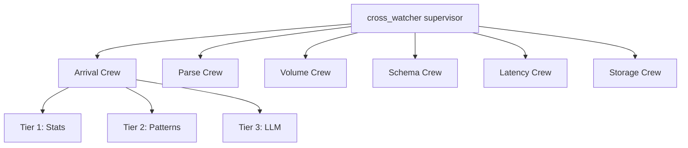

# Agentic Architectural Patterns — Sentinel Index

> **MCP Validated:** 2026-06-01
> Source: Packt *Agentic Architectural Patterns for Multi-Agent Systems* (primary reference),
> Sync 01 notes (`victor_docs/Sync 01.md`), Sync 02 transcript, Sentinel spec.

This KB is a navigation layer, not a summary. The Packt book is the canonical textbook. This
file answers the question: *"Which chapter do I open, and why, for the Sentinel problem in front
of me right now?"*

---

## Why this KB exists

Sentinel's architecture is, at its core, an agentic system:

- **Tier 3 of the detection cascade** (LLM: Haiku → Sonnet → Opus) is a tool-augmented LLM
  pipeline. Every LLM invocation in that tier follows function-calling patterns from the book.
- **The 6 Watcher Crews** (Arrival, Parse, Volume, Schema, Latency, Storage) are multi-agent
  groups — each Watcher maps directly to the CrewAI crew topology described in Part II.
- **The 8-stage spine** (`otel_core → rolling_stats → tiered_engine → cross_watcher →
  policy_engine → remediation → audit_log → feedback_loop`) mirrors the supervisor-worker
  hierarchical orchestration pattern the book covers.
- **The Commander → Crew → Pod human structure** is an analogue of agent supervisor graphs.
  Understanding that structural parallel helps design the software hierarchy.

Without a shared vocabulary for these patterns, design discussions stall on naming. The book
provides that vocabulary.

---

## Sentinel's agentic pattern taxonomy

### Pattern 1 — Tool use and function calling

Every LLM call in Tier 3 is tool-augmented. The LLM does not produce raw prose; it calls
named functions (e.g., `emit_anomaly_event`, `classify_blast_radius`, `page_on_call`) whose
schemas are Pydantic-validated contracts.

Sentinel relevance:

| Where | Tool use appears |
|---|---|
| Tier 3 cascade | LLM calls tools to classify anomaly type, severity, and blast-radius tier |
| Policy engine | LLM (if escalated) invokes policy lookup to decide T0/T1/T2 remediation |
| Audit log | Tool call records become the attestation trail |

When to open the book: designing any new LLM step, choose tool schemas, or debug why an LLM
is hallucinating instead of calling the right function.

### Pattern 2 — Multi-agent crews (CrewAI topology)

Sentinel's Watcher Crews are the CrewAI pattern literally instantiated. A Crew has:

- **Agents** with specialized roles (Arrival analyst, Parse validator, ...)
- **Tasks** bound to agents
- **A process** (sequential or hierarchical)
- **Shared memory** (the rolling-stats context window)

The book maps cleanly to CrewAI's API. When you are designing a new Watcher Crew — specifying
its agents, their tools, their task decomposition — Part II of the book is the reference.

Sentinel Watcher → CrewAI concept mapping:

```
Watcher (W01–W06)     →  CrewAI Crew
Detection logic        →  CrewAI Task
z-score engine         →  Tier 1 Agent (no LLM, pure stats)
signature matcher      →  Tier 2 Agent (pattern library)
LLM router             →  Tier 3 Agent (Haiku/Sonnet/Opus)
anomaly_event output   →  Task output schema (Pydantic)
```

### Pattern 3 — Hierarchical orchestration

The book's supervisor-worker pattern maps to Sentinel's runtime:



The `cross_watcher` stage on the 8-stage spine is the supervisor. It fans out to Watcher
Crews, aggregates their `anomaly_event` outputs, and passes correlated signals to
`policy_engine`. Designing `cross_watcher` well requires the supervisor-graph chapter of the
book. Key questions that chapter answers:

- When does the supervisor short-circuit (one Watcher fires, rest abort)?
- How does the supervisor aggregate conflicting signals from two Crews?
- What is the timeout / retry contract between supervisor and worker?

### Pattern 4 — MVP-first principle

Quoted from Sync 01 (source: Packt book, Chapter on progressive validation):

> "Successful agentic engineering requires a discipline of progressive validation. The
> development life cycle of a new agentic workflow should begin with the minimum viable
> agent."

Sentinel application: every new Watcher Crew starts with *only* Tier 1 (z-score). Tier 2 and
Tier 3 are added when Tier 1 proves insufficient on real data. The 3-tier cascade is not
deployed all at once. This is the minimum viable agent principle in practice.

Checklist before adding Tier 2 or Tier 3 to a Watcher:

- [ ] Tier 1 has been deployed and is producing anomaly events
- [ ] False-positive rate is measured on the golden dataset (`baseline_seed42.jsonl`)
- [ ] There is a documented scenario where Tier 1 *fails* that Tier 2 or 3 *resolves*
- [ ] Cost budget for Tier 3 (LLM tokens) is approved

### Pattern 5 — Pattern-first architecture

Quoted from Sync 01 (source: Packt book):

> "Consider starting with a pattern-first architectural sketch — think of this as a form of
> test-first design."

Sentinel application: before writing a single line of Watcher code, sketch the crew topology
as a Mermaid diagram in an ADR. The diagram IS the architectural contract. Code follows the
diagram; the diagram does not follow the code. This KB is itself a pattern-first artifact.

### Pattern 6 — Continuous improvement loop

Quoted from Sync 01 (source: Packt book):

> "Your first deployed agent is not the end of the project — it is the beginning of its
> lifecycle."

Sentinel maps this to the `feedback_loop` stage (Stage 8 of the 8-stage spine):

```
remediation → audit_log → feedback_loop
                              │
                              └─ rolling_stats updated
                              └─ signature library updated
                              └─ LLM prompt refined
```

Every remediation action — whether T0 (safe replay) or T1 (bounded skip) — writes an
attestation to `audit_log`. The `feedback_loop` reads these attestations and updates the
baseline that Tier 1 uses next cycle. The agent lifecycle is the data pipeline lifecycle.

---

## Decision framework: when is LLM detection the right tier?

Sentinel's 3-tier cascade IS the answer to "should I add an LLM step?":

```
1. Can a z-score or rolling-window threshold resolve this anomaly class?
      YES → Tier 1. Stop. Do not add LLM.

2. Is there a known signature (regex, schema fingerprint, known bad pattern)?
      YES → Tier 2. Stop. Do not add LLM.

3. Is the anomaly semantically ambiguous, context-dependent, or novel?
      YES → Tier 3. Escalate to Haiku first.
         Haiku confident (>= threshold)?  → emit anomaly event
         Haiku not confident?             → escalate to Sonnet
            Sonnet confident?             → emit anomaly event
            Sonnet not confident AND blast_radius == T2?  → escalate to Opus
            Sonnet not confident AND blast_radius <= T1?  → page human
```

This is the cheapest-tier-wins principle. The book's "progressive validation" concept
underpins it: you do not skip to the expensive tier without evidence that the cheaper tier
cannot serve.

LLM cost guardrails (Sentinel defaults, adjust per ADR):

| Tier | Model | When escalated | Max tokens | Cost gate |
|---|---|---|---|---|
| 3a | Haiku | Tier 2 miss | 512 | Always eligible |
| 3b | Sonnet | Haiku confidence < 0.75 | 1024 | Pipeline volume < 10k events/hr |
| 3c | Opus | Sonnet confidence < 0.75 AND T2 blast radius | 2048 | Explicit ADR approval per Watcher |

---

## Tool selection: the new agentic stack

Quoted from Sync 01 (source: Packt book, tooling chapter):

> "Function calling (OpenAI/Anthropic style), MCP (Model Context Protocol), A2A
> (Agent-to-Agent) — this is the new agentic stack."

How Sentinel uses each layer:

| Layer | Sentinel use |
|---|---|
| **Function calling** | Tier 3 LLM calls structured tools with Pydantic schemas. The tool output IS the anomaly event — no free-text parsing. |
| **MCP (Model Context Protocol)** | Potential future: Watcher Crews exposed as MCP servers so the policy engine (or a human) can query them via a standard protocol. Not in Phase 1. |
| **A2A (Agent-to-Agent)** | The `cross_watcher` → Watcher Crew fan-out is the A2A pattern: agents calling agents over a defined contract. `cross_watcher` does not know the internal implementation of any Watcher Crew — it only knows the `anomaly_event` contract. |

---

## The book in the knowledge graph

```
victor_docs/
└── book-agentic-architectural-patterns-multi-agent-systems.pdf  ← TEXTBOOK (primary)

.claude/kb/patterns/agentic-architecture/
└── index.md  ← THIS FILE (navigation layer — maps book chapters to Sentinel problems)

.claude/kb/detection/anomaly-detection/
└── index.md  ← Tier 1 + 2 implementation (stats, rolling windows, signatures)

.claude/CLAUDE.md
└── Architecture section  ← the 8-stage spine and 3-tier cascade spec

docs/adr/
└── ADR-001 (blast radius)  ← governs when T2/T3 remediation triggers
└── ADR-002 (baseline)      ← governs what Tier 1 compares against
```

The book is the textbook; Sentinel is the build. The KB is the bridge between them — it
surfaces the precise chapter to read for each Sentinel design decision, so no Astronaut has
to re-derive the pattern from scratch.

---

## Quick reference: when to open the book

| Situation | Chapter area to open |
|---|---|
| Designing a new Watcher Crew from scratch | Multi-agent crew topology (Part II) |
| Choosing orchestration: sequential vs hierarchical | Orchestration patterns chapter |
| Debugging why a Tier 3 LLM call returns free text instead of a tool call | Function calling / tool schema chapter |
| Deciding if a new anomaly type needs LLM at all | Progressive validation / MVP-first chapter |
| Designing the `cross_watcher` supervisor fan-out | Supervisor-worker / A2A chapter |
| Writing the `feedback_loop` stage | Continuous improvement lifecycle chapter |
| Evaluating Watcher Crew output quality (precision/recall of anomaly detection) | Evaluation and observability chapter |
| Designing the blast-radius classification step inside policy_engine | Tool use for classification chapter |

---

## Conjectural sections

The following mappings are inferred from Sync 01 quotes and the Sentinel spec. They have not
been verified against specific chapter numbers in the Packt PDF:

- The exact chapter that covers "cheapest-tier-wins" escalation routing
- Whether the book covers ClickHouse or any columnar store as a tool-call target
- The book's stance on synchronous vs asynchronous agent invocations (Sentinel uses async
  throughout — confirm against the book's concurrency chapter when designing `cross_watcher`)

Open the PDF to verify before citing a chapter number in an ADR.

---

## See also

- `.claude/CLAUDE.md` — Sentinel project context, 8-stage spine, 3-tier cascade spec,
  Watcher Crew list, lookup tables
- `kb/detection/anomaly-detection/` — Tier 1 (z-scores, rolling windows) and Tier 2 (pattern
  matching) implementation patterns
- `kb/process/crew-b-wow/` — the working agreement that governs when a new agent or tier is
  added (MVP-first enforced via PR checklist)
- `kb/contracts/` — Pydantic + Protobuf contract patterns; every tool-call output and every
  A2A message in Sentinel is a validated contract
- `.claude/docs/CREW_B_GLOSSARY.md` — Watcher Crew vs Crew B disambiguation; blast-radius
  tier definitions
- `.claude/docs/ROADMAP.md` — Phase 3 (Weeks 9–14) backlog: `kb/detection/llm-cascade/` and
  `kb/detection/policy-engine/` extend this KB
- `docs/adr/ADR-001` (blast radius) — blast-radius tiers T0/T1/T2 that gate Tier 3 escalation
- `docs/adr/ADR-002` (baseline) — rolling-window baseline that Tier 1 compares against
- `victor_docs/book-agentic-architectural-patterns-multi-agent-systems.pdf` — the Packt book
  (primary reference; local only)
- `victor_docs/Sync 01.md` — source of the three direct book quotes in this file
