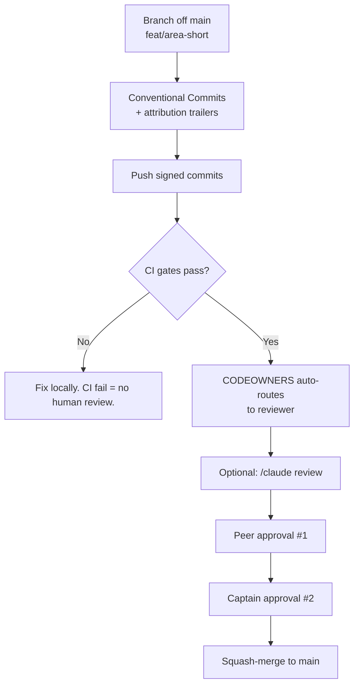

# Crew B Way of Working

> **MCP Validated:** 2026-06-01
> **Agent Git governance web-validated:** 2026-07-14
> Sources: Sync 01 deck, Sync 02 transcript (2026-05-26), `bem-vindos.md` (Commander's intro), `.claude/docs/CREW_B_GLOSSARY.md`.

This is the canonical process reference for Sentinel Crew B. Every Astronaut, every PR, and every weekly sync follows what is written here. When this file and a Discord message disagree, this file wins.

---

## Roles

### Commander

Luan Moreno. Owns the mission vision, opens architecture-level GitHub Issues, merges to `main`, leads the weekly Zoom sync. Not a sprint facilitator — that is the Captain hat.

### Astronaut(a)

Any member of Crew B. Eight total. (Portuguese: *astronauta* — same word, used interchangeably in the repo.)

### Captain

A *hat*, not a separate role. The Astronaut wearing it this sprint:

- Plans and owns the sprint backlog
- Triages PRs Wednesday and Friday
- Runs a weekly 15-minute 1:1 with the Commander
- Pre-tags `good-first-issue` (5-10 items per sprint, pre-sprint)
- Writes the cohort status update at sprint end

Time split: approximately 60-70% Individual Contributor, 30-40% leadership overhead. The hat rotates every sprint — confirmed at the Tuesday Zoom.

### Pod

The unit of work within Crew B. Two Astronautas per Pod. A Pod owns one feature end-to-end: from contract definition through CI-green merge. Pods are the atomic accountability unit — if a feature slips, the owning Pod is the first call.

---

## Pod Assignments (Sync 02, 2026-05-26)

| Pod | Watcher scope | Astronautas |
|-----|---------------|-------------|
| B1  | Arrival (W01) + Parse (W02) | TBD |
| B2  | OTel Collector (Pod 2 — Generator→ClickHouse middle layer) | Alex Botelho, Victor Urquiola, Ruan Pomponet |
| B3  | Volume (W03) + Schema (W04) / Latency (W05) + Storage (W06) | TBD |
| B4  | Action Dispatcher | TBD |

Pod B2 is Victor's Pod. It owns the OTel Collector: receives OTLP gRPC on `:4317`, validates contracts, converts, and exports to ClickHouse. A Rust vs Go bake-off is in progress (see ADR-0004 on `feat/rust-otel-collector`).

> Naming note: "Hotel Collector" in AI transcripts = OTel Collector. "Hotel" is a Portuguese-pronunciation transcription artifact. Use "OTel Collector" in all written artifacts.

---

## Sprint Cadence

### Weekly Sync

- **When:** Tuesday, Zoom, approximately 60 minutes
- **Who facilitates:** The Captain for that sprint
- **Standing agenda:** Pod assignments confirmed, first PRs reviewed live, ADR progress, blockers surfaced

### Sprint 1 Is Not Coding

The Commander's explicit framing from `bem-vindos.md`. Sprint 1 runs five steps in strict order:

```
1. Market Finding  →  2. Discuss what to build  →  3. Architecture sketch
    →  4. Backlog  →  5. First slice to main
```

No code merges to `main` until all five steps are done. The sprint ends when the first real slice lands. ADRs are the primary output of steps 2-3.

### Async Channels

| Channel | Purpose | NOT for |
|---------|---------|---------|
| Discord `#crew-b` | Async chat, questions, links | Decisions that matter in 6 months |
| WhatsApp | Urgent sync only | Documentation, design discussion |
| GitHub Issues | Every work item, bugs, spikes | Casual chat |
| GitHub Projects | Kanban board (backlog → done) | Free-form discussion |

The rule of thumb: if you would quote it in an ADR or PR description, write it in GitHub, not Discord.

---

## ADR Flow

Architecture Decision Records are the primary design artifact for Sentinel.

### File location

```
docs/adr/NNNN-<kebab-title>.md
```

Numbers are monotonically increasing. Zero-padded to four digits. Companion research (exploration briefs, benchmarks, data) lives in `docs/research/` and is referenced from the ADR.

### Status lifecycle

```
Proposed  →  Accepted
           →  Rejected
           →  Superseded (links to the superseding ADR)
```

Status is a field in the ADR frontmatter. Captain and Commander review before status moves to Accepted.

### Sprint 1 ADRs (due end of Sprint 1)

Three foundational ADRs were assigned in `bem-vindos.md`:

| ADR | Title | Core question |
|-----|-------|---------------|
| ADR-001 | Blast Radius | What levels of remediation exist (T0/T1/T2) and which may auto-execute? |
| ADR-002 | Baseline Definition | What is "normal" — rolling 7-day window, pre-trained model, or external OTel stream? |
| ADR-003 | Primary User | Who is Sentinel built for first — the data engineer, the SRE, or the pipeline owner? |

ADR-0004 (Collector implementation language: Rust vs Go) is live on `feat/rust-otel-collector` and is active beyond Sprint 1.

---

## PR Flow (8 Steps)

For agent-authored changes, the eight steps run inside the isolation and governance rules in [`concepts/agent-git-governance.md`](concepts/agent-git-governance.md): one Issue, agent task, worktree, short-lived branch, and PR per independently reviewable outcome. Agents never share a mutable checkout or bypass GitHub merge controls.



### Step 1 — Branch naming

```
feat/<area>-<short-description>
fix/<area>-<short-description>
chore/<area>-<short-description>
docs/<area>-<short-description>
```

Examples: `feat/collector-otlp-receiver`, `docs/adr-0004-go-rust-bakeoff`, `fix/b2-grpc-shutdown`.

⚠️ [ADR-0009](../../../../docs/adr/0009-agentic-gitflow.md) introduces a second, finer level —
`leg/<area>/<task>-v<n>` for a parallelizable chunk worked in its own worktree — and lists only
`feat/` and `leg/` as prefixes. Whether `fix/`, `chore/` and `docs/` survive is open, and so is
how any of it gets enforced:
[#36](https://github.com/luanmorenommaciel/sentinel/issues/36).

### Step 2 — Conventional Commits + attribution

Every commit message follows the Conventional Commits specification:

```
<type>(<scope>): <description>

[optional body]

Co-Authored-By: Human Name <email>
Co-Authored-By: Claude Sonnet 4.5 <noreply@anthropic.com>
Reviewed-by: CodeRabbit <bot@coderabbit.ai>
```

The `Co-Authored-By` trailers for human and LLM are **mandatory**. `Reviewed-by` for CodeRabbit is optional but encouraged. These appear in `git log` forever — that is the attribution contract.

**Tool freedom:** Astronautas may use any agentic coding tool — Claude Code, Cursor, Codex CLI, Aider, Zed AI, Kimi K2, Cline, Windsurf, or propose another. The non-negotiable is honest attribution on the output.

### Step 3 — Signed commits

All commits must be GPG-signed (`git commit -S`).

⚠️ **`main` does not currently enforce this, or anything else** — the branch has no protection
rules at all, so unsigned commits and unreviewed pushes both go through. Signing remains the
rule; it is presently honour-based. Tracked in
[#35](https://github.com/luanmorenommaciel/sentinel/issues/35), which needs an admin.

### Step 3b — Open the PR against the template

`.github/PULL_REQUEST_TEMPLATE.md` pre-fills three sections and one question:

- **What** changes — not how.
- **Why**, which is `Closes #<n>`. **A PR that closes no issue fails `pr-linked-issue.yml`.**
  Forgot? Edit the description and the check re-runs itself; the issue does not have to exist
  before the PR. A change that genuinely needs none takes the `no-issue` label, which leaves a
  record of who decided that.
- **Tests / evidence** — `make test passes` is a claim, the output is the evidence.
- **What could this break, and how did you check?** A different question from "does it work",
  and the one a green suite does not answer.

A bare `#33` does **not** link. It needs the keyword — `Closes`, `Fixes` or `Resolves` —
otherwise it is a cross-reference and the check will (correctly) fail.

### Step 4 — CI gates

**What actually runs today** — `.github/workflows/`, verified against the repository:

| Workflow | Covers |
|---|---|
| `rust-ci.yml` | `cargo fmt --check` · `cargo clippy -D warnings` · `cargo test` · a round-trip against a live ClickHouse · `cargo-deny` · Docker build |
| `pr-linked-issue.yml` | fails a PR that closes no issue, unless labelled `no-issue` |

**What does not run, and should.** These four suites are green locally and gate nothing —
a PR can break any of them and merge clean. Tracked in
[#34](https://github.com/luanmorenommaciel/sentinel/issues/34):

| Suite | Command | Size |
|---|---|---|
| generator-python | `make test-generator` | 178 pytest |
| flow-ui | `make test-flow-ui` | 57 pytest |
| Silver read models | `make test-silver` | 60 SQL asserts |
| Python lint | `make lint` | ruff over both services |

**The seven-gate target.** This section previously listed `ruff`, `mypy --strict`,
`pytest >80%`, `bandit + safety`, `markdownlint`, `CodeRabbit` and `Docker build` as if they
existed. None of them did. They remain the goal; they are written here as a backlog, not as a
description of the present, because a process document that overstates its own enforcement
teaches people to distrust it.

Full Rust setup: `.claude/docs/RUST_PROJECT_STANDARDS.md`.

### Steps 5-6 — CODEOWNERS + optional Claude review

`CODEOWNERS` automatically routes the PR to the owning Pod's Astronautas. Optionally invoke the `code-reviewer` agent via `/claude review` for a structured pre-human pass before requesting approvals.

### Steps 7-8 — 2 approvals + squash-merge

Two approvals required: first from a peer Astronaut, second from the Captain. Squash-merge to `main`. The squash commit retains the attribution trailers from the constituent commits in its body.

---

## GitHub Issues

Every work item — feature, bug, spike, or research task — lives as a GitHub Issue. Rules:

- Issues are the single source of truth for scope; Discord messages are not.
- Every Issue is tagged (area, type, priority) and linked to its ADR when relevant.
- Issues are closed by a merged PR, not by hand.
- `good-first-issue` is the sacred tag. Captain pre-tags 5-10 per sprint before the Tuesday sync. These are the entry points for Astronautas picking up new work.

### Anatomy

Derived from the Commander's own issues (#4–#23, 2026-05-26), which are the only worked
examples the repo has. Recorded here because it was practice and nowhere written, so anyone
opening the twentieth issue had to reverse-engineer it from the first nineteen.

**Title** — `[TYPE] Short imperative description`, where TYPE is `EPIC`, `FEATURE`,
`COMPONENT`, `ADR-NNN`, `CA` (Commander Attention) or `BLOCKER`.

**Labels — four axes, always all four:**

| Axis | Values |
|---|---|
| crew | `crew-a` … `crew-d` |
| type | `type:epic` · `type:feature` · `type:component` · `type:task` · `type:adr` · `type:blocker` · `type:commander-attention` |
| priority | `priority:p0` · `priority:p1` · `priority:p2` |
| phase | `phase:backlog` · `phase:spec` · `phase:design` · `phase:build` · `phase:review` · `phase:ship` |

Plus `blocked` when something external is holding it.

**Body** — two header lines, then prose:

```markdown
**Feature:** <the feature or area this belongs to>
**Parent Epic:** https://github.com/luanmorenommaciel/sentinel/issues/4

<What and why, in a few sentences. Evidence or a quote where it decides something.>
```

**Bodies are short.** #19 is three sentences; #21 is a quoted example plus one line. An issue
states *what* and *why*; *how* belongs in the PR that closes it. Decision issues (`ADR-NNN`,
`CA`) add a `## Decision` or `## Decision Required` heading and nothing else.

**Issues are closed by a merged PR, not by hand** — restated here because it is the rule most
often broken when an issue has drifted rather than been delivered. An issue that no longer
makes sense is closed with the reason, not silently.

---

## Lego Principle

Every component (Watcher, stage of the eight-stage spine, or the Collector itself) declares an explicit input/output contract:

- **Python:** Pydantic models (versioned semver)
- **Go / Rust:** Protobuf schemas (versioned semver)

"Build it like Lego" means the internals of a component can change completely as long as the contract boundary holds. This is what enables Pod-level ownership — Pod B2 can rewrite the Collector in Rust without breaking Pod B1's generator output or Pod B3's ClickHouse schema.

Contract spec for Pod 1 output: `contract/schema/otlp_output.schema.json` on `001-otel-data-generator` branch (JSON Schema v1.0.0, signal_type discriminated log/span/metric, Sentinel-specific resource attrs required).

---

## Anti-patterns

| Anti-pattern | Why it is wrong |
|---|---|
| Merging directly to `main` | `main` is protected. No exceptions. |
| Requesting human review with red CI | CI fail = no human review. Fix the gate first. |
| Omitting `Co-Authored-By` trailers | Breaks the attribution contract. Every commit. |
| Using "Hotel" for the Collector | Transcription artifact. Always "OTel Collector." |
| Making architectural decisions in Discord | Discord is ephemeral. ADRs are permanent. |
| Skipping `good-first-issue` pre-tagging | Blocks new Astronautas from picking up work. |
| Writing an ADR without companion research | ADRs need evidence. Companion in `docs/research/`. |
| "Self-healing" without specifying blast radius | Meaningless until ADR-001 ships the T0/T1/T2 taxonomy. |

---

## See also

- [`concepts/agent-git-governance.md`](concepts/agent-git-governance.md) — three agent execution models and Sentinel's Git/GitHub control standard
- `.claude/CLAUDE.md` — full project context, architecture summary, KB routing table
- `.claude/docs/CREW_B_GLOSSARY.md` — canonical definitions for all Sentinel terms
- `.claude/docs/RUST_PROJECT_STANDARDS.md` — Rust CI profile, workspace layout, `cargo` toolchain
- `docs/adr/` — all Architecture Decision Records (start with ADR-001, ADR-002, ADR-003)
- `docs/research/` — research briefs companion to ADRs
- `../../../victor_docs/bem-vindos.md` — Commander's intro (Sprint 1 framing, five-step order)
- `kb/contracts/` — Pydantic and Protobuf contract patterns (Lego principle detail)
- `kb/telemetry/otel-collector/` — OTel Collector architecture (Pod B2's scope)
- `kb/languages/rust/` — Rust async patterns (tokio, tonic) for Pod B2
- `kb/languages/go/` — Go concurrency + OTel Collector internals for the bake-off
