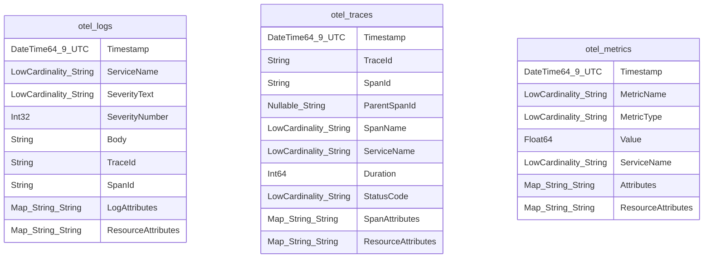
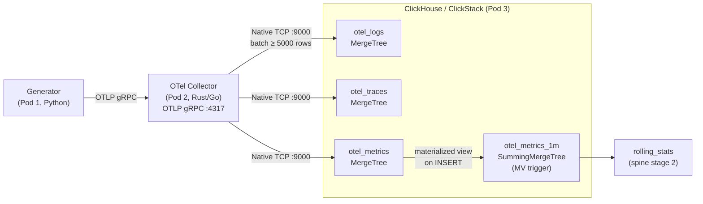

> **MCP Validated:** 2026-06-01
> Sources: ClickHouse official docs (clickhouse.com/docs), ClickStack observability guide, Pod 1 contract (`contract/clickhouse_schema.yaml`, `src/otelgen/exporters/clickhouse.py`).

# ClickHouse / ClickStack for Sentinel

ClickHouse is Sentinel's **hot storage tier** — the destination for all OTel signals flowing through the spine. Pod 3 owns the production ClickStack deployment; Pod 2 (the OTel Collector) writes to it.

---

## Why ClickHouse for OTel telemetry

ClickHouse is a column-oriented OLAP database designed for high-ingestion append workloads and sub-second analytical queries over billions of rows — exactly the profile of telemetry data.

| Property | ClickHouse behavior | Why it matters for Sentinel |
|---|---|---|
| Columnar storage | Each column stored separately, compressed independently | Queries that scan `ServiceName` + `Timestamp` touch a tiny fraction of disk |
| Ingestion throughput | 1-10M rows/sec on modest hardware (LZ4 on by default) | Collector can batch-flush without back-pressure under normal load |
| Sub-second aggregations | Vectorized execution, SIMD, skip indexes | `rolling_stats` stage computes z-scores in real time |
| Materialized views | Incremental, trigger on INSERT | Downsampling for `rolling_stats` without a separate job |
| TTL on partition column | Native, per-table, async compaction | Retention policy needs zero application code |
| `LowCardinality(String)` | Dictionary-encoded strings, ~10x storage reduction | `ServiceName`, `SeverityText`, `StatusCode` are perfect candidates |

**Direct Generator → ClickHouse is REJECTED** (Phase 1 architecture decision, Sync 02 2026-05-26). All writes go through the OTel Collector at `:4317` via OTLP gRPC.

---

## ClickStack

**ClickStack = ClickHouse + the schema, ingestion config, and retention policy** that Pod 3 will own and deploy. From ClickHouse's observability guide, ClickStack refers to the opinionated setup for storing OTel signals in ClickHouse using canonical table names and column conventions.

Key ClickStack conventions Sentinel follows:

- Table names: `otel_logs`, `otel_traces`, `otel_metrics`
- Primary engine: `MergeTree` family (specifically `ReplacingMergeTree` for idempotent re-delivery is optional; plain `MergeTree` is the default start)
- Partitioning: `PARTITION BY toDate(Timestamp)`
- Primary sort key (ORDER BY): `(ServiceName, Timestamp, TraceId)` — supports both per-service time-range scans and trace assembly

Pod 2's exporter **must target these table names**. Any deviation breaks the `rolling_stats` materialized views that Pod 3 will register.

---

## Native protocol vs HTTP — Pod 2 guidance

ClickHouse exposes two wire protocols:

| Protocol | Port | Format | Use when |
|---|---|---|---|
| **Native (TCP, binary)** | `9000` | ClickHouse binary blocks | High-throughput Collector exporter — **prefer this** |
| HTTP | `8123` | RowBinary, JSON, CSV | Dashboards, ad-hoc queries, health checks |

Pod 2 should use the **Native protocol** for the Collector exporter:

- Native transmits pre-serialized column blocks; HTTP adds JSON encoding overhead.
- The `clickhouse-connect` Python client (used by Pod 1's dev-only exporter) defaults to HTTP. The Rust/Go Collector exporter should use a native client library.
- In Rust: `clickhouse-rs` (pure Rust, async). In Go: `clickhouse-go` with `native://` DSN.

The HTTP interface remains useful for readiness probes (`GET /?query=SELECT+1`) and local debug queries.

> **Correction 2026-06-01 · Confidence 0.95 (verified locally, Pod 2 Day-3)**
> Two *different* Rust crates are easy to confuse — and Pod 2's scaffold pins
> the HTTP one, not the native one:
>
> | Crate | Transport | Port | Notes |
> |---|---|---|---|
> | **`clickhouse`** (ClickHouse-official) | **HTTP**, binary RowBinary body | **8123** | What `services/collector-rust/Cargo.toml` actually pins (`0.13`). Despite the name, it does **not** speak native TCP. |
> | `clickhouse-rs` (third-party) | Native TCP | 9000 | The crate this section originally recommended; **not** what we use. |
>
> So the current Pod 2 exporter URL is `http://localhost:8123`, RowBinary over
> HTTP — not the native `:9000` path. RowBinary keeps the payload compact, so
> the "HTTP adds JSON overhead" caveat above does **not** apply to the
> `clickhouse` crate (it's binary, just over HTTP). Revisit the native-vs-HTTP
> throughput question with a real bake-off before assuming `:9000` is required.

---

## OTel storage schema

### Per-signal table layout



### DDL stubs (abridged — authoritative version in Pod 3)

```sql
CREATE TABLE otel_logs
(
    Timestamp        DateTime64(9, 'UTC'),
    ServiceName      LowCardinality(String),
    SeverityText     LowCardinality(String),
    SeverityNumber   Int32,
    Body             String,
    TraceId          String,
    SpanId           String,
    LogAttributes    Map(String, String),
    ResourceAttributes Map(String, String)
)
ENGINE = MergeTree
PARTITION BY toDate(Timestamp)
ORDER BY (ServiceName, Timestamp, TraceId)
TTL toDate(Timestamp) + INTERVAL 30 DAY;

CREATE TABLE otel_traces
(
    Timestamp        DateTime64(9, 'UTC'),
    TraceId          String,
    SpanId           String,
    ParentSpanId     Nullable(String),
    SpanName         LowCardinality(String),
    ServiceName      LowCardinality(String),
    Duration         Int64,
    StatusCode       LowCardinality(String),
    SpanAttributes   Map(String, String),
    ResourceAttributes Map(String, String)
)
ENGINE = MergeTree
PARTITION BY toDate(Timestamp)
ORDER BY (ServiceName, Timestamp, TraceId)
TTL toDate(Timestamp) + INTERVAL 30 DAY;

CREATE TABLE otel_metrics
(
    Timestamp        DateTime64(9, 'UTC'),
    MetricName       LowCardinality(String),
    MetricType       LowCardinality(String),
    Value            Float64,
    ServiceName      LowCardinality(String),
    Attributes       Map(String, String),
    ResourceAttributes Map(String, String)
)
ENGINE = MergeTree
PARTITION BY toDate(Timestamp)
ORDER BY (ServiceName, MetricName, Timestamp)
TTL toDate(Timestamp) + INTERVAL 30 DAY;
```

### Relationship to Pod 1's dev-only stub

`contract/clickhouse_schema.yaml` (branch `001-otel-data-generator`, version `1.0.0`) is a **local-testing stub only**. It maps canonical field names to ClickHouse column names for the generator's direct-insert exporter (`src/otelgen/exporters/clickhouse.py`). This path is rejected for production. Pod 2 must not derive its production schema from this file — treat it as a reference for field naming alignment, not the authoritative DDL.

---

## Partitioning and ordering

```text
PARTITION BY toDate(Timestamp)
  - One partition per calendar day
  - TTL operates at partition granularity (efficient bulk-drop)
  - Queries filtered by date range skip whole partitions

ORDER BY (ServiceName, Timestamp, TraceId)
  - Primary index: service-scoped time-range scans are the dominant query pattern
  - TraceId last: trace assembly (GROUP BY TraceId) benefits from locality
  - Avoid high-cardinality first in ORDER BY — ServiceName is LowCardinality
```

For `otel_metrics`, ordering by `(ServiceName, MetricName, Timestamp)` is preferable because the dominant query is "give me the last N minutes of metric X for service Y".

---

## Materialized views for rolling_stats

The `rolling_stats` spine stage needs pre-aggregated statistics (mean, stddev per service per metric per 1-minute window) without scanning the full `otel_metrics` table on every detection cycle.

```sql
-- Summary table: 1-minute buckets for metric values
CREATE TABLE otel_metrics_1m
(
    window_start  DateTime,
    ServiceName   LowCardinality(String),
    MetricName    LowCardinality(String),
    count         SimpleAggregateFunction(sum, UInt64),
    sum_val       SimpleAggregateFunction(sum, Float64),    -- mean = sum_val/count
    sum_sq        SimpleAggregateFunction(sum, Float64),    -- stddev: sqrt(sum_sq/n - (sum/n)^2)
    min_val       SimpleAggregateFunction(min, Float64),
    max_val       SimpleAggregateFunction(max, Float64)
)
ENGINE = AggregatingMergeTree
PARTITION BY toDate(window_start)
ORDER BY (ServiceName, MetricName, window_start);

-- Materialized view: triggers on every INSERT into otel_metrics
CREATE MATERIALIZED VIEW otel_metrics_1m_mv
TO otel_metrics_1m
AS
SELECT
    toStartOfMinute(Timestamp)  AS window_start,
    ServiceName,
    MetricName,
    count()                     AS count,
    sum(Value)                  AS sum_val,
    sum(Value * Value)          AS sum_sq,
    min(Value)                  AS min_val,
    max(Value)                  AS max_val
FROM otel_metrics
GROUP BY window_start, ServiceName, MetricName;
```

The `rolling_stats` agent reads from `otel_metrics_1m`, not the raw table. This keeps detection latency under 1s even at high ingest rates.

> **Corrected 2026-06-01 · Confidence 0.97 (verified live on ClickHouse 25.4, Pod 2 Day-3)**
> This table **must not be `SummingMergeTree`** — that engine sums *every*
> non-key numeric column on merge, which silently corrupts `min_val`/`max_val`
> (two parts holding `min=10` and `min=100` would merge to `min=110`, proven in
> testing). Use **`AggregatingMergeTree` + `SimpleAggregateFunction(<fn>, T)`**
> so each column declares its own merge combinator (`sum` for count/sum_val/
> sum_sq, `min`/`max` for the extremes). `SimpleAggregateFunction` stores the
> plain value (not an opaque `-State` blob), so reads are ordinary columns —
> **but parts may be unmerged, so the reader MUST re-aggregate with the same
> function in a `GROUP BY`** (or use `FINAL`):
>
> ```sql
> SELECT ServiceName, MetricName, window_start,
>        sum(count) AS n, sum(sum_val) AS total,
>        min(min_val) AS lo, max(max_val) AS hi
> FROM otel_metrics_1m
> GROUP BY ServiceName, MetricName, window_start;
> ```
>
> Reading `min_val` directly (without `min(...)`) can return a per-part partial,
> not the true window min. See `infra/clickhouse/ddl/003_otel_metrics.sql`.

An equivalent `otel_traces_1m` view (keyed on `ServiceName`, `SpanName`, bucketed duration p50/p95 via `quantileMerge`) supports the Latency watcher (W05).

---

## Retention: TTL policy

TTL is declared on the partition column (`Timestamp`) as shown in the DDL stubs above. Key properties:

- `TTL toDate(Timestamp) + INTERVAL 30 DAY` — partitions older than 30 days are dropped asynchronously by ClickHouse's background merge scheduler.
- Interval is configurable per table. Hot telemetry (logs, traces) may use 7 days; metrics summary tables may keep 90 days.
- **TTL does not fire immediately** on the expiry date; it fires during the next background merge. Force with `OPTIMIZE TABLE otel_logs FINAL` (avoid in production — expensive).
- Tiered storage (S3 → local NVMe) can be added later via `STORAGE POLICY` without schema changes.

> **Gotcha 2026-06-01 · Confidence 0.97 (verified live on ClickHouse 25.4, Pod 2 Day-3)**
> TTL is evaluated against **event time** (the `Timestamp` column), not ingest
> time. So replaying an **old-dated fixture** is purged on the first merge:
> inserting Pod 1's golden file (timestamped `2023-11-14`) under a 30/90-day TTL
> makes `count()` return the right number immediately, then **drop to 0** after
> any background merge or `OPTIMIZE`. This bit Day-3 schema verification.
> Mitigation for tests that replay aged fixtures: shift the fixture timestamps
> to ~now in the replay harness (closest to production, where OTLP arrives in
> real time), or strip TTL in the test-only schema variant
> (`ALTER TABLE … MODIFY TTL … + INTERVAL 100 YEAR`). Do **not** weaken the
> production TTL to accommodate aged test data.

---

## Common gotchas

| Gotcha | Detail |
|---|---|
| **Nullable columns are slower** | `Nullable(T)` adds a null-bitmap column internally; avoid unless semantically required. Use empty string `''` for optional `String`, `-1` for optional integers, or a sentinel value. Pod 2 stores `TraceId`/`SpanId`/`ParentSpanId` as `''`-when-absent (**not** `Nullable`) per [ADR-0006](../../../../docs/adr/0006-optional-id-representation.md) — a present ID is validated 32/16-hex upstream, so `''` can never collide with a real value. |
| **`Map` ↔ `Vec<(K,V)>` in the `clickhouse` Rust crate** | The `clickhouse` 0.13 crate does **not** serialize `HashMap<K,V>` into a `Map(String,String)` column — the `Row` struct field must be `Vec<(String, String)>`. Convert with `map.into_iter().collect::<Vec<_>>()`; pre-sort if deterministic output matters. *(verified 2026-06-01)* |
| **`DateTime64(9)` serde path** | For a `DateTime64(9,'UTC')` column with the crate's `"time"` feature, annotate the `Row` field `#[serde(with = "clickhouse::serde::time::datetime64::nanos")]` over a `time::OffsetDateTime`. Build it from `i64` nanos via `OffsetDateTime::from_unix_timestamp_nanos(nanos as i128)` — note the **`i128`** arg. *(verified 2026-06-01)* |
| **Map vs JSONString** | `Map(String, String)` is the right type for `LogAttributes` / `SpanAttributes` — structured key lookup, not full-text scan. `JSONString` (plain `String` with JSON blob) is faster to ingest but forces client-side parsing. Never use `JSONString` for fields the detection engine will filter on. |
| **LZ4 on by default** | ClickHouse compresses all columns with LZ4 by default. No action needed, but know that ZSTD (`CODEC(ZSTD(1))`) gives better ratios at moderate CPU cost for `Body` (log message text). Benchmark before changing. |
| **INSERT batching** | Small inserts (< 1000 rows) create many small parts, triggering excessive merges. The Collector exporter must batch to at least 5000 rows or 1s flush intervals (aligns with Pod 1's `batch_size: 5000` in `clickhouse_schema.yaml`). |
| **DateTime64 precision** | `DateTime64(9, 'UTC')` stores nanosecond-precision Unix timestamps. Do not store as `UInt64` (loses timezone metadata) and do not truncate to seconds (loses sub-second resolution for latency detection). |
| **LowCardinality limit** | `LowCardinality(String)` works best with < 10,000 distinct values in the dictionary. `ServiceName`, `SeverityText`, `StatusCode`, `MetricName` are safe. `TraceId` and `SpanId` must remain plain `String`. |
| **Ordering key is immutable** | `ORDER BY` cannot be changed after table creation without a full table rebuild. Choose carefully before Pod 3 ships the first migration. |

---

## Quick-reference: inspect and debug

### Verify recent ingestion

```sql
-- Last 100 log lines
SELECT Timestamp, ServiceName, SeverityText, Body
FROM otel_logs
WHERE Timestamp >= now() - INTERVAL 5 MINUTE
ORDER BY Timestamp DESC
LIMIT 100;

-- Row counts per signal type, last hour
SELECT 'logs'    AS signal, count() FROM otel_logs    WHERE Timestamp >= now() - INTERVAL 1 HOUR
UNION ALL
SELECT 'traces'  AS signal, count() FROM otel_traces  WHERE Timestamp >= now() - INTERVAL 1 HOUR
UNION ALL
SELECT 'metrics' AS signal, count() FROM otel_metrics WHERE Timestamp >= now() - INTERVAL 1 HOUR;
```

### Latency p95 per service (last 15 minutes)

```sql
SELECT
    ServiceName,
    SpanName,
    count()                                        AS span_count,
    round(quantile(0.50)(Duration) / 1e6, 2)      AS p50_ms,
    round(quantile(0.95)(Duration) / 1e6, 2)      AS p95_ms,
    round(quantile(0.99)(Duration) / 1e6, 2)      AS p99_ms
FROM otel_traces
WHERE
    Timestamp >= now() - INTERVAL 15 MINUTE
    AND StatusCode = 'OK'
GROUP BY ServiceName, SpanName
ORDER BY p95_ms DESC
LIMIT 20;
```

`Duration` is stored as `Int64` nanoseconds (derived from `end_unix_nano - start_unix_nano` in Pod 1's exporter). Divide by `1e6` for milliseconds.

### Check partition sizes and TTL candidates

```sql
SELECT
    partition,
    round(sum(bytes_on_disk) / 1048576, 1) AS size_mb,
    sum(rows)                               AS rows,
    min(min_time)                           AS oldest_row
FROM system.parts
WHERE table IN ('otel_logs', 'otel_traces', 'otel_metrics')
  AND active = 1
GROUP BY partition
ORDER BY partition DESC
LIMIT 30;
```

### Force merge (dev/test only — never production)

```sql
OPTIMIZE TABLE otel_logs FINAL;
```

---

## Signal-to-table flow



---

## See also

- `.claude/CLAUDE.md` — Sentinel architecture overview, Pod assignments, spine definition
- `.claude/docs/CREW_B_GLOSSARY.md` — terminology (ClickStack, Watcher, spine stages)
- `kb/telemetry/otel-collector/` — Collector architecture; Pod 2's receiver/processor/exporter pipeline
- `kb/telemetry/opentelemetry/` — OTel signal types (logs/traces/metrics), OTLP wire format
- `kb/detection/anomaly-detection/` — rolling_stats and z-score detection that consumes `otel_metrics_1m`
- `contract/clickhouse_schema.yaml` (branch `001-otel-data-generator`) — Pod 1's dev-only field mapping; canonical column type list in `src/otelgen/exporters/clickhouse.py:_COLUMN_TYPES`
- `docs/adr/` — ADR-0004 (Collector language bake-off); future ADR for ClickHouse schema finalization
- ClickHouse docs: <https://clickhouse.com/docs/>
- ClickStack observability guide: <https://clickhouse.com/docs/observability>
