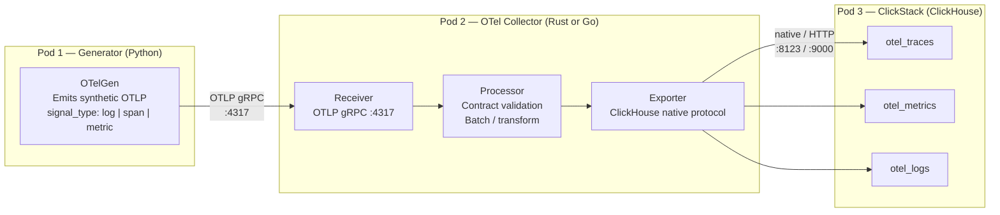

> **MCP Validated:** 2026-06-01
> Source: https://opentelemetry.io/docs/ — Pod 1 contract v1.0.0 (branch `001-otel-data-generator`)

# OpenTelemetry — Core Concepts + OTLP

OpenTelemetry (OTel) is a vendor-neutral, CNCF-graduated framework for collecting and exporting telemetry (traces, metrics, logs) from any application. Sentinel uses OTLP gRPC on `:4317` as the exclusive wire protocol between the Generator (Pod 1) and the OTel Collector (Pod 2).

---

## Signal Flow (Sentinel Architecture)



Transport decision: gRPC over HTTP because Sentinel targets high-volume synthetic pipelines where binary framing and multiplexing matter. HTTP/4318 is available as a fallback for debugging.

---

## The Three Signals

### Traces (spans)

A trace is a directed acyclic graph of **spans** representing one logical operation across services.

| Field | Type | Notes |
|---|---|---|
| `trace_id` | 128-bit hex (32 chars) | Shared by every span in a trace |
| `span_id` | 64-bit hex (16 chars) | Unique per span |
| `parent_span_id` | 64-bit hex or null | Absent on the root span |
| `name` | string | Human-readable operation name |
| `start_unix_nano` / `end_unix_nano` | uint64 | Wall-clock nanoseconds |
| `status_code` | `OK` \| `ERROR` | Pod 1 contract enum |
| `attributes` | `map<string, string>` | Span-level key-values |

**Use when:** measuring duration, tracking request fan-out, correlating errors to specific operations.

Pod 1 contract fields for `signal_type = "span"`:
```json
{
  "signal_type": "span",
  "trace_id": "4bf92f3577b34da6a3ce929d0e0e4736",
  "span_id": "00f067aa0ba902b7",
  "parent_span_id": null,
  "name": "ingest.batch",
  "start_unix_nano": 1717200000000000000,
  "end_unix_nano":   1717200001500000000,
  "status_code": "OK"
}
```

### Metrics

A metric is a numerical measurement sampled at runtime and aggregated over time.

| Instrument | Aggregation | Sentinel use case |
|---|---|---|
| `gauge` | Last value | Queue depth, active connections |
| `sum` | Cumulative sum | Records processed, bytes received |
| Histogram (not in v1 contract) | Buckets | Latency distributions (future) |

Pod 1 v1.0.0 only emits `gauge` and `sum` types. Histograms are deferred.

**Use when:** tracking rates, saturation, error ratios — the RED / USE method signals.

### Logs

A log record is a timestamped, severity-coded event with an optional free-text body and structured attributes.

| Field | Type | Notes |
|---|---|---|
| `time_unix_nano` | uint64 | Nanosecond epoch |
| `severity_text` | string | e.g., `INFO`, `ERROR` |
| `severity_number` | int | OTel numeric scale (1–24) |
| `body` | string | Free-text message |
| `trace_id` / `span_id` | string or null | Correlation fields |

**Use when:** capturing discrete events, errors, state transitions — especially when the event body is unstructured or context-heavy.

Correlation note: Pod 1 emits `trace_id` and `span_id` on log records that were produced inside an active span. This enables cross-signal correlation in ClickHouse (`JOIN` on `TraceId`).

---

## OTLP Wire Format

OTLP is the canonical protobuf-defined transport for all three signals.

| Transport | Port | Encoding | When to use |
|---|---|---|---|
| gRPC | **:4317** | Protobuf (binary) | Production — Sentinel standard |
| HTTP | :4318 | Protobuf or JSON | Debugging, proxied environments |

### Protobuf service requests Sentinel cares about

| Signal | Protobuf type | Package |
|---|---|---|
| Traces | `ExportTraceServiceRequest` | `opentelemetry.proto.collector.trace.v1` |
| Metrics | `ExportMetricsServiceRequest` | `opentelemetry.proto.collector.metrics.v1` |
| Logs | `ExportLogsServiceRequest` | `opentelemetry.proto.collector.logs.v1` |

Each request wraps a `ResourceSpans` / `ResourceMetrics` / `ResourceLogs` — a three-level envelope: **Resource → Scope → Signal**. See "Attribute Levels" below.

In the Rust Collector (Cargo dependency):
```toml
opentelemetry-proto = { version = "0.27", features = ["gen-tonic", "trace", "metrics", "logs"] }
```
`gen-tonic` generates tonic gRPC service stubs from the `.proto` files directly.

---

## Attribute Levels

OTel distinguishes three levels of key-value pairs on every exported batch:

| Level | Scope | Examples | Populated by |
|---|---|---|---|
| **Resource attributes** | The emitting process/service | `service.name`, `cloud.provider`, `sentinel.synthetic` | SDK / Generator config |
| **Scope (instrumentation) attributes** | A library or subsystem within the service | `otelgen.version`, `scope.name` | SDK instrumentation scope |
| **Signal attributes** | A single span / metric point / log record | `span.name`, `http.status_code`, `error.type` | Application code |

Pod 1 contract requires these **resource attributes** on every signal:

```
sentinel.synthetic   = "true"
sentinel.scenario    = "<scenario-name>"
sentinel.run_id      = "<uuid>"
cloud.provider       = "gcp"       (or other)
service.name         = "<svc>"
```

Resource attributes survive the Collector untouched and land in ClickHouse as indexed columns — never omit them.

---

## Semantic Conventions

OTel defines standard attribute names so tooling (dashboards, alerts, samplers) can rely on well-known keys.

Reference: https://opentelemetry.io/docs/specs/semconv/

Key namespaces Sentinel uses or will use:

| Namespace | Example keys | Signal context |
|---|---|---|
| `service.*` | `service.name`, `service.version` | Resource |
| `cloud.*` | `cloud.provider`, `cloud.region` | Resource |
| `db.*` | `db.system`, `db.statement` | Span attributes |
| `messaging.*` | `messaging.system`, `messaging.destination` | Span attributes |
| `error.*` | `error.type` | Span / log attributes |
| `sentinel.*` | `sentinel.synthetic`, `sentinel.scenario`, `sentinel.run_id` | Resource (Sentinel extension) |

`sentinel.*` keys are Sentinel's own extension namespace — not in the official spec, but follow the same dot-separated, lowercase convention.

---

## OTel SDK vs OTel Collector

| | OTel SDK | OTel Collector |
|---|---|---|
| What it is | Language library (Python, Go, Rust, Java, …) | Standalone process (binary or container) |
| Role | Instruments application code, exports OTLP | Receives, processes, and re-exports OTLP |
| Where it runs | Inside the application process | As a sidecar, agent, or gateway |
| Sentinel usage | Pod 1's Generator uses the Python SDK | Pod 2 builds (or configures) a custom Collector |
| Why custom Collector | Standard contrib Collector lacks the Sentinel contract-validation processor and the ClickHouse exporter in the exact config Sentinel needs | — |

The Collector is structured as a pipeline of three component types:

```
Receiver (accepts OTLP gRPC :4317)
  → Processor (batch, validate Sentinel contract, enrich)
    → Exporter (ClickHouse native)
```

Pod 2's bake-off (ADR-0004) evaluates Rust (`tonic` + `opentelemetry-proto`) vs Go (`otelcol-builder`) for the Collector implementation.

---

## Signal → ClickHouse Table Mapping

Pod 1's `signal_type` discriminator maps directly to ClickHouse tables:

| `signal_type` | ClickHouse table | Primary sort key |
|---|---|---|
| `"span"` | `otel_traces` | `(ServiceName, SpanId, toDate(Timestamp))` |
| `"metric"` | `otel_metrics` | `(MetricName, toDate(TimeUnix))` |
| `"log"` | `otel_logs` | `(ServiceName, SeverityNumber, toDate(Timestamp))` |

The OTel Collector's ClickHouse exporter performs this routing based on the signal type of each `ResourceSpans` / `ResourceMetrics` / `ResourceLogs` batch it receives. The Collector never merges signal types into a single table.

---

## Watcher → Signal Type Reference

Each Watcher consumes a specific signal type. The Collector must route correctly or a Watcher will see empty inputs.

| Watcher | ID | Primary signal | Secondary signal | Routing note |
|---|---|---|---|---|
| Arrival | W01 | `log` | — | Detects missing / late records by log timestamp |
| Parse | W02 | `log` | `span` (on error) | Validates body parse success; errors produce spans |
| Volume | W03 | `metric` | — | Tracks `sum` instrument on record count |
| Schema | W04 | `log` | `span` | Log body carries field violations; span tracks call |
| Latency | W05 | `span` | `metric` (histogram, future) | Span `end - start` is the latency signal |
| Storage | W06 | `metric` | `log` | Gauge on disk / partition usage |

Conjectural note: W01–W06 assignments above are derived from the 8-stage spine and Sync 02 design discussion. Formal contracts per Watcher are owed as ADRs.

---

## Quick-Reference: OTel Ports and Env Vars

| Variable | Value | Purpose |
|---|---|---|
| `OTEL_EXPORTER_OTLP_ENDPOINT` | `http://collector:4317` | SDK export target (gRPC) |
| `OTEL_EXPORTER_OTLP_PROTOCOL` | `grpc` | Force gRPC (default varies by SDK) |
| `OTEL_SERVICE_NAME` | `sentinel-generator` | Sets `service.name` resource attr |
| `OTEL_RESOURCE_ATTRIBUTES` | `sentinel.synthetic=true,...` | Injects resource attrs via env |

Generator (Pod 1) sets these in its Docker environment. Collector binds `0.0.0.0:4317` to receive.

---

## See also

- `.claude/CLAUDE.md` — Sentinel project context, architecture spine, terminology guardrails
- `kb/telemetry/otel-collector/` — Collector architecture: receiver/processor/exporter deep-dive, Pod 2 design
- `kb/storage/clickhouse/` — ClickHouse OTel schema, table engines, ingestion config
- `kb/contracts/` — Pydantic + Protobuf contract validation, versioning policy
- `kb/languages/rust/` — Tokio, tonic, async patterns for the Rust Collector
- `kb/languages/go/` — Go Collector internals, `otelcol-builder` patterns
- `docs/adr/` — ADR-0004 (Collector language bake-off), ADR-001 (blast radius), ADR-002 (baseline)
- Pod 1 contract: branch `001-otel-data-generator` at `contract/schema/otlp_output.schema.json` (v1.0.0)
- Official spec: https://opentelemetry.io/docs/specs/otel/
- Semantic conventions: https://opentelemetry.io/docs/specs/semconv/
