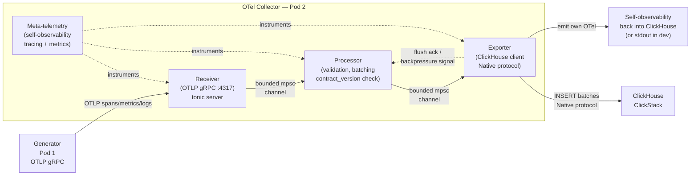

> **MCP Validated:** 2026-06-01

# OTel Collector Architecture

Pod 2's component. Sits between the Generator and ClickHouse in the Phase 1 data flow. Owns the canonical ingestion path: direct Generator → ClickHouse writes were explicitly rejected at Sync 02 (D6), making the Collector the sole swap point when synthetic telemetry is later replaced by real cloud connections.

```text
Generator ──OTLP gRPC──▶ OTel Collector :4317 ──▶ ClickHouse
                         (Pod 2 owns this)
```

**Astronautas:** Alex Botelho · Victor Urquiola · Ruan Pomponet.

**Language:** Undecided — Rust vs Go bake-off in progress. See [ADR-0004](../../../docs/adr/0004-collector-implementation-language.md).

---

## What the Upstream OTel Collector Is

The upstream [OpenTelemetry Collector](https://github.com/open-telemetry/opentelemetry-collector) is a **configurable pipeline binary** written in Go. It has three pipeline stages:

| Stage | Role |
|---|---|
| **Receiver** | Accepts telemetry over a protocol (OTLP gRPC, Jaeger, Prometheus scrape, etc.). Converts the wire format into the internal pdata representation. |
| **Processor** | Transforms, filters, batches, or enriches pdata in-flight. Examples: batch, memory_limiter, attributes, resource, span. |
| **Exporter** | Writes pdata to a backend (Prometheus, Jaeger, OTLP, ClickHouse, stdout). |

Pipelines are declared in `config.yaml`; multiple pipelines can share receivers and exporters.

**Why Sentinel is not using the upstream binary:** the upstream OTel Collector works by configuration, not code. Sentinel needs **contract validation at the boundary** (Sync 02 D8), sentinel-specific resource attribute enforcement (`sentinel.synthetic`, `sentinel.scenario`, `sentinel.run_id`), and a ClickHouse exporter shaped for Sentinel's schema — none of which are drop-in config. Building custom means we control the contract surface and can add meta-telemetry natively.

---

## Sentinel's Custom Collector

### Pipeline Anatomy



### Stage-by-Stage Responsibilities

#### Receiver (OTLP gRPC server)

- Binds `0.0.0.0:4317` (OTLP standard).
- Implements `TraceServiceServer`, `MetricsServiceServer`, `LogsServiceServer` (protobuf-generated, from `opentelemetry-proto`).
- **Rust:** `tonic::transport::Server` + generated gRPC stubs. **Go:** `otelcol-contrib` receiver framework.
- Converts incoming OTLP payloads into internal event structs.
- Sends to the Processor via a **bounded mpsc channel** (see Backpressure model below).
- Contract fast-fail: if `contract_version` is absent or unparseable → reject with `INVALID_ARGUMENT` gRPC status immediately (fails closed — see Contract Validation section).

#### Processor (validation + batching)

- Validates the full `otlp_output.schema.json` contract (Pod 1's spec at `contract/schema/otlp_output.schema.json` on `001-otel-data-generator`).
- Enforces required Sentinel resource attributes: `sentinel.synthetic`, `sentinel.scenario`, `sentinel.run_id`.
- Accumulates events into a batch (configurable: max 1 000 events or 500 ms flush interval — whichever fires first).
- On invalid events: emit a structured validation error to the meta-telemetry stream, then **drop** (not forward to ClickHouse).
- Exposes current batch size and channel depth as OTel metrics (visible to Sentinel itself).

#### Exporter (ClickHouse client)

- Writes batches to ClickHouse using the **Native protocol** (not HTTP) for throughput.
- **Rust:** `clickhouse` crate (v0.13, lz4 compression). **Go:** `clickhouse-go` (mature, production-grade).
- Async, connection-pooled.
- On ClickHouse write failure: retry with exponential backoff (max 3 attempts), then drop with a logged error and increment a `collector.export.failed` counter.
- Sends a backpressure signal back to the Processor channel when the ClickHouse write queue exceeds a high-water mark.

---

## Backpressure Model

The Collector uses **bounded mpsc (multi-producer, single-consumer) channels** between every stage. The bound is the primary backpressure mechanism.

```text
Receiver ──[chan, cap=N]──▶ Processor ──[chan, cap=M]──▶ Exporter
```

When ClickHouse is slow:

1. The Exporter's write loop blocks (awaiting insert ACK or timeout).
2. The Processor's send to the Exporter channel blocks when the channel is full (`M` events queued).
3. The Processor stops draining the Receiver channel.
4. The Receiver's channel fills to `N`. The gRPC handler returns `RESOURCE_EXHAUSTED` to the Generator.
5. **The Generator is responsible for back-off** — it receives the gRPC error and should retry with exponential back-off.

This is fail-loud: no silent drops, no unbounded memory growth. The Generator is signalled immediately.

**Configuration knobs (env vars at launch):**
- `COLLECTOR_RECV_CHAN_CAP` — Receiver → Processor channel capacity (default: 10 000)
- `COLLECTOR_EXPORT_CHAN_CAP` — Processor → Exporter channel capacity (default: 1 000)
- `COLLECTOR_BATCH_MAX_EVENTS` — max events per ClickHouse INSERT batch (default: 1 000)
- `COLLECTOR_BATCH_FLUSH_MS` — max time before a partial batch is flushed (default: 500)

These values are not tuned yet — the bake-off harness (ADR-0006, pending) will establish baselines on the shared 8 GB VM.

---

## Contract Validation at the Boundary

Per **Sync 02 D8**: contract validation happens at the Collector boundary, not at the Generator. The Generator is trusted to emit valid OTLP; the Collector enforces the Sentinel-specific layer on top.

### What is validated

| Field | Validation rule | On failure |
|---|---|---|
| `contract_version` | Present, semver, compatible with Collector's accepted range | **Fail closed** — `INVALID_ARGUMENT` gRPC error returned; event not ingested |
| `signal_type` | One of `log`, `span`, `metric` (Pod 1 discriminant) | **Fail closed** |
| `sentinel.synthetic` (resource attr) | Present, boolean-string | **Fail closed** |
| `sentinel.scenario` (resource attr) | Present, non-empty string | **Fail closed** |
| `sentinel.run_id` (resource attr) | Present, UUID-format | **Fail closed** |
| Extra unknown fields | Tolerated (forward-compatible) | **Fail open** — log warning, ingest |
| ClickHouse write timeout | Non-contract failure | **Fail open** — retry + counter, not a rejection |

**Fail closed** = the event is rejected at ingestion. The Generator receives a gRPC error. Nothing enters ClickHouse.

**Fail open** = the event is ingested despite the anomaly. A structured warning is emitted to the meta-telemetry stream.

The separation matters: fail-closed errors are Producer-side bugs (fix the Generator); fail-open warnings are Collector-side observability signals (watch the meta-telemetry).

### Reference schema

Pod 1's contract lives at `contract/schema/otlp_output.schema.json` on the `001-otel-data-generator` branch. Version: `1.0.0`. The golden dataset baseline is `baseline_seed42.jsonl`. The Collector must accept everything in that dataset.

---

## Meta-Telemetry: Sentinel Watching Sentinel

The Collector emits its own OTel signals so Sentinel's Watcher fleet can detect anomalies in the Collector itself. This is not optional — Sentinel's core mission (no downstream user finds the bug first) applies to the Collector too.

### Signals emitted

| Signal | Type | Description |
|---|---|---|
| `collector.recv.events_received` | Counter | Total events received on :4317 |
| `collector.recv.events_rejected` | Counter (+ reason attr) | Events rejected at validation |
| `collector.proc.batch_size` | Histogram | Events per ClickHouse INSERT |
| `collector.proc.channel_depth` | Gauge | Current Processor queue depth |
| `collector.export.events_exported` | Counter | Events successfully written to ClickHouse |
| `collector.export.failed` | Counter | ClickHouse write failures (after retries) |
| `collector.export.latency_ms` | Histogram | End-to-end OTLP receive → ClickHouse ACK |
| `collector.self.uptime_seconds` | Gauge | Seconds since startup |

In production these go to ClickHouse via the same export path (loopback INSERT). In development / CI they go to stdout as structured JSON.

**Health endpoint:** `GET /healthz` (HTTP, port configurable) returns `200 OK` + `{"status":"up","version":"..."}`. Used by Docker health checks and any orchestration layer.

---

## The Rust vs Go Bake-Off (ADR-0004)

Sync 02 ruled out Python for the Collector (D6: "Python is too slow"). The language is **undecided** between Rust and Go. ADR-0004 makes the case for Rust and proposes a time-boxed bake-off.

### The minimum-viable Collector for the bake-off

Both implementations must pass a single hard gate before the bake-off is valid:

> "Accepts an OTLP gRPC payload on :4317 and writes a single span to ClickHouse."

If neither does by Day 14 of Sprint 1, the decision defaults to Go (lower ramp-up cost).

### High-level trade-off summary

| Criterion | Go | Rust |
|---|---|---|
| Time to first working OTLP receive | Days | 1-2 weeks (ramp-up) |
| p99 latency at saturation | GC tail present | Flat (no GC) |
| RSS at saturation | Higher (~2-3× Rust) | Lower |
| OTel ecosystem coverage | Extensive | Growing (1.0 stable since 2024) |
| ClickHouse client maturity | `clickhouse-go` (mature) | `clickhouse-rs` (solid) |
| Container image size | 15-50 MB | 5-20 MB (scratch) |

**Current state:** `services/collector-rust/` scaffold exists on `feat/rust-otel-collector` (scaffold only — does not yet bind :4317 or write to ClickHouse). A symmetric `services/collector-go/` PR has not been opened yet.

**Decision authority:** ADR-0005 (pending), after the bake-off results. Bake-off target: Sync 04.

For the full trade-off analysis, risk register, and "what changes if Rust wins vs Go wins": see [ADR-0004](../../../docs/adr/0004-collector-implementation-language.md).

---

## Quick Reference: Building a New Receiver / Processor / Exporter

Use this when you need to add a new stage or extend an existing one.

### New Receiver

1. Define the gRPC service interface (Protobuf → `opentelemetry-proto`).
2. Implement the trait/interface that the generated server stub requires.
3. Convert the wire payload to the internal `SentinelEvent` struct.
4. Send to the Processor channel: `recv_tx.send(event).await` — await means you get backpressure for free.
5. Add a `collector.recv.*` OTel counter for every accept / reject branch.
6. Write a unit test that sends a known OTLP payload and asserts the channel receives an expected `SentinelEvent`.

### New Processor

1. Consume from the Receiver channel: `while let Some(event) = recv_rx.recv().await`.
2. Apply validation (use the shared `ContractValidator` struct — do not duplicate schema logic).
3. Accumulate into a batch; flush on size or time trigger.
4. Send batch to the Exporter channel; apply backpressure if the channel is full (await blocks, do not use `try_send` + silent drop).
5. Emit `collector.proc.batch_size` histogram on every flush.
6. Test: feed malformed events and assert they are dropped + rejection counter increments.

### New Exporter

1. Consume a `Batch` from the Processor channel.
2. Serialize to the target wire format (ClickHouse Native, Arrow, JSON-newline — all are available).
3. Write with retry (max 3 attempts, exponential backoff).
4. On final failure: log structured error, increment `collector.export.failed`, do not panic.
5. Signal backpressure: if the write queue is above the high-water mark, pause consuming from the Processor channel (let the channel fill naturally — do not call sleep).
6. Test: mock the ClickHouse client; assert batch size, retry behaviour, and failure counter.

### Shared types (both Rust and Go)

The `SentinelEvent` internal struct is the canonical in-memory representation between stages:

```text
SentinelEvent {
  signal_type:        "log" | "span" | "metric"
  contract_version:   semver string
  sentinel.synthetic: bool
  sentinel.scenario:  string
  sentinel.run_id:    UUID
  payload:            raw OTLP Any
  received_at:        UTC timestamp
}
```

Both language implementations must produce identical ClickHouse rows from the same OTLP input — verified by the bake-off test harness against `baseline_seed42.jsonl`.

---

## File Layout (services/collector-rust/)

```text
services/collector-rust/
├── Cargo.toml         # Crate manifest (deps pinned at workspace level)
├── src/
│   ├── main.rs        # Binary entry — scaffold only (does not yet bind :4317)
│   └── lib.rs         # Library entry (for testability — not yet created)
├── tests/
│   └── e2e_otlp_receive.rs   # Integration test: send OTLP → assert ClickHouse row
├── benches/
│   └── ingest_throughput.rs  # Criterion benchmark (bake-off harness)
└── README.md
```

Build: `just build` or `cargo build` from repo root. See `.claude/docs/RUST_PROJECT_STANDARDS.md` for the full UV-equivalent setup.

---

## See also

- **ADR-0004** — [Collector Implementation Language](../../../docs/adr/0004-collector-implementation-language.md) (Rust vs Go bake-off, full trade-off, decision criteria)
- **services/collector-rust/** — current Rust scaffold on `feat/rust-otel-collector`
- **KB sibling: OTel core** — `.claude/kb/telemetry/opentelemetry/` (OTLP wire protocol, signal types, resource attributes)
- **KB sibling: ClickHouse** — `.claude/kb/storage/clickhouse/` (schema, Native protocol, ClickStack)
- **KB sibling: Rust** — `.claude/kb/languages/rust/` (tokio, tonic, async patterns, error handling)
- **KB sibling: Go** — `.claude/kb/languages/go/` (OTel Collector internals, channels, concurrency)
- **KB sibling: Contracts** — `.claude/kb/contracts/` (Pydantic/Protobuf boundary validation, versioning)
- **CLAUDE.md** — `.claude/CLAUDE.md` (project context, Pod assignments, 8-stage spine, terminology guardrails)
- **Crew B Glossary** — `.claude/docs/CREW_B_GLOSSARY.md` (OTel vs Hotel, Watcher, blast radius)
- **Rust Project Standards** — `.claude/docs/RUST_PROJECT_STANDARDS.md` (Cargo workspace, justfile, CI gate mapping)
- **Upstream OTel Collector (Go)** — <https://github.com/open-telemetry/opentelemetry-collector>
- **opentelemetry-rust (1.0 stable)** — <https://github.com/open-telemetry/opentelemetry-rust>
- **tonic (Rust gRPC)** — <https://github.com/hyperium/tonic>
- **clickhouse-rs** — <https://github.com/suharev7/clickhouse-rs>
