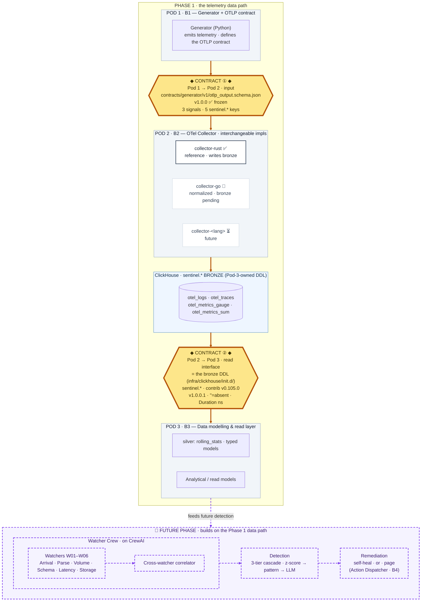

# Sentinel

> **Self-healing data pipelines.** Autonomous detection, AI-native reasoning, OTel-native by design.
> *No downstream user finds the bug before Sentinel does.*

Sentinel is an open-source observability + remediation system for data pipelines, built by **Crew B** of the DataShip Mission 2026 program (Commander: Luan Moreno). This repository is the **integrated polyglot monorepo** — every Pod's component behind clear contracts and ownership boundaries, with a one-command end-to-end pipeline.

---

## 1. System architecture

Telemetry flows top-to-bottom through the Pods. **Phase 1 builds the data path:** Pod 1 *generates* telemetry and defines the OTLP contract, Pod 2 *ingests, validates, transforms, and exports* it, and Pod 3 *consumes* Pod 2's output contract for data modelling (bronze → silver → read models). **Watchers, detection, CrewAI-driven reasoning, and remediation are a future phase** layered on top. Each **gold gate** is a **contract boundary** — a versioned interface owned by the upstream Pod and consumed by the downstream one. Implementations (e.g. Pod 2's collectors) are interchangeable behind their contract.



**Diagram key** — gold gate = contract boundary (versioned; the durable asset) · grey box = Pod / ownership zone · white box = interchangeable implementation · **purple dashed cluster = future phase** · status glyphs: ✅ frozen / agreed · 🔶 in progress · ⏳ pending. The hierarchy is shape- and border-redundant, so it survives grayscale.

**What Pod 2 receives, processes, and delivers:**

| Stage | Detail |
|---|---|
| **Receive** | OTLP gRPC `:4317` (real clients) **or** NDJSON file (Pod 1's generator), both conforming to **`contracts/generator/v1/otlp_output.schema.json` v1.0.0** |
| **Process** | Parse/transform → internal `Signal` (log / span / metric) → typed rows; derive span duration; route metrics by type |
| **Deliver** | Rows in the **bronze** `sentinel.otel_logs` / `otel_traces` / `otel_metrics_gauge` / `otel_metrics_sum`, per the **Pod 2 → Pod 3 read contract**; Pod 3 builds silver (rolling-stats, read models) on top |

---

## 2. The Pods

**Phase 1** builds the telemetry **data path** (Pods 1 → 2 → 3). Watchers, detection, CrewAI reasoning, and remediation are a **future phase**.

| Pod | Crew | Phase 1 role | Status |
|---|---|---|---|
| **Pod 1** | B1 | Telemetry **Generator** + the **OTLP input contract** | Input contract **v1.0.0 frozen** |
| **Pod 2** | B2 | **OTel Collector** — ingest · validate · transform · export | Rust **writes bronze, validated e2e**; Go normalized (bronze pending) |
| **Pod 3** | B3 | **Data modelling** — owns the bronze DDL; builds silver + read models | Bronze landed; silver in progress |
| **Pod 4** | B4 | *(Future)* Action Dispatcher — remediation + paging | Future phase |

**Future phase — detection & remediation.** Watchers (W01–W06: Arrival · Parse · Volume · Schema · Latency · Storage) feed a **3-tier detection cascade** — Statistical (z-score) → Pattern (signature) → LLM — orchestrated with **CrewAI**. *Cheapest tier wins.*

---

## 3. POD 2 — the OTel Collector

Be the **single ingestion gateway** between telemetry producers and storage: receive OTLP (or Pod 1 NDJSON), validate/transform against the input contract, and persist to the **bronze** ClickHouse schema in a shape the detection layer can query in <1s. Nothing reaches storage except through a collector.

Pod 2 ships **multiple collector implementations** (a deliberate bake-off — [ADR-0004](docs/adr/0004-collector-implementation-language.md)). They are **interchangeable**: same input contract in, same bronze schema out.

| Implementation | Language | Owner | Status |
|---|---|---|---|
| [`services/collector-rust/`](services/collector-rust/) | Rust | Victor | ✅ **Reference** — OTLP gRPC + NDJSON → **bronze `sentinel.*`**, Dockerized, CI-green |
| [`services/collector-go/`](services/collector-go/) | Go | Alex | 🔶 Normalized to `default.*`; bronze alignment pending |
| `services/collector-<lang>/` | TBD | B2 | ⏳ Future |

The Rust collector is the **reference**: it defines the behaviour every other implementation must match (the bronze output + the golden conformance fixture). The aligned exporter writes directly into Pod 3's bronze tables — see [ADR-0007](docs/adr/0007-bronze-canonical-contract.md).

---

## 4. Contracts

Contracts are **language-agnostic shared assets** — never duplicated inside an implementation.

| Boundary | Artifact | Version | Status |
|---|---|---|---|
| **Pod 1 → Pod 2** (input) | [`contracts/generator/v1/`](contracts/generator/v1/) (`schema/otlp_output.schema.json` + `golden/`) | **v1.0.0** | ✅ Frozen |
| **Pod 2 → Pod 3** (output) | [`contracts/collector/v1/pod2-pod3-read-contract.md`](contracts/collector/v1/pod2-pod3-read-contract.md) → the **bronze DDL** ([`infra/clickhouse/init.d/01-bronze-otel.sql`](infra/clickhouse/init.d/01-bronze-otel.sql)) | **v1.0.0.1** | ✅ Agreed contract boundary (Pod 3 sign-off pending) |

**Input** — three signal types (`log` / `span` / `metric`), 5 guaranteed `sentinel.*`/`cloud.provider` resource keys, contract-versioned. A golden fixture (`baseline_seed42.jsonl`, 48 logs + 48 spans + 183 metrics) is the conformance oracle.

**Output** — the canonical read schema is Pod 3's **bronze** DDL (`sentinel.*`, otel-collector-contrib v0.105.0). The read contract documents the *semantic* layer on top: the 5 Sentinel keys are carried in `ResourceAttributes`, optional IDs follow the `''`=absent rule, `Duration` is nanoseconds, metrics split into gauge/sum, and the rolling-stats rollup is a Pod 3 **silver** artifact. Full ratification = [ADR-0007](docs/adr/0007-bronze-canonical-contract.md) accepted + Pod 3 sign-off (the round-trip evidence is met).

**Decisions of record** — [`docs/adr/`](docs/adr/): 0004 (language) · ~~0005 (hand-rolled schema)~~ superseded · 0006 (optional-ID, refined) · **0007 (bronze = canonical contract)**.

---

## 5. Repository structure

The monorepo separates **shared** assets (contracts, infra, docs) from **per-component** code; adding a collector, language, or Pod never touches another's directory.

```text
sentinel/
├── README.md                      # ← this file: system entry point
├── Makefile                       # 🔗 one-command UX (COLLECTOR=rust|go switch)
├── docker-compose.yml             # 🔗 root orchestrator (rust|go compose profiles)
│
├── contracts/                     # 🔗 SHARED · contract registry, namespaced by producing Pod
│   ├── generator/v1/                      #   Pod 1 → Pod 2 INPUT contract (SSOT)
│   │   ├── schema/otlp_output.schema.json #     the wire schema (v1.0.0)
│   │   └── golden/baseline_seed42.jsonl   #     conformance fixture (all impls test against this)
│   └── collector/v1/                      #   Pod 2 → Pod 3 READ contract (bronze semantic layer)
│       └── pod2-pod3-read-contract.md     #     v1.0.0.1 · points at the bronze DDL
│
├── infra/                         # 🔗 SHARED · ClickHouse bootstrap
│   ├── clickhouse-init.sql                #   db/users init (dev-only auth)
│   ├── clickhouse-users.d/                #   default-user network override (Rust HTTP path)
│   └── clickhouse/init.d/01-bronze-otel.sql  #   the BRONZE schema (sentinel.*, Pod-3-owned)
│
├── docs/                          # 🔗 SHARED · cross-cutting knowledge
│   ├── adr/                       #   architecture decisions (numbered, Pod-spanning)
│   └── research/ · proposals/     #   design notes, gap analysis, decision proposals
│
├── services/                      # 🧩 PER-COMPONENT · self-contained implementations
│   ├── collector-rust/            #   Pod 2 — Rust (reference). Own Cargo/toolchain/Docker/tests ✅
│   ├── collector-go/              #   Pod 2 — Go (own go.mod/Docker/tests) 🔶
│   └── generator-python/          #   Pod 1 — Python telemetry generator (otelgen)
│
├── .github/workflows/             # per-component CI, path-filtered (rust-ci.yml, …)
└── .claude/                       # Crew B knowledge env (agents · KBs · skills · standards)
```

**The scoping rule:** *language-specific config lives inside the component; cross-cutting config lives at the repo root.* Each component is self-contained; the root `Makefile` only coordinates the end-to-end pipeline.

---

## 6. Quick start — configurable end-to-end

Requires Docker (no host toolchains). Choose the collector with `COLLECTOR` (default `rust`):

```sh
make e2e                  # ClickHouse (bronze auto-applied) + Rust collector + generator → sentinel.*
make e2e COLLECTOR=go     # same, with the Go collector (writes default.* — bronze alignment pending)
```

Step by step, plus inspect:

```sh
make up   COLLECTOR=rust       # start ClickHouse (bronze auto-applies on boot) + the collector
make generate SCENARIO=black_friday SEED=42   # generate → OTLP :4317
make logs COLLECTOR=rust       # tail collector logs
# inspect at http://localhost:8123/play  →  SELECT count() FROM sentinel.otel_traces
make reset                     # stop everything + drop the ClickHouse volume
```

Run `make help` for all targets and the active `COLLECTOR / SCENARIO / SEED / WINDOW`. Per-component dev still works standalone (`cd services/collector-rust && cargo test`).

> Only one collector runs at a time — both bind OTLP `:4317`. The generator targets the network alias `collector`, so it works regardless of which is active.

---

## 7. Ownership & boundaries

- **`main` is protected.** Feature branches `feat/<area>-<short>`; Conventional Commits; signed commits; attribution trailers; squash-merge after 2 approvals (peer + Captain).
- **Per-component CI** is path-filtered so each implementation's gates run independently.
- **Contracts are jointly owned** by the Pods on both sides of a boundary (input = Pod 1 + Pod 2; the bronze read schema = Pod 2 + Pod 3). **Implementations are singly owned.**
- The **bronze DDL is Pod-3-owned** (`create_schema:false`); collectors only `INSERT`.

---

## 8. Current status

**Pod 2 / Rust reference — writes the bronze schema, validated end-to-end.** generator → Rust collector → `sentinel.*` lands **40,200 logs / 40,200 traces / 152,700 metrics** (gauge 83,400 + sum 69,300), lossless; the golden file-mode round-trip yields 48 / 48 / 183.

| Capability | State |
|---|---|
| Parse Pod 1 NDJSON / OTLP gRPC against v1.0.0 contract | ✅ |
| Write directly into Pod 3 **bronze** (`sentinel.*`) | ✅ verified live |
| Metrics routed by type → `otel_metrics_gauge` / `otel_metrics_sum` | ✅ |
| Sentinel metadata carried in `ResourceAttributes` | ✅ |
| gRPC receive-boundary contract validation (`off`/`warn`/`strict`) | ✅ |
| Distroless Docker image + root compose orchestrator | ✅ |
| CI: fmt · clippy · tests · cargo-deny · docker-build | ✅ |
| Go collector → bronze | 🔶 normalized to `default.*`; alignment pending |
| Pod 3 silver (rolling-stats rollup, read models) | 🔶 in progress |

**Remaining:** ADR-0007 acceptance (Pod 3 sign-off); align the Go collector to bronze; Pod 3 silver.

---

## 9. Open questions & decisions

| # | Item | Type | Where |
|---|---|---|---|
| 1 | Collector language bake-off not formally accepted (Rust is the reference) | Open | [ADR-0004](docs/adr/0004-collector-implementation-language.md) |
| 2 | Bronze = canonical Pod 2 → Pod 3 contract (`Proposed`; Pod 3 sign-off pending) | Pending | [ADR-0007](docs/adr/0007-bronze-canonical-contract.md) · [read contract](contracts/collector/v1/pod2-pod3-read-contract.md) |
| 3 | Sentinel keys are `Map` probes under bronze (no typed columns) — materialize in silver? | Open | [ADR-0007 §Trade-offs](docs/adr/0007-bronze-canonical-contract.md) |
| 4 | `otel_metrics_1m` rolling-stats moved to Pod 3 silver (Tier-1 input) | Handoff | [read contract §2.3](contracts/collector/v1/pod2-pod3-read-contract.md) |
| 5 | Histogram / Summary metrics not emitted (no v1.0.0 type) | Known gap | `services/collector-rust/src/otlp.rs` |
| 6 | Go collector still writes `default.*` — needs the same bronze alignment | Pending | `services/collector-go/` |

---

## 10. Pointers

[Rust collector](services/collector-rust/) · [ADRs](docs/adr/README.md) · [Pod 2 → Pod 3 read contract](contracts/collector/v1/pod2-pod3-read-contract.md) · [bronze gap analysis](docs/research/pod3-bronze-gap.md) · [bronze DDL](infra/clickhouse/init.d/01-bronze-otel.sql) · [Crew B standards](.claude/docs/)

---

*Built by Crew B · DataShip Mission 2026 · Upstream: <https://github.com/luanmorenommaciel/sentinel>*
