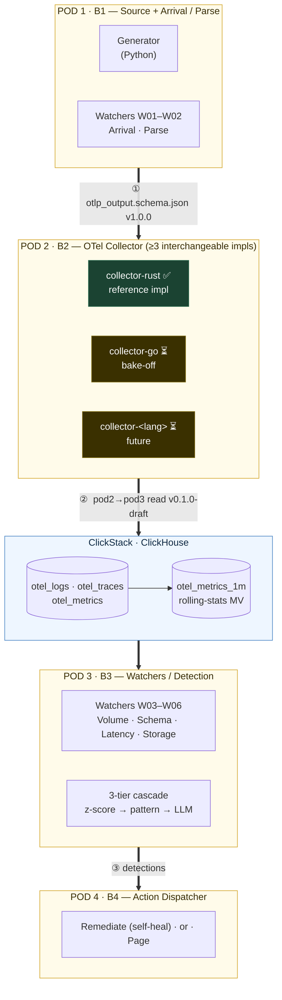

# Sentinel

> **Self-healing data pipelines.** Autonomous detection, AI-native reasoning, OTel-native by design.
> *No downstream user finds the bug before Sentinel does.*

Sentinel is an open-source observability + remediation system for data pipelines, built by **Crew B** of the DataShip Mission 2026 program (Commander: Luan Moreno). This repository is a **polyglot monorepo** that houses every Pod's component behind clear contracts and ownership boundaries.

---

## 1. System architecture

Telemetry flows left-to-right through four Pods. Each arrow is a **contract boundary** — a versioned interface owned by the upstream Pod and consumed by the downstream one.



**Reading the diagram — what Pod 2 (us) receives, processes, and delivers:**

| Stage | Detail |
|---|---|
| **Receive** | OTLP gRPC `:4317` (real clients) **or** NDJSON file (Pod 1's generator), both conforming to **`otlp_output.schema.json v1.0.0`** |
| **Process** | Parse/transform → internal `Signal` (log / span / metric) → typed ClickHouse rows; hoist resource keys; derive span duration; pre-aggregate metrics |
| **Deliver** | Rows in `otel_logs` / `otel_traces` / `otel_metrics` + the `otel_metrics_1m` rolling-stats MV, per the **Pod 2 → Pod 3 read contract** |

The **8-stage vendor-agnostic spine** (`otel_core → rolling_stats → tiered_engine → cross_watcher → policy_engine → remediation → audit_log → feedback_loop`) spans Pods 2–4; Pod 2 owns `otel_core` (ingest) and seeds `rolling_stats` (the MV).

---

## 2. The Pods

| Pod | Crew | Owns | Status |
|---|---|---|---|
| **Pod 1** | B1 | Telemetry **Generator** + Arrival/Parse watchers (W01–W02) | Input contract **v1.0.0 frozen** |
| **Pod 2** | B2 | **OTel Collector** — the ingestion gateway (this README's focus) | Rust impl **functional**; Go + 3rd pending |
| **Pod 3** | B3 | Volume/Schema/Latency/Storage watchers (W03–W06) + 3-tier detection | Reads the Pod 2 output contract |
| **Pod 4** | B4 | Action Dispatcher — remediation + paging | Downstream of detection |

**3-tier detection cascade** (Pod 3): Statistical (z-score) → Pattern (signature) → LLM (Haiku → Sonnet → Opus). *Cheapest tier wins; Opus only when Sonnet confidence is low AND blast radius is high.*

---

## 3. POD 2 — the OTel Collector (this component)

### Responsibility

Be the **single ingestion gateway** between telemetry producers and storage. Receive OTLP (or Pod 1 NDJSON), validate/transform against the contract, and persist to ClickHouse in a shape the detection layer can query in <1s. Nothing reaches storage except through a collector; nothing downstream re-parses raw telemetry.

### One Pod, multiple implementations

Pod 2 ships **several collector implementations in different languages** (a deliberate bake-off — see [ADR-0004](docs/adr/0004-collector-implementation-language.md)). They are **interchangeable**: same input contract in, same output contract out.

| Implementation | Language | Owner | Status |
|---|---|---|---|
| [`services/collector-rust/`](services/collector-rust/) | Rust | Victor | ✅ **Reference** — OTLP gRPC + NDJSON → ClickHouse, Dockerized, CI-green |
| `services/collector-go/` | Go | TBD (B2) | ⏳ Pending (ADR-0004 bake-off) |
| `services/collector-<lang>/` | TBD | TBD (B2) | ⏳ Future |

> The Rust collector is the **reference implementation**: it defines the behaviour every other implementation must match (the output contract + the golden conformance fixture). See [`services/collector-rust/`](services/collector-rust/) for language-specific docs.

---

## 4. Contracts

Contracts are **language-agnostic, shared assets** — never duplicated inside an implementation.

| Boundary | Artifact | Version | Status |
|---|---|---|---|
| **Pod 1 → Pod 2** (input) | [`contract/schema/otlp_output.schema.json`](contract/schema/otlp_output.schema.json) + [`contract/golden/`](contract/golden/) | **v1.0.0** | ✅ Frozen (vendored from Pod 1) |
| **Pod 2 → Pod 3** (output) | [`docs/contracts/pod2-pod3-read-contract.md`](docs/contracts/pod2-pod3-read-contract.md) | **v0.1.0-draft** | ⏳ Proposed (Pod 3 review pending) |

**Input** — three signal types (`log` / `span` / `metric`) discriminated on `signal_type`, 5 guaranteed resource keys, contract-versioned. A golden fixture (`baseline_seed42.jsonl`, 48 logs + 48 spans + 183 metrics) is the conformance oracle.

**Output** — four ClickHouse objects with per-column guarantees, the `''`-sentinel rule for optional IDs, and a mandatory re-aggregation read pattern for the rolling-stats MV. Freeze gates: [ADR-0005](docs/adr/0005-clickhouse-storage-schema.md) + [ADR-0006](docs/adr/0006-optional-id-representation.md) accepted, round-trip verified ✅, Pod 3 sign-off ⏳.

**Decisions of record** — [`docs/adr/`](docs/adr/): 0004 (language), 0005 (CH schema), 0006 (optional-ID representation).

---

## 5. Repository structure (built to scale)

The monorepo separates **shared** assets (contracts, specs, infra, docs) from **per-implementation** code. Adding a collector, a language, or a Pod never touches another's directory.

```text
sentinel/
├── README.md                      # ← this file: system entry point
│
├── contract/                      # 🔗 SHARED  · Pod 1 → Pod 2 INPUT contract
│   ├── schema/otlp_output.schema.json     #   the wire schema (v1.0.0)
│   └── golden/baseline_seed42.jsonl       #   conformance fixture (all impls test against this)
│
├── docs/                          # 🔗 SHARED  · cross-cutting knowledge
│   ├── adr/                       #   architecture decisions (numbered, Pod-spanning)
│   ├── contracts/                 #   Pod 2 → Pod 3 OUTPUT contract (the read schema)
│   └── research/                  #   design notes / receipts behind ADRs
│
├── infra/                         # 🔗 SHARED  · storage + deployment (every collector writes here)
│   ├── clickhouse/ddl/            #   the schema all collectors target (one source of truth)
│   ├── docker-compose.yml         #   ClickHouse base (used by dev, CI, all impls)
│   └── docker-compose.collector.yml  #   full-stack overlay (swap which impl it builds)
│
├── services/                      # 🧩 PER-COMPONENT  · self-contained implementations
│   ├── collector-rust/            #   Pod 2 impl — Rust (reference). Owns its Cargo.toml,
│   │                              #   toolchain, lints, Dockerfile, tests. (✅ functional)
│   ├── collector-go/              #   Pod 2 impl — Go (go.mod, .golangci.yml, Dockerfile)  ⏳
│   ├── collector-<lang>/          #   Pod 2 impl — future                                  ⏳
│   ├── generator/                 #   Pod 1 — Python telemetry generator
│   └── watchers/                  #   Pod 3 — detection (future)
│
├── .github/
│   ├── workflows/                 # per-component CI, path-filtered (rust-ci.yml, go-ci.yml, …)
│   └── CODEOWNERS                 # ownership map (recommended — see §6)
│
└── .claude/                       # Crew B knowledge env (agents, KBs, skills, standards)
```

**The scoping rule** (applies to every component): *language-specific config lives inside the component; cross-cutting config lives at the repo root.* A Rust contributor never sees Go files; a Python PR never triggers Rust CI (path-filtered workflows). The root coordinates; each component is self-contained (`cd services/collector-rust && just ci` works standalone). Full rationale: [`.claude/docs/RUST_PROJECT_STANDARDS.md`](.claude/docs/RUST_PROJECT_STANDARDS.md).

---

## 6. Ownership & boundaries

- **`main` is protected.** Feature branches `feat/<area>-<short>`; Conventional Commits; signed commits; mandatory attribution trailers; squash-merge after 2 approvals (peer + Captain).
- **Per-component CI** is path-filtered so each implementation's gates run independently.
- **Recommended `.github/CODEOWNERS`** to make ownership enforceable:

  ```text
  /contract/                     @pod1-leads @pod2-leads   # input contract — joint
  /docs/contracts/               @pod2-leads @pod3-leads   # output contract — joint
  /docs/adr/                     @crew-b-captains          # decisions — Captain review
  /infra/clickhouse/             @pod2-leads @pod3-leads   # shared schema
  /services/collector-rust/      @victor                   # Rust impl
  /services/collector-go/        @<go-owner>               # Go impl
  /services/generator/           @pod1-leads               # Pod 1
  ```

  Contracts are **jointly owned** by the Pods on both sides of the boundary — a change needs both signatures. Implementations are **singly owned**.

---

## 7. Shared assets & avoiding duplication across collectors

The N collector implementations cannot share *code* (different languages), but they **must not** diverge on *behaviour*. The anti-duplication strategy is to share everything that defines behaviour and let each language implement only the mechanics:

| Shared asset | Location | Why it prevents drift |
|---|---|---|
| **Input schema** | `contract/schema/` | One wire definition; each impl deserializes the same shape (codegen target where possible) |
| **Golden fixture + expected counts** | `contract/golden/` | The **conformance oracle**: every impl must turn `baseline_seed42.jsonl` into exactly 48 logs / 48 spans / 183 metrics in ClickHouse |
| **Output schema (DDL)** | `infra/clickhouse/ddl/` | All impls write the *same tables* — the schema is never re-declared per impl |
| **Read contract** | `docs/contracts/` | The output guarantees every impl must honour |
| **ClickHouse base compose** | `infra/docker-compose.yml` | One dev/CI stack; the collector overlay swaps which impl is built |
| **Config shape** | per-impl, but **same documented schema** (`input` / `clickhouse` / `grpc` / `contract` / `logging`) | Ops config is portable across implementations |

**Recommended next step for multi-impl coherence:** promote the golden round-trip into a **language-agnostic conformance suite** — a shared fixture + expected-result manifest that each collector's CI runs (the Rust impl's [`tests/clickhouse_roundtrip.rs`](services/collector-rust/tests/clickhouse_roundtrip.rs) and [`grpc_export_roundtrip.rs`](services/collector-rust/tests/grpc_export_roundtrip.rs) are the template). If all impls pass the same fixture, they are interchangeable by construction.

---

## 8. Current status

**Pod 2 / Rust reference implementation — functional end-to-end.** The full circuit works: **OTLP gRPC `:4317` → transform → ClickHouse**, verified live.

| Capability | State |
|---|---|
| Parse Pod 1 NDJSON against v1.0.0 contract | ✅ |
| ClickHouse schema (3 tables + rolling-stats MV) | ✅ verified live |
| File → ClickHouse export (48/48/183 round-trip) | ✅ |
| YAML config + contract-version boundary checks | ✅ |
| Distroless Docker image (10.7 MB) + full-stack compose | ✅ |
| OTLP gRPC server on `:4317` (Trace/Logs/Metrics) | ✅ |
| OTLP gRPC → ClickHouse (real payloads land) | ✅ verified live |
| CI: fmt · clippy · tests · cargo-deny · docker-build | ✅ (7-gate WoW map) |

**Remaining:** Day-10 polish + open the PR; freeze the Pod 2 → Pod 3 contract (gated on ADR-0005/0006 + Pod 3 review); siblings (Go, 3rd impl).

---

## 9. Assumptions, risks & open questions

| # | Item | Type | Where |
|---|---|---|---|
| 1 | Collector language bake-off not formally accepted (Rust is working lead) | Open decision | [ADR-0004](docs/adr/0004-collector-implementation-language.md) |
| 2 | Pod 2 → Pod 3 read contract not frozen (needs ADR-0005/0006 + Pod 3 sign-off) | Pending | [contract](docs/contracts/pod2-pod3-read-contract.md) |
| 3 | Hand-rolled CH schema vs OTel-native ClickStack schema | Open decision | [ADR-0005](docs/adr/0005-clickhouse-storage-schema.md) |
| 4 | Optional IDs as `''`-sentinel vs `Nullable` | Open decision | [ADR-0006](docs/adr/0006-optional-id-representation.md) |
| 5 | gRPC path skips `validate()` + synthesizes `contract_version` (OTLP lacks `sentinel.*` keys) | Assumption | `services/collector-rust/src/otlp.rs` |
| 6 | Histogram / Summary metrics dropped (no v1.0.0 type) | Known gap | `src/otlp.rs` |
| 7 | No batching/backpressure yet — gRPC inserts per request | Risk (scale) | future |
| 8 | TTL vs golden fixture age (2023-dated rows purge on merge) | Gotcha | [schema note](docs/research/clickhouse-schema-pod2.md) |
| 9 | Retention tiers (ADR-Q1) and non-hoisted attribute strategy (ADR-Q3) deferred | Deferred | schema note |
| 10 | Conformance suite across impls not yet shared (per-impl tests only) | Recommendation | §7 |

---

## 10. Getting started

```sh
# Run the Rust reference collector + ClickHouse as a full stack
docker compose -f infra/docker-compose.yml -f infra/docker-compose.collector.yml up --build

# Or develop the Rust collector directly
cd services/collector-rust && just ci      # fmt · clippy · test · audit · deny · doc
```

**Pointers:** [Rust collector README](services/collector-rust/README.md) · [ADRs](docs/adr/README.md) · [Pod 2 → Pod 3 contract](docs/contracts/pod2-pod3-read-contract.md) · [ClickHouse schema design](docs/research/clickhouse-schema-pod2.md) · [Crew B standards](.claude/docs/)

---

*Built by Crew B · DataShip Mission 2026 · Upstream: <https://github.com/luanmorenommaciel/sentinel>*
