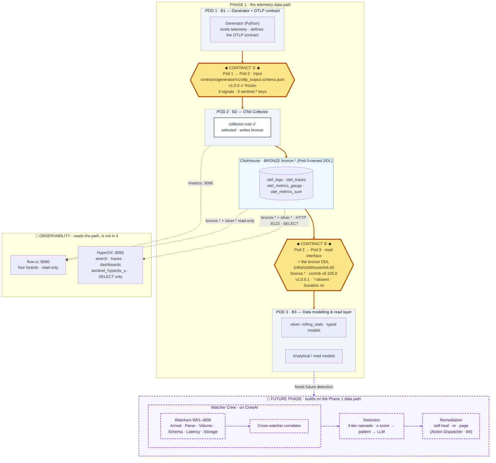

# Sentinel

> **Self-healing data pipelines.** Autonomous detection, AI-native reasoning, OTel-native by design.
> *No downstream user finds the bug before Sentinel does.*

Sentinel is an open-source observability + remediation system for data pipelines, built by **Crew B** of the DataShip Mission 2026 program (Commander: Luan Moreno). This repository is the **integrated monorepo** — every Pod's component behind clear contracts and ownership boundaries, with a one-command end-to-end pipeline. Pod 2 uses Rust as its selected collector implementation.

---

## 1. System architecture

Telemetry flows top-to-bottom through the Pods. **Phase 1 builds the data path:** Pod 1 *generates* telemetry and defines the OTLP contract, Pod 2 *ingests, validates, transforms, and exports* it, and Pod 3 *consumes* Pod 2's output contract for data modelling (bronze → silver → read models). **Watchers, detection, CrewAI-driven reasoning, and remediation are a future phase** layered on top. Alongside the path — not in it — **`flow-ui` observes the pipeline** from the collector's `/metrics` and read-only views of bronze and silver, and **HyperDX** lets an operator search the same bronze rows; nothing in the path depends on either being up. Each **gold gate** is a **contract boundary** — a versioned interface owned by the upstream Pod and consumed by the downstream one.


```mermaid
flowchart TB
    subgraph PHASE1["PHASE 1 · the telemetry data path"]
        direction TB
        subgraph POD1["POD 1 · B1 — Generator + OTLP contract"]
            GEN["Generator (Python)<br/>emits telemetry · defines the OTLP contract"]
        end

        C1{{"◆ CONTRACT ① ◆<br/>Pod 1 → Pod 2 · input<br/>contracts/generator/v1/otlp_output.schema.json<br/>v1.0.0 ✅ frozen<br/>3 signals · 5 sentinel.* keys"}}

        subgraph POD2["POD 2 · B2 — OTel Collector"]
            CRUST["collector-rust ✅<br/>selected · writes bronze"]
        end

        subgraph STORE["ClickHouse · BRONZE bronze.* (Pod-3-owned DDL)"]
            direction LR
            RAW[("otel_logs · otel_traces<br/>otel_metrics_gauge · otel_metrics_sum")]
        end

        C2{{"◆ CONTRACT ② ◆<br/>Pod 2 → Pod 3 · read interface<br/>= the bronze DDL (infra/clickhouse/init.d/)<br/>bronze.* · contrib v0.105.0<br/>v1.0.0.1 · ''=absent · Duration ns"}}

        subgraph POD3["POD 3 · B3 — Data modelling & read layer"]
            direction LR
            SILVER["silver: rolling_stats · typed models"]
            DM["Analytical / read models"]
        end

        POD1 ==> C1 ==> POD2 ==> STORE ==> C2 ==> POD3
    end

    subgraph FUTURE["🔮 FUTURE PHASE · builds on the Phase 1 data path"]
        direction LR
        subgraph CREW["Watcher Crew · on CrewAI"]
            direction LR
            WATCH["Watchers W01–W06<br/>Arrival · Parse · Volume · Schema · Latency · Storage"]
            XCORR["Cross-watcher correlator"]
            WATCH --> XCORR
        end
        DETECT["Detection<br/>3-tier cascade · z-score → pattern → LLM"]
        REMED["Remediation<br/>self-heal · or · page<br/>(Action Dispatcher · B4)"]
        CREW --> DETECT --> REMED
    end

    POD3 -.->|"feeds future detection"| FUTURE

    subgraph OBS["🔭 OBSERVABILITY · reads the path, is not in it"]
        FLOW["flow-ui :8080<br/>four boards · read-only"]
        HDX["HyperDX :8082<br/>search · traces · dashboards<br/>sentinel_hyperdx_u · SELECT only"]
    end
    POD2 -. "/metrics :9090" .-> FLOW
    STORE -. "bronze.* + silver.* read-only" .-> FLOW
    STORE -. "bronze.* + silver.* · HTTP :8123 · SELECT" .-> HDX

    classDef contract fill:#fde68a,stroke:#b45309,stroke-width:4px,color:#3a2f00;
    classDef zone fill:#f1f5f9,stroke:#94a3b8,color:#0f172a;
    classDef store fill:#eef6ff,stroke:#4a86c5,color:#0d2a45;
    classDef refimpl fill:#ffffff,stroke:#475569,stroke-width:2px,color:#1e293b;
    classDef future fill:#f5f3ff,stroke:#7c3aed,stroke-width:2px,stroke-dasharray:6 4,color:#3b1d6e;
    class C1,C2 contract;
    class POD1,POD2,POD3 zone;
    class STORE store;
    class CRUST refimpl;
    class FUTURE,CREW,WATCH,XCORR,DETECT,REMED future;
    linkStyle 0,1,2,3,4 stroke:#b45309,stroke-width:3px;
    linkStyle 5,6,7,8 stroke:#7c3aed,stroke-width:2px,stroke-dasharray:6 4;
```

**Diagram key** — gold gate = contract boundary (versioned; the durable asset) · grey box = Pod / ownership zone · white box = active component · **purple dashed cluster = future phase** · status glyphs: ✅ frozen / agreed · 🔶 in progress · ⏳ pending. The hierarchy is shape- and border-redundant, so it survives grayscale.

**What Pod 2 receives, processes, and delivers:**

| Stage | Detail |
|---|---|
| **Receive** | OTLP gRPC `:4317` (real clients) **or** NDJSON file (Pod 1's generator), both conforming to **`contracts/generator/v1/otlp_output.schema.json` v1.0.0** |
| **Process** | Parse/transform → internal `Signal` (log / span / metric) → typed rows; derive span duration; route metrics by type |
| **Deliver** | Rows in the **bronze** `bronze.otel_logs` / `otel_traces` / `otel_metrics_gauge` / `otel_metrics_sum`, per the **Pod 2 → Pod 3 read contract**; Pod 3 builds silver (rolling-stats, read models) on top |

---

## 2. The Pods

**Phase 1** builds the telemetry **data path** (Pods 1 → 2 → 3). Watchers, detection, CrewAI reasoning, and remediation are a **future phase**.

| Pod | Crew | Phase 1 role | Status |
|---|---|---|---|
| **Pod 1** | B1 | Telemetry **Generator** + the **OTLP input contract** | Input contract **v1.0.0 frozen** |
| **Pod 2** | B2 | **OTel Collector** — ingest · validate · transform · export | Rust selected; writes bronze and is validated e2e |
| **Pod 3** | B3 | **Data modelling** — owns the bronze DDL; builds silver + read models | Bronze landed; silver in progress |
| **Pod 4** | B4 | *(Future)* Action Dispatcher — remediation + paging | Future phase |

**Future phase — detection & remediation.** Watchers (W01–W06: Arrival · Parse · Volume · Schema · Latency · Storage) feed a **3-tier detection cascade** — Statistical (z-score) → Pattern (signature) → LLM — orchestrated with **CrewAI**. *Cheapest tier wins.*

---

## 3. POD 2 — the OTel Collector

Be the **single ingestion gateway** between telemetry producers and storage: receive OTLP (or Pod 1 NDJSON), validate/transform against the input contract, and persist to the **bronze** ClickHouse schema in a shape the detection layer can query in <1s. Nothing reaches storage except through a collector.

Pod 2 runs the selected Rust implementation, whose language decision is tracked in [ADR-0004](docs/adr/0004-collector-implementation-language.md).

[`services/collector-rust/`](services/collector-rust/) receives OTLP gRPC or NDJSON, validates the input contract, buffers exports with bounded backpressure, writes directly into Pod 3's **bronze `bronze.*`** tables, and exposes Prometheus metrics on `:9090`. See [ADR-0007](docs/adr/0007-bronze-canonical-contract.md) for the canonical output contract.

---

## 4. Contracts

Contracts are **language-agnostic shared assets** — never duplicated inside an implementation.

| Boundary | Artifact | Version | Status |
|---|---|---|---|
| **Pod 1 → Pod 2** (input) | [`contracts/generator/v1/`](contracts/generator/v1/) (`schema/otlp_output.schema.json` + `golden/`) | **v1.0.0** | ✅ Frozen |
| **Pod 2 → Pod 3** (output) | [`contracts/collector/v1/pod2-pod3-read-contract.md`](contracts/collector/v1/pod2-pod3-read-contract.md) → the **bronze DDL** ([`infra/clickhouse/init.d/01-bronze-otel.sql`](infra/clickhouse/init.d/01-bronze-otel.sql)) | **v1.0.0.1** | ✅ Agreed contract boundary (Pod 3 sign-off pending) |

**Input** — three signal types (`log` / `span` / `metric`), 5 guaranteed `sentinel.*`/`cloud.provider` resource keys, contract-versioned. A golden fixture (`baseline_seed42.jsonl`, 48 logs + 48 spans + 183 metrics) is the conformance oracle.

**Output** — the canonical read schema is Pod 3's **bronze** DDL (`bronze.*`, otel-collector-contrib v0.105.0). The read contract documents the *semantic* layer on top: the 5 Sentinel keys are carried in `ResourceAttributes`, optional IDs follow the `''`=absent rule, `Duration` is nanoseconds, metrics split into gauge/sum, and the rolling-stats rollup is a Pod 3 **silver** artifact. Full ratification = [ADR-0007](docs/adr/0007-bronze-canonical-contract.md) accepted + Pod 3 sign-off (the round-trip evidence is met).

**Decisions of record** — [`docs/adr/`](docs/adr/): 0004 (language) · ~~0005 (hand-rolled schema)~~ superseded · 0006 (optional-ID, refined) · **0007 (bronze = canonical contract)**.

---

## 5. Repository structure

The monorepo separates **shared** assets (contracts, infra, docs) from **per-component** code; adding a collector, language, or Pod never touches another's directory.

```text
sentinel/
├── README.md                      # ← this file: system entry point
├── Makefile                       # 🔗 one-command UX
├── docker-compose.yml             # 🔗 root Rust pipeline orchestrator
│
├── contracts/                     # 🔗 SHARED · contract registry, namespaced by producing Pod
│   ├── generator/v1/                      #   Pod 1 → Pod 2 INPUT contract (SSOT)
│   │   ├── schema/otlp_output.schema.json #     the wire schema (v1.0.0)
│   │   └── golden/baseline_seed42.jsonl   #     collector conformance fixture
│   └── collector/v1/                      #   Pod 2 → Pod 3 READ contract (bronze semantic layer)
│       └── pod2-pod3-read-contract.md     #     v1.0.0.1 · points at the bronze DDL
│
├── infra/                         # 🔗 SHARED · ClickHouse bootstrap
│   ├── clickhouse-init.sql                #   db/users init (dev-only auth)
│   ├── clickhouse-users.d/                #   default-user network override (Rust HTTP path)
│   ├── clickhouse/migrate.sh              #   applies migrations/, recording each in the _meta ledger
│   ├── hyperdx/                           #   HyperDX bootstrap: sources.json (bronze mapping) · entrypoint.sh · tests/
│   ├── deploy/                            #   what release.yml publishes + the GCP prerequisites
│   └── clickhouse/init.d/            #   applied on ClickHouse boot, in order
│       ├── 01-bronze-otel.sql         #     the BRONZE schema (bronze.*, Pod-3-owned)
│       └── 02-silver-layer.sql        #     SILVER v1 · typed models + read views (ADR-0010)
│
├── scripts/ci/                    # 🔗 SHARED · repository invariant harness
│   ├── run-invariants.sh                  #   runs every assert in invariants.d/
│   └── invariants.d/                      #   drop-in asserts, one property each
│
├── intent/ · spec/ · plan/        # 🔗 SHARED · the sdlc-e2e-review cycle's document chain
│   ├── intent/                            #   core-intent.md (As-Is) · design-spec.md (rationale)
│   ├── spec/core-spec.md                  #   implementation-ready spec
│   └── plan/                              #   core-plan.md (ticket registry) · decisions/DEC-*.md
│
├── docs/                          # 🔗 SHARED · cross-cutting knowledge
│   ├── adr/                       #   architecture decisions (numbered, Pod-spanning)
│   └── research/ · proposals/     #   design notes, gap analysis, decision proposals
│
├── services/                      # 🧩 PER-COMPONENT · self-contained implementations
│   ├── collector-rust/            #   Pod 2 — selected Rust collector. Cargo/Docker/tests ✅
│   ├── generator-python/          #   Pod 1 — Python telemetry generator (otelgen)
│   └── flow-ui/                   #   the pipeline watching itself — four boards, read-only
│       └── ARCHITECTURE.md      #     how it is built (FastAPI + SSE + no-framework SVG)
│
├── .github/
│   ├── PULL_REQUEST_TEMPLATE.md   # what · why (the linked issue) · tests/evidence
│   └── workflows/                 # rust-ci · python-ci · repo-invariants · release · pr-linked-issue
```

**The scoping rule:** *language-specific config lives inside the component; cross-cutting config lives at the repo root.* Each component is self-contained; the root `Makefile` only coordinates the end-to-end pipeline.

---

## 6. Quick start — end-to-end

Requires Docker (no host toolchains):

Create the ignored local secret file once before the first run:

```sh
cp infra/secrets/ch_password.example infra/secrets/ch_password
# Replace its single line with a local development password.
```

```sh
make e2e                  # ClickHouse → migrations → Rust collector → generator → bronze.*
```

Step by step, plus inspect:

```sh
make up                        # the WHOLE stack: ClickHouse → migrations → collector → flow-ui + HyperDX
make status                    # the container table + URL list again, without starting anything
make generate SCENARIO=black_friday SEED=42   # generate → OTLP :4317
make logs                      # tail collector logs
make down                      # stop every container make up started (volumes kept)
make reset                     # stop everything + drop the ClickHouse and HyperDX Mongo volumes
```

`make up` is the one command: it starts every long-running service in order, waits for
each one at its **host-published** port, and ends by printing `docker compose ps` plus
where everything is. If any service never answers, it exits non-zero with that service's
last 60 log lines and the `lsof` line to find whoever holds the port — it does not leave
you to discover a half-started stack. A finished run looks like this:

```
── readiness (host-published ports) ─────────────────────────────────
  ClickHouse      ready   http://127.0.0.1:8123/ping
  collector       ready   http://127.0.0.1:9090/metrics
  flow-ui         ready   http://127.0.0.1:8080/healthz
  HyperDX         ready   http://127.0.0.1:8082/
```

The generator is the one service `make up` does not *start*, on purpose: it is a one-shot
CLI (`otelgen`), not a daemon. `make up` builds its image so `make generate` is instant,
and a service that ran `otelgen --help` and exited would sit in `docker compose ps` as
`Exited` — a healthy stack that reads as a broken one.

### Host ports

All five bind to `127.0.0.1` only, and each is overridable when something local already
owns it. Service-to-service traffic always uses the container ports over the private
Compose network, so moving one changes the URL you type and nothing about the pipeline.

| Variable | Default | What it reaches |
|---|---|---|
| `CLICKHOUSE_HOST_PORT` | `8123` | ClickHouse HTTP + the `/play` query UI |
| `COLLECTOR_OTLP_HOST_PORT` | `4317` | the collector's OTLP gRPC receiver, for telemetry sent from the host |
| `COLLECTOR_METRICS_HOST_PORT` | `9090` | the collector's Prometheus `/metrics` |
| `FLOW_UI_HOST_PORT` | `8080` | flow-ui's four boards |
| `HYPERDX_HOST_PORT` | `8082` | HyperDX search, traces and dashboards |

HyperDX takes `8082` rather than `8081` so that `8081` stays free as the obvious second
choice when `8080` is gone — including for moving flow-ui itself.

Set them on the make line, or copy `.env.example` to `.env` (gitignored; Compose reads it
automatically, so `make up` then needs no flags):

```sh
make up FLOW_UI_HOST_PORT=8081 HYPERDX_HOST_PORT=8083
COLLECTOR_OTLP_HOST_PORT=14317 make up
# host clients use http://127.0.0.1:14317; Compose services still use collector:4317
```

Every readiness probe in the Makefile derives its URL from the same variable Compose
reads, so the committed Makefile works on both the defaults and an override. Invariant 09
fails the build on a hard-coded `127.0.0.1:<port>` anywhere in it, and invariant 03 on two
services publishing the same host port.

Flow-ui and HyperDX are part of `make up`; these start or stop either one on its own, without the collector:

```sh
make ui                            # start flow-ui independently → http://127.0.0.1:8080
make down-ui                       # stop only flow-ui
make generate-stream DURATION=10m  # real-time telemetry, paced by the wall clock
```

Search the same rows in HyperDX (ADR-0011), connected straight to ClickHouse:

```sh
make hyperdx                       # ClickHouse + migrations + HyperDX → http://127.0.0.1:8082
make down-hyperdx                  # stop HyperDX and its Mongo; accounts and saved views are kept
make reset-hyperdx                 # drop its Mongo volume so infra/hyperdx/sources.json is re-read
```

The first visit asks you to create a local account (HyperDX keeps users, saved searches,
dashboards and alerts in its own Mongo; none of it is telemetry). The Logs, Traces and
Metrics sources are already mapped onto `bronze.*`. HyperDX reads `sources.json` only into
an empty Mongo, so after editing it run `make reset-hyperdx`. It connects as
`sentinel_hyperdx_u` (`SELECT` on `bronze.*` and `silver.*`, no writes, no DDL) and ships
no collector of its own: ingestion stays with collector-rust. If `8082` is taken,
`HYPERDX_HOST_PORT=8083 make hyperdx`.

All host-published ports bind to `127.0.0.1`; generator, collector, flow-ui, HyperDX (and its Mongo), and
ClickHouse communicate over the private Compose network. This is a local development
boundary, not remote edge authentication or a production security configuration.
`make up` applies the migration ledger and waits for `/metrics` readiness before the
collector is considered ready. `make ui` can run without the collector; its status
board reports the collector as unavailable while remaining readable.

ClickHouse, flow-ui, HyperDX and its Mongo each carry a Compose healthcheck, so `make up`
brings them up with `--wait` and a container that never goes healthy fails the command.
**collector-rust carries none, and that is a constraint rather than an oversight:** its
runtime stage is `gcr.io/distroless/static-debian12`, which has no shell, no `wget` and no
`curl`, so there is no in-container command for Docker to run. Its readiness is asserted
from the host instead, by polling `/metrics`. The consequence is that nothing can depend on
the collector with `condition: service_healthy` — which is fine, because nothing should:
flow-ui and HyperDX must start without it (invariant 09) and the generator runs after
`make up` returns.

One more thing `make up` survives: the collector's `--build` re-resolves its distroless base
image from `gcr.io` on **every** run, even when nothing needs rebuilding, and that registry is
measurably flaky (2 of 3 probes from one machine on 2026-10-07 died with `SSL_ERROR_SYSCALL`
after ~10s). Three retries with a widening pause come first; if they all fail and
`sentinel-collector-rust:dev` is already in the local image store, `make up` starts the stack
from it and says loudly that the image may predate your working tree and how to rebuild it.
A network hiccup no longer takes the whole stack down. With no local image there is nothing
to start, and it fails.

Silver read models are created by migrations and maintained from Bronze: `metric_stats_1m`,
`volume_1m`, `resource_key_presence_1m`, and refresh-driven `call_edges_1m`. Historical
rebuilds use the guarded two-phase runner documented in
[`infra/clickhouse/backfill/README.md`](infra/clickhouse/backfill/README.md); the current
date partition is always refused. flow-ui uses Silver for volume and call-edge boards
when coverage is sufficient, falls back to Bronze for gaps or data outside Silver's
window, and combines Silver per-key missing counts with Bronze's authoritative `bad`
count for contract violations. Each result reports its source.

Run `make help` for all targets and the active `SCENARIO / SEED / WINDOW`. Per-component dev still works standalone (`cd services/collector-rust && cargo test`).

---

## 7. Ownership & boundaries

- **The `main` branch policy** is feature branches `feat/<area>-<short>`, Conventional Commits, signed
  commits, attribution trailers and 2 approvals (peer + Captain). **It is convention, not
  enforcement:** `main` carries no GitHub branch-protection rule today (verified 2026-10-06 —
  the API reports `protected: false`), so nothing rejects a push that skips it. The candidates for the
  required-check set are documented in [`docs/ci-gates.md`](docs/ci-gates.md) (T21), and configuring the
  rules on GitHub is tracked separately in issue #35.
- **Agent-assisted work follows [ADR-0009](docs/adr/0009-agentic-gitflow.md)** — *seam → swimlane → leg → task*: one git worktree per agent, legs declaring **disjoint paths**, squash into the swimlane and a merge commit into `main` so per-leg attribution survives. The ADR is the record; the `.claude/` agent layer that carried the mechanics was removed from the repo in `7689c16`.
- **CI is five workflows** in [`.github/workflows/`](.github/workflows/): [`rust-ci.yml`](.github/workflows/rust-ci.yml) (gates · integration · cargo-deny · docker-build), [`python-ci.yml`](.github/workflows/python-ci.yml) (ruff · pytest · supply-chain), [`repo-invariants.yml`](.github/workflows/repo-invariants.yml), [`release.yml`](.github/workflows/release.yml) and [`pr-linked-issue.yml`](.github/workflows/pr-linked-issue.yml). Component gates are path-filtered; several jobs are deliberately non-blocking today — see §8 for which, and why.
- **Contracts are jointly owned** by the Pods on both sides of a boundary (input = Pod 1 + Pod 2; the bronze read schema = Pod 2 + Pod 3). **Components are singly owned.**
- The **bronze DDL is Pod-3-owned** (`create_schema:false`); collectors only `INSERT`.

---

## 8. Current status

**Pod 2 / selected Rust collector — writes the bronze schema, validated end-to-end.** generator → Rust collector → `bronze.*` lands **40,200 logs / 40,200 traces / 152,700 metrics** (gauge 83,400 + sum 69,300), lossless; the golden file-mode round-trip yields 48 / 48 / 183.

| Capability | State |
|---|---|
| Parse Pod 1 NDJSON / OTLP gRPC against v1.0.0 contract | ✅ |
| Write directly into Pod 3 **bronze** (`bronze.*`) | ✅ verified live |
| Metrics routed by type → `otel_metrics_gauge` / `otel_metrics_sum` | ✅ |
| Sentinel metadata carried in `ResourceAttributes` | ✅ |
| gRPC receive-boundary contract validation (`off`/`warn`/`strict`) | ✅ |
| Bounded buffered export with batch-size and flush-interval controls | ✅ |
| Prometheus `/metrics` endpoint on `:9090` | ✅ |
| Graceful shutdown with final buffer flush | ✅ |
| Distroless Docker image + root compose orchestrator | ✅ |
| CI: gates (fmt · clippy · test · build) · integration (live ClickHouse, every `#[ignore]`d test) · cargo-deny · docker-build | ✅ |
| Pod 3 silver (rolling-stats rollup, read models) | ✅ silver v1 DDL plus the four Watcher read models (T25–T29): `metric_stats_1m`, `volume_1m`, `resource_key_presence_1m`, `call_edges_1m` |

**Latest local E2E snapshot** — Docker/Linux arm64, scenario `baseline`, seed `42`, window `5m` (2026-08-04):

| Measurement | Result |
|---|---:|
| Signals delivered | 233,100 in 4.5s (~51.4k signals/s) |
| Ingested / accepted / persisted | 233,100 / 233,100 / 233,100 |
| Rejected / dropped / export errors | 0 / 0 / 0 |
| Successful batch flushes | 84 |
| Average batch size | 2,775 signals |
| Average ClickHouse export latency | 32.3ms |
| Export latency distribution | 100% of flush attempts ≤80ms |
| Bronze rows | 40,200 logs · 40,200 traces · 83,400 gauges · 69,300 sums |

This workload met the collector health gates: no signal loss, no contract rejection, no failed export, complete bronze parity, and sub-80ms export attempts. These numbers are a reproducible local snapshot, not a production SLO or a substitute for sustained-load benchmarking on target infrastructure.

### Delivery path and SDLC hardening (`sdlc-e2e-review` cycle)

This cycle hardened how the pipeline is built, checked and published rather than what it computes. The ticket registry is [`plan/core-plan.md`](plan/core-plan.md).

**43 of 48 implementation tickets are complete. T42 is deferred and T45–T48 were absorbed into same-PR documentation updates.**

### Task Status Summary

| Status | Count | Percentage | Tickets |
|---|---:|---:|---|
| **Done** | 43 | 89.6% | T01–T41, T43–T44 |
| **Deferred** | 1 | 2.1% | T42 (TLS, by DEC-A4) |
| **Absorbed** | 4 | 8.3% | T45–T48 (same-PR docs, by DEC-I2) |
| **Total** | **48** | **100%** | Full implementation plan |

---

### Complete Task Registry (T01–T48)

Every ticket defined in [`plan/core-plan.md`](plan/core-plan.md) with its current status:

| ID | Title / Summary | Wave / Area | Blocked by | Status |
|---|---|---|---|---|
| **T01** | Invariant-assert harness with drop-in directory (`scripts/ci/run-invariants.sh`) | Wave 1 · CI | — | **Done** |
| **T02** | flow-ui `conftest.py` two-coverage response builder | Wave 1 · flow-ui | — | **Done** |
| **T03** | Compose `include:` path-resolution probe (`[V-4]`) | Wave 1 · Infra | — | **Done** |
| **T04** | arm64 + x86_64 musl/TLS spike, toolchain target, CI `platforms:` | Wave 1 · CI | — | **Done** |
| **T05** | `migrate.sh` + `_meta` schema ledger (`0003_meta.sql`) | Wave 1 · Infra | — | **Done** |
| **T06** | Collector `user` / `password_file` credential config | Wave 1 · Collector | — | **Done** |
| **T07** | `python-ci.yml`: ruff + pytest + `PYTHON_IMAGE` matrix + `-D warnings` | Wave 1 · CI | — | **Done** |
| **T08** | Generator integration suite targeting live `CLICKHOUSE_URL` | Wave 1 · Test | — | **Done** |
| **T09** | `rust-ci.yml` runs every `#[ignore]`d integration test | Wave 1 · CI | — | **Done** |
| **T10** | Python supply-chain audit job (`pip-audit` + `bandit`, warn-only) | Wave 1 · CI | — | **Done** |
| **T11** | `make migrate` target | Wave 1 · Build | T05, T07 | **Done** |
| **T12** | `compose.clickhouse.yml` — single ClickHouse service definition (pinned 25.4) | Wave 1 · Infra | DEC-I1, T03 | **Done** |
| **T13** | Root `docker-compose.yml` → `include:` unified ClickHouse service | Wave 1 · Infra | T12 | **Done** |
| **T14** | CI Compose → `include:` + silver mount + drop env route | Wave 1 · Infra | T12, T09 | **Done** |
| **T15** | Delete generator Compose file & update documentation | Wave 1 · Contract | T13, T14 | **Done** |
| **T16** | Extract DDL into `migrations/0001`/`0004`, symlink `init.d/`, divergence assert | Wave 1 · Infra | T05, T01, T13 | **Done** |
| **T17** | Least-privilege roles + users created (`0002_roles.sql`) | Wave 1 · Infra | T16 | **Done** |
| **T18** | Collector & flow-ui connect as dedicated role users via secret file | Wave 1 · Infra | T06, T13, T14, T17 | **Done** |
| **T19** | Delete open `::/0` default network route and drop `otelgen` user | Wave 1 · Infra | T15, T18 | **Done** |
| **T20** | `e2e-silver.yml` — live-ClickHouse full pipeline test workflow | Wave 1 · CI | T07, T08, T09, T11, T19 | **Done** |
| **T21** | `docs/ci-gates.md` status table + flip `repo-invariants` to blocking gate | Wave 1 · CI | T20 | **Done** |
| **T22** | `release.yml` — Artifact Registry, OIDC, SLSA provenance, SBOM, Cosign signing | Wave 1 · Release | — | **Done** |
| **T23** | Digest promotion `main` → `:staging`, `v*` → `:prod` with signature verification | Wave 1 · Release | T22 | **Done** |
| **T24** | Image vulnerability scan gates the push (Trivy) | Wave 1 · Release | T22 | **Done** |
| **T25** | `0005a` `silver.metric_stats_1m` + MV + test suite (`03-watcher-models.test.sql`) | Wave 2 · Silver | T16, T20 | **Done** |
| **T26** | Real-telemetry tripwire (`countIf(NOT is_synthetic)`) | Wave 2 · Silver | T25 | **Done** |
| **T27** | `0005b` `silver.volume_1m` + 3 MVs (log, trace, metric) | Wave 2 · Silver | T25 | **Done** |
| **T28** | `0005c` `silver.resource_key_presence_1m` + 3 MVs | Wave 2 · Silver | T27 | **Done** |
| **T29** | `0005d` `silver.call_edges_1m` + determinism / no-verdict asserts | Wave 2 · Silver | T28, T01 | **Done** |
| **T30** | Backfill runner skeleton + live-partition refusal + README (`backfill.sh`) | Wave 3 · Backfill | T05, T19, DEC-A2 | **Done (local)** |
| **T31** | Backfill phase 1 — bronze → silver base, partition swap | Wave 3 · Backfill | T30 | **Done (local)** |
| **T32** | REQ-E-11 in-runner content checksum | Wave 3 · Backfill | T31 | **Done (local)** |
| **T33** | Backfill phase 2 — silver base → rollups, phase gate | Wave 3 · Backfill | T32, T29 | **Done (local)** |
| **T34** | `0006` re-point `metric_rollup_1m` to storage-backed table, ledger-gated | Wave 3 · Backfill | T25, T33 | **Done (local)** |
| **T35** | flow-ui `silver_coverage` probe on 30 s lane + `source` field | Wave 3 · flow-ui | T02 | **Done** |
| **T36** | Dual-source `volume_band` on flow-ui + rename stale `_volume_state` | Wave 3 · flow-ui | T35, T27 | **Done** |
| **T37** | Dual-source `call_edges` on flow-ui | Wave 3 · flow-ui | T35, T29 | **Done** |
| **T38** | Dual-source `contract_violations` on flow-ui | Wave 3 · flow-ui | T35, T28 | **Done** |
| **T39** | Fallback removal criterion as automated test | Wave 3 · flow-ui | T36, T37, T38 | **Done** |
| **T40** | Local Docker/Make startup, migrations-before-ingest, readiness | Wave 4 · Local runtime | DEC-A1, DEC-A2, T05 | **Done (local; configurable loopback OTLP port)** |
| **T41** | flow-ui starts/stops independently in Compose | Wave 4 · Local runtime | T40 | **Done (local)** |
| **T42** | TLS hop 2 + Dockerfile purity verification | Wave 4 · Security | DEC-A4, T04, T40 | **Deferred (DEC-A4)** |
| **T43** | Loopback-only host access; internal service traffic | Wave 4 · Local runtime | DEC-A1, T40 | **Done (local)** |
| **T44** | Local file secrets mounted read-only | Wave 4 · Local runtime | T06, T40 | **Done (local)** |
| **T45** | Wave 1 documentation leg | Docs | T24, DEC-I2 | **Absorbed (DEC-I2)** |
| **T46** | Wave 2 documentation leg | Docs | T29 | **Absorbed (DEC-I2)** |
| **T47** | Wave 3 documentation leg | Docs | T39, T34 | **Absorbed (DEC-I2)** |
| **T48** | Wave 4 documentation leg | Docs | T44 | **Absorbed (DEC-I2)** |

---

### Wave 0 — Architecture Decisions

| ID | Topic / Question | Owner | Status | Details |
|---|---|---|---|---|
| **DEC-A1** | Compute platform form for the three services | Captain / Commander | **Resolved (local only)** | Docker Compose + Make; no remote platform |
| **DEC-A2** | ClickHouse hosting and operational owner | Commander | **Resolved (local only)** | Local 25.4 MergeTree; provider validation deferred |
| **DEC-A3** | What applies DDL in deployed environments | Pod 3 / Pod 2 | **Done** | Adopted bespoke `migrate.sh` with `_meta` ledger (T05/T11) |
| **DEC-A4** | TLS termination: collector vs platform edge vs sidecar | Pod 2 | **Deferred** | T42 held for future TLS decision |
| **DEC-I1** | ClickHouse version pin & generator Compose deletion | Pod 1 / Pod 3 | **Working** | Implemented in practice in commit `75d656d` (25.4 pin, generator compose deleted); awaiting formal owner sign-off |
| **DEC-I2** | Pre-PR doc discipline vs disjoint paths | Captain / Commander | **Resolved** | Docs update in each implementation PR; T45–T48 absorbed |
| **DEC-D1** | Materialize typed Sentinel keys in silver | Pod 3 / Pod 2 | **Pending** | Open; deferred to T28 |
| **DEC-V3a** | Refreshable MV vs scheduled INSERT for `call_edges_1m` | Pod 3 | **Done** | Folded into DEC-I1; refreshable MVs ungated on 25.4 |

---

### Landed Capabilities and Limits

| Area | Landed | Limit |
|---|---|---|
| **Compose unification** (T12–T15) | Single `infra/clickhouse/compose.clickhouse.yml` pinned to 25.4, included by root and CI stacks; deleted redundant generator compose | Implemented in commit `75d656d`; formal sign-off for DEC-I1 pending |
| **Least-privilege roles** (T16–T19) | Migration symlinks (`init.d` → `migrations/`), `0002_roles.sql` with three dedicated roles/users, collector/flow-ui use role credentials, dropped `otelgen` and closed `::/0` route | Landed in commit `7434bb2` |
| **Live CI Oracle & Gates** (T20, T21) | [`e2e-silver.yml`](.github/workflows/e2e-silver.yml) live ClickHouse pipeline test; [`docs/ci-gates.md`](docs/ci-gates.md) full gate catalog; `repo-invariants` flipped to blocking | Landed in commit `7d17fef`; branch protection on GitHub is tracked in issue #35 |
| **Python CI** (T07, T08) | [`python-ci.yml`](.github/workflows/python-ci.yml): ruff + pytest on a `PYTHON_IMAGE` matrix; generator integration suite targets `CLICKHOUSE_URL` | Closes former "no Python gate" gap |
| **Rust CI** (T09) | `rust-ci.yml` runs every `#[ignore]`d integration test | Landed |
| **Python supply chain** (T10) | `pip-audit` + `bandit` job | **Warn-only** (`continue-on-error`) pending lockfile |
| **Repository invariants** (T01) | [`scripts/ci/run-invariants.sh`](scripts/ci/run-invariants.sh) + drop-in [`invariants.d/`](scripts/ci/invariants.d/), gating in `repo-invariants.yml` | All asserts PASS; blocking gate |
| **Migrations** (T05, T11) | [`infra/clickhouse/migrate.sh`](infra/clickhouse/migrate.sh) records each migration in `_meta.schema_migrations` ledger (`0003_meta.sql`); `make migrate` runs it | Landed |
| **Collector credentials** (T06) | `user` / `password_file` collector config | Landed |
| **Cross-arch** (T04) | arm64 + musl/TLS compile spike, toolchain target, CI `platforms:` | Landed |
| **Test scaffolding** (T02, T03) | flow-ui two-coverage fixtures; Compose `include:` path-resolution probe | Landed |
| **flow-ui coverage probe** (T35) | `silver_coverage` probe on the 30 s lane | Landed |
| **Release** (T22) | [`release.yml`](.github/workflows/release.yml): Artifact Registry, GitHub OIDC → Workload Identity Federation, SLSA provenance, SBOM, keyless Cosign signing | **Unverified against real registry** (see below) |
| **Promotion** (T23) | Digest promotion `main` → `:staging`, `v*` → `:prod`; `cosign verify` runs before any tag moves | **Unverified against real registry** (see below) |
| **Image scan** (T24) | Trivy scan by digest | **Warn-only** (runs post-push) |

Also this cycle, commit `7689c16` removed the `.claude/` agent layer and the `meetings/` archive (89 files).

**Unverified: nothing in the release lane has run against a real registry.** No GCP project, Artifact Registry repository or Workload Identity provider exists yet. Signing, attestation verification and `crane tag` on a multi-arch index have therefore not been exercised; [`infra/deploy/README.md`](infra/deploy/README.md) carries the specific "Unverified" notes and what to confirm on the first publish.

**The vulnerability scan does not gate the push.** It runs after `push: true`, so REQ-H-12's wording ("SHOULD gate the registry push") is not met: a multi-arch manifest cannot be loaded into the runner's daemon to be scanned beforehand. It is warn-only (`exit-code: "0"`, a single flag). Making it blocking, and the severity threshold, are policy and belong to T21.

### Repository Invariants Status

All repository invariant checks pass (`bash scripts/ci/run-invariants.sh` reports 0 failed), and the check actively gates PRs in [`repo-invariants.yml`](.github/workflows/repo-invariants.yml):

| Assert | Result | Property Verified |
|---|---|---|
| `01-single-clickhouse-image` | **PASS** | Exactly one ClickHouse image pinned (`25.4` in `infra/clickhouse/compose.clickhouse.yml`) |
| `02-service-named-clickhouse` | **PASS** | All 3 stacks expose a service literally named `clickhouse` |
| `03-no-duplicate-host-8080` | **PASS** | No host ports published twice |
| `04-no-plaintext-secrets` | **PASS** | No plaintext credentials in operational tree; `otelgen` dropped; gitignored secrets allowed |
| `05-flow-ui-is-read-only` | **PASS** | flow-ui issues no write statement |
| `06-initd-matches-migrations` | **PASS** | `init.d/` contains symlinks into `migrations/`; one DDL source, two apply paths |
| `07-silver-mv-determinism` | **PASS** | Silver MV bodies are deterministic (except `call_edges_1m_rmv` as REQ-D-12 names) |
| `08-no-verdict-in-silver` | **PASS** | No verdict or threshold literals in silver read models |
| `09-local-compose-boundary` | **PASS** | Loopback-only host ports, migration-before-collector startup, independently startable UI |
| `10-hyperdx-is-read-only` | **PASS** | HyperDX connects as the SELECT-only user, password by file path, loopback-only port, Mongo unpublished, images pinned, no bundled ClickStack ClickHouse/collector (ADR-0011) |

---

### Work Ahead and Blockers

- **Wave 2 complete:** T25–T29 add metric, volume, resource-key-presence, and call-edge Silver read models with CI tripwires.
- **Wave 3 complete for local MergeTree:** T30–T34 provide guarded two-phase backfills; T36–T39 implement coverage-aware Bronze/Silver flow-ui reads and fallback criteria. Managed-provider validation remains deferred.
- **Local runtime:** T40 implements migration-before-ingest and readiness. If host `4317` is occupied, `COLLECTOR_OTLP_HOST_PORT=<free-port> make up` publishes the collector on another loopback port while Compose services retain `collector:4317`. T41/T43/T44 cover independent UI start/stop, loopback-only host ports, and local file secrets. T42 TLS is deferred by DEC-A4; no remote deployment is in scope.
- **HyperDX (post-cycle, ADR-0011):** `make hyperdx` starts a second read-layer UI on `127.0.0.1:8082`, wired straight to ClickHouse as `sentinel_hyperdx_u` (migration `0007`). It is outside the T01–T48 registry, so the counts above do not move. Verified locally against a live ClickHouse 25.4 (see ADR-0011 *Verification*); not exercised in CI — no workflow runs `make test-hyperdx` yet, though Actions itself resumed on 2026-10-08.
- **Docs policy resolved:** DEC-I2 folds T45–T48 into implementation PRs; concurrent legs that share a documentation path are serialized. This README and the backfill/deploy docs describe current local behavior.

---

## 9. Open questions & decisions

| # | Item | Type | Where |
|---|---|---|---|
| 1 | Rust selection recorded in ADR-0004 (**Accepted** 2026-10-06). Open residue: the Go-vs-Rust bake-off it specified was never run, so there is no comparative baseline | Resolved, with a caveat | [ADR-0004 §Selection](docs/adr/0004-collector-implementation-language.md) |
| 2 | Bronze = canonical Pod 2 → Pod 3 contract (`Proposed`; Pod 3 sign-off pending) | Pending | [ADR-0007](docs/adr/0007-bronze-canonical-contract.md) · [read contract](contracts/collector/v1/pod2-pod3-read-contract.md) |
| 3 | Sentinel keys are `Map` probes under bronze (no typed columns) — materialize in silver? | Open | [ADR-0007 §Trade-offs](docs/adr/0007-bronze-canonical-contract.md) |
| 4 | `otel_metrics_1m` rolling-stats moved to Pod 3 silver (Tier-1 input) | Handoff | [read contract §2.3](contracts/collector/v1/pod2-pod3-read-contract.md) |
| 5 | Histogram / Summary metrics not emitted (no v1.0.0 type) | Known gap | `services/collector-rust/src/otlp.rs` |
| 6 | **DEC-I1** — One ClickHouse image pin (25.4) and deleted generator Compose stack (implemented in `75d656d`; formal sign-off pending) | Working / In practice | [`plan/decisions/DEC-I1.md`](plan/decisions/DEC-I1.md) |
| 7 | **DEC-A2** — local-only Docker ruling; deployed owner/provider remains open | **Resolved for local scope** | [`plan/decisions/DEC-A2.md`](plan/decisions/DEC-A2.md) |
| 8 | Release lane (signing, attestation verification, `crane tag` on a multi-arch index) never run against a real registry | Unverified | [`infra/deploy/README.md`](infra/deploy/README.md) |
| 9 | Image scan runs after push (REQ-H-12 not met) and is warn-only; blocking threshold is policy | Open | T21 · [`infra/deploy/README.md`](infra/deploy/README.md) |
| 10 | Agentic gitflow amends the WoW's squash-to-main rule (needs ratification) | Pending | [ADR-0009](docs/adr/0009-agentic-gitflow.md) |

---

## 10. Pointers

[Rust collector](services/collector-rust/) · [ADRs](docs/adr/README.md) · [Pod 2 → Pod 3 read contract](contracts/collector/v1/pod2-pod3-read-contract.md) · [bronze gap analysis](docs/research/pod3-bronze-gap.md) · [bronze DDL](infra/clickhouse/init.d/01-bronze-otel.sql) · [ticket registry](plan/core-plan.md) · [decisions](plan/decisions/README.md) · [deployment artifacts](infra/deploy/README.md)

---

*Built by Crew B · DataShip Mission 2026 · Upstream: <https://github.com/luanmorenommaciel/sentinel>*
