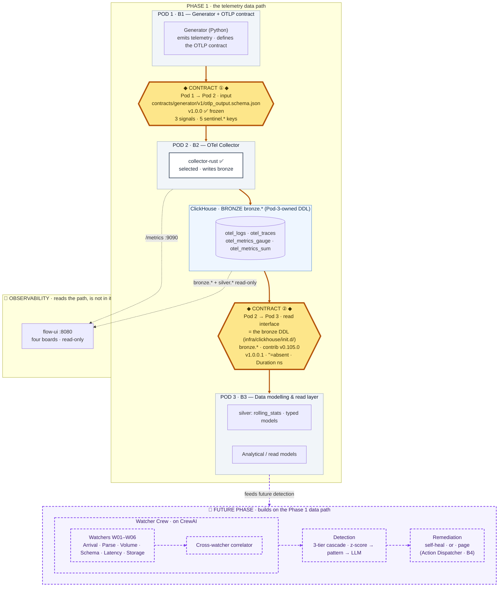

# Sentinel

> **Self-healing data pipelines.** Autonomous detection, AI-native reasoning, OTel-native by design.
> *No downstream user finds the bug before Sentinel does.*

Sentinel is an open-source observability + remediation system for data pipelines, built by **Crew B** of the DataShip Mission 2026 program (Commander: Luan Moreno). This repository is the **integrated monorepo** — every Pod's component behind clear contracts and ownership boundaries, with a one-command end-to-end pipeline. Pod 2 uses Rust as its selected collector implementation.

---

## 1. System architecture

Telemetry flows top-to-bottom through the Pods. **Phase 1 builds the data path:** Pod 1 *generates* telemetry and defines the OTLP contract, Pod 2 *ingests, validates, transforms, and exports* it, and Pod 3 *consumes* Pod 2's output contract for data modelling (bronze → silver → read models). **Watchers, detection, CrewAI-driven reasoning, and remediation are a future phase** layered on top. Alongside the path — not in it — **`flow-ui` observes the pipeline** from the collector's `/metrics` and read-only views of bronze and silver; nothing in the path depends on it being up. Each **gold gate** is a **contract boundary** — a versioned interface owned by the upstream Pod and consumed by the downstream one.


```mermaid
flowchart TB
    subgraph PHASE1["PHASE 1 · the telemetry data path"]
        direction TB
        subgraph POD1["POD 1 · B1 — Generator + OTLP contract"]
            GEN["Generator (Python)<br/>emits telemetry · defines the OTLP contract"]
        end

        C1{{"◆ CONTRACT ① ◆<br/>Pod 1 → Pod 2 · input<br/>contracts/generator/v1/otlp_output.schema.json<br/>v1.0.0 ✅ frozen<br/>3 signals · 5 sentinel.* keys"}}

        subgraph POD2["POD 2 · B2 — OTel Collector"]
            CRUST["collector-rust ✅<br/>selected · writes bronze"]
        end

        subgraph STORE["ClickHouse · BRONZE bronze.* (Pod-3-owned DDL)"]
            direction LR
            RAW[("otel_logs · otel_traces<br/>otel_metrics_gauge · otel_metrics_sum")]
        end

        C2{{"◆ CONTRACT ② ◆<br/>Pod 2 → Pod 3 · read interface<br/>= the bronze DDL (infra/clickhouse/init.d/)<br/>bronze.* · contrib v0.105.0<br/>v1.0.0.1 · ''=absent · Duration ns"}}

        subgraph POD3["POD 3 · B3 — Data modelling & read layer"]
            direction LR
            SILVER["silver: rolling_stats · typed models"]
            DM["Analytical / read models"]
        end

        POD1 ==> C1 ==> POD2 ==> STORE ==> C2 ==> POD3
    end

    subgraph FUTURE["🔮 FUTURE PHASE · builds on the Phase 1 data path"]
        direction LR
        subgraph CREW["Watcher Crew · on CrewAI"]
            direction LR
            WATCH["Watchers W01–W06<br/>Arrival · Parse · Volume · Schema · Latency · Storage"]
            XCORR["Cross-watcher correlator"]
            WATCH --> XCORR
        end
        DETECT["Detection<br/>3-tier cascade · z-score → pattern → LLM"]
        REMED["Remediation<br/>self-heal · or · page<br/>(Action Dispatcher · B4)"]
        CREW --> DETECT --> REMED
    end

    POD3 -.->|"feeds future detection"| FUTURE

    subgraph OBS["🔭 OBSERVABILITY · reads the path, is not in it"]
        FLOW["flow-ui :8080<br/>four boards · read-only"]
    end
    POD2 -. "/metrics :9090" .-> FLOW
    STORE -. "bronze.* + silver.* read-only" .-> FLOW

    classDef contract fill:#fde68a,stroke:#b45309,stroke-width:4px,color:#3a2f00;
    classDef zone fill:#f1f5f9,stroke:#94a3b8,color:#0f172a;
    classDef store fill:#eef6ff,stroke:#4a86c5,color:#0d2a45;
    classDef refimpl fill:#ffffff,stroke:#475569,stroke-width:2px,color:#1e293b;
    classDef future fill:#f5f3ff,stroke:#7c3aed,stroke-width:2px,stroke-dasharray:6 4,color:#3b1d6e;
    class C1,C2 contract;
    class POD1,POD2,POD3 zone;
    class STORE store;
    class CRUST refimpl;
    class FUTURE,CREW,WATCH,XCORR,DETECT,REMED future;
    linkStyle 0,1,2,3,4 stroke:#b45309,stroke-width:3px;
    linkStyle 5,6,7,8 stroke:#7c3aed,stroke-width:2px,stroke-dasharray:6 4;
```

**Diagram key** — gold gate = contract boundary (versioned; the durable asset) · grey box = Pod / ownership zone · white box = active component · **purple dashed cluster = future phase** · status glyphs: ✅ frozen / agreed · 🔶 in progress · ⏳ pending. The hierarchy is shape- and border-redundant, so it survives grayscale.

**What Pod 2 receives, processes, and delivers:**

| Stage | Detail |
|---|---|
| **Receive** | OTLP gRPC `:4317` (real clients) **or** NDJSON file (Pod 1's generator), both conforming to **`contracts/generator/v1/otlp_output.schema.json` v1.0.0** |
| **Process** | Parse/transform → internal `Signal` (log / span / metric) → typed rows; derive span duration; route metrics by type |
| **Deliver** | Rows in the **bronze** `bronze.otel_logs` / `otel_traces` / `otel_metrics_gauge` / `otel_metrics_sum`, per the **Pod 2 → Pod 3 read contract**; Pod 3 builds silver (rolling-stats, read models) on top |

---

## 2. The Pods

**Phase 1** builds the telemetry **data path** (Pods 1 → 2 → 3). Watchers, detection, CrewAI reasoning, and remediation are a **future phase**.

| Pod | Crew | Phase 1 role | Status |
|---|---|---|---|
| **Pod 1** | B1 | Telemetry **Generator** + the **OTLP input contract** | Input contract **v1.0.0 frozen** |
| **Pod 2** | B2 | **OTel Collector** — ingest · validate · transform · export | Rust selected; writes bronze and is validated e2e |
| **Pod 3** | B3 | **Data modelling** — owns the bronze DDL; builds silver + read models | Bronze landed; silver in progress |
| **Pod 4** | B4 | *(Future)* Action Dispatcher — remediation + paging | Future phase |

**Future phase — detection & remediation.** Watchers (W01–W06: Arrival · Parse · Volume · Schema · Latency · Storage) feed a **3-tier detection cascade** — Statistical (z-score) → Pattern (signature) → LLM — orchestrated with **CrewAI**. *Cheapest tier wins.*

---

## 3. POD 2 — the OTel Collector

Be the **single ingestion gateway** between telemetry producers and storage: receive OTLP (or Pod 1 NDJSON), validate/transform against the input contract, and persist to the **bronze** ClickHouse schema in a shape the detection layer can query in <1s. Nothing reaches storage except through a collector.

Pod 2 runs the selected Rust implementation, whose language decision is tracked in [ADR-0004](docs/adr/0004-collector-implementation-language.md).

[`services/collector-rust/`](services/collector-rust/) receives OTLP gRPC or NDJSON, validates the input contract, buffers exports with bounded backpressure, writes directly into Pod 3's **bronze `bronze.*`** tables, and exposes Prometheus metrics on `:9090`. See [ADR-0007](docs/adr/0007-bronze-canonical-contract.md) for the canonical output contract.

---

## 4. Contracts

Contracts are **language-agnostic shared assets** — never duplicated inside an implementation.

| Boundary | Artifact | Version | Status |
|---|---|---|---|
| **Pod 1 → Pod 2** (input) | [`contracts/generator/v1/`](contracts/generator/v1/) (`schema/otlp_output.schema.json` + `golden/`) | **v1.0.0** | ✅ Frozen |
| **Pod 2 → Pod 3** (output) | [`contracts/collector/v1/pod2-pod3-read-contract.md`](contracts/collector/v1/pod2-pod3-read-contract.md) → the **bronze DDL** ([`infra/clickhouse/init.d/01-bronze-otel.sql`](infra/clickhouse/init.d/01-bronze-otel.sql)) | **v1.0.0.1** | ✅ Agreed contract boundary (Pod 3 sign-off pending) |

**Input** — three signal types (`log` / `span` / `metric`), 5 guaranteed `sentinel.*`/`cloud.provider` resource keys, contract-versioned. A golden fixture (`baseline_seed42.jsonl`, 48 logs + 48 spans + 183 metrics) is the conformance oracle.

**Output** — the canonical read schema is Pod 3's **bronze** DDL (`bronze.*`, otel-collector-contrib v0.105.0). The read contract documents the *semantic* layer on top: the 5 Sentinel keys are carried in `ResourceAttributes`, optional IDs follow the `''`=absent rule, `Duration` is nanoseconds, metrics split into gauge/sum, and the rolling-stats rollup is a Pod 3 **silver** artifact. Full ratification = [ADR-0007](docs/adr/0007-bronze-canonical-contract.md) accepted + Pod 3 sign-off (the round-trip evidence is met).

**Decisions of record** — [`docs/adr/`](docs/adr/): 0004 (language) · ~~0005 (hand-rolled schema)~~ superseded · 0006 (optional-ID, refined) · **0007 (bronze = canonical contract)**.

---

## 5. Repository structure

The monorepo separates **shared** assets (contracts, infra, docs) from **per-component** code; adding a collector, language, or Pod never touches another's directory.

```text
sentinel/
├── README.md                      # ← this file: system entry point
├── Makefile                       # 🔗 one-command UX
├── docker-compose.yml             # 🔗 root Rust pipeline orchestrator
│
├── contracts/                     # 🔗 SHARED · contract registry, namespaced by producing Pod
│   ├── generator/v1/                      #   Pod 1 → Pod 2 INPUT contract (SSOT)
│   │   ├── schema/otlp_output.schema.json #     the wire schema (v1.0.0)
│   │   └── golden/baseline_seed42.jsonl   #     collector conformance fixture
│   └── collector/v1/                      #   Pod 2 → Pod 3 READ contract (bronze semantic layer)
│       └── pod2-pod3-read-contract.md     #     v1.0.0.1 · points at the bronze DDL
│
├── infra/                         # 🔗 SHARED · ClickHouse bootstrap
│   ├── clickhouse-init.sql                #   db/users init (dev-only auth)
│   ├── clickhouse-users.d/                #   default-user network override (Rust HTTP path)
│   ├── clickhouse/migrate.sh              #   applies migrations/, recording each in the _meta ledger
│   ├── deploy/                            #   what release.yml publishes + the GCP prerequisites
│   └── clickhouse/init.d/            #   applied on ClickHouse boot, in order
│       ├── 01-bronze-otel.sql         #     the BRONZE schema (bronze.*, Pod-3-owned)
│       └── 02-silver-layer.sql        #     SILVER v1 · typed models + read views (ADR-0010)
│
├── scripts/ci/                    # 🔗 SHARED · repository invariant harness
│   ├── run-invariants.sh                  #   runs every assert in invariants.d/
│   └── invariants.d/                      #   drop-in asserts, one property each
│
├── intent/ · spec/ · plan/        # 🔗 SHARED · the sdlc-e2e-review cycle's document chain
│   ├── intent/                            #   core-intent.md (As-Is) · design-spec.md (rationale)
│   ├── spec/core-spec.md                  #   implementation-ready spec
│   └── plan/                              #   core-plan.md (ticket registry) · decisions/DEC-*.md
│
├── docs/                          # 🔗 SHARED · cross-cutting knowledge
│   ├── adr/                       #   architecture decisions (numbered, Pod-spanning)
│   └── research/ · proposals/     #   design notes, gap analysis, decision proposals
│
├── services/                      # 🧩 PER-COMPONENT · self-contained implementations
│   ├── collector-rust/            #   Pod 2 — selected Rust collector. Cargo/Docker/tests ✅
│   ├── generator-python/          #   Pod 1 — Python telemetry generator (otelgen)
│   └── flow-ui/                   #   the pipeline watching itself — four boards, read-only
│       └── ARCHITECTURE.md      #     how it is built (FastAPI + SSE + no-framework SVG)
│
├── .github/
│   ├── PULL_REQUEST_TEMPLATE.md   # what · why (the linked issue) · tests/evidence
│   └── workflows/                 # rust-ci · python-ci · repo-invariants · release · pr-linked-issue
```

**The scoping rule:** *language-specific config lives inside the component; cross-cutting config lives at the repo root.* Each component is self-contained; the root `Makefile` only coordinates the end-to-end pipeline.

---

## 6. Quick start — end-to-end

Requires Docker (no host toolchains):

```sh
make e2e                  # ClickHouse (bronze auto-applied) + Rust collector + generator → bronze.*
```

Step by step, plus inspect:

```sh
make up                        # start ClickHouse (bronze auto-applies on boot) + the collector
make generate SCENARIO=black_friday SEED=42   # generate → OTLP :4317
make logs                      # tail collector logs
# inspect at http://localhost:8123/play  →  SELECT count() FROM bronze.otel_traces
# scrape collector metrics at http://localhost:9090/metrics
make reset                     # stop everything + drop the ClickHouse volume
```

Watch it happen instead of querying for it:

```sh
make ui                            # flow-ui → http://localhost:8080
make generate-stream DURATION=10m  # real-time telemetry, paced by the wall clock
```

Run `make help` for all targets and the active `SCENARIO / SEED / WINDOW`. Per-component dev still works standalone (`cd services/collector-rust && cargo test`).

---

## 7. Ownership & boundaries

- **The `main` branch policy** is feature branches `feat/<area>-<short>`, Conventional Commits, signed
  commits, attribution trailers and 2 approvals (peer + Captain). **It is convention, not
  enforcement:** `main` carries no GitHub branch-protection rule today (verified 2026-10-06 —
  the API reports `protected: false`), so nothing rejects a push that skips it. Turning the
  policy into a required-check set is T21, behind DEC-I1, and is tracked separately in issue #35.
- **Agent-assisted work follows [ADR-0009](docs/adr/0009-agentic-gitflow.md)** — *seam → swimlane → leg → task*: one git worktree per agent, legs declaring **disjoint paths**, squash into the swimlane and a merge commit into `main` so per-leg attribution survives. The ADR is the record; the `.claude/` agent layer that carried the mechanics was removed from the repo in `7689c16`.
- **CI is five workflows** in [`.github/workflows/`](.github/workflows/): [`rust-ci.yml`](.github/workflows/rust-ci.yml) (gates · integration · cargo-deny · docker-build), [`python-ci.yml`](.github/workflows/python-ci.yml) (ruff · pytest · supply-chain), [`repo-invariants.yml`](.github/workflows/repo-invariants.yml), [`release.yml`](.github/workflows/release.yml) and [`pr-linked-issue.yml`](.github/workflows/pr-linked-issue.yml). Component gates are path-filtered; several jobs are deliberately non-blocking today — see §8 for which, and why.
- **Contracts are jointly owned** by the Pods on both sides of a boundary (input = Pod 1 + Pod 2; the bronze read schema = Pod 2 + Pod 3). **Components are singly owned.**
- The **bronze DDL is Pod-3-owned** (`create_schema:false`); collectors only `INSERT`.

---

## 8. Current status

**Pod 2 / selected Rust collector — writes the bronze schema, validated end-to-end.** generator → Rust collector → `bronze.*` lands **40,200 logs / 40,200 traces / 152,700 metrics** (gauge 83,400 + sum 69,300), lossless; the golden file-mode round-trip yields 48 / 48 / 183.

| Capability | State |
|---|---|
| Parse Pod 1 NDJSON / OTLP gRPC against v1.0.0 contract | ✅ |
| Write directly into Pod 3 **bronze** (`bronze.*`) | ✅ verified live |
| Metrics routed by type → `otel_metrics_gauge` / `otel_metrics_sum` | ✅ |
| Sentinel metadata carried in `ResourceAttributes` | ✅ |
| gRPC receive-boundary contract validation (`off`/`warn`/`strict`) | ✅ |
| Bounded buffered export with batch-size and flush-interval controls | ✅ |
| Prometheus `/metrics` endpoint on `:9090` | ✅ |
| Graceful shutdown with final buffer flush | ✅ |
| Distroless Docker image + root compose orchestrator | ✅ |
| CI: gates (fmt · clippy · test · build) · integration (live ClickHouse, every `#[ignore]`d test) · cargo-deny · docker-build | ✅ |
| Pod 3 silver (rolling-stats rollup, read models) | 🔶 in progress — silver v1 DDL exists; read models (T25–T29) not started |

**Latest local E2E snapshot** — Docker/Linux arm64, scenario `baseline`, seed `42`, window `5m` (2026-08-04):

| Measurement | Result |
|---|---:|
| Signals delivered | 233,100 in 4.5s (~51.4k signals/s) |
| Ingested / accepted / persisted | 233,100 / 233,100 / 233,100 |
| Rejected / dropped / export errors | 0 / 0 / 0 |
| Successful batch flushes | 84 |
| Average batch size | 2,775 signals |
| Average ClickHouse export latency | 32.3ms |
| Export latency distribution | 100% of flush attempts ≤80ms |
| Bronze rows | 40,200 logs · 40,200 traces · 83,400 gauges · 69,300 sums |

This workload met the collector health gates: no signal loss, no contract rejection, no failed export, complete bronze parity, and sub-80ms export attempts. These numbers are a reproducible local snapshot, not a production SLO or a substitute for sustained-load benchmarking on target infrastructure.

### Delivery path and SDLC hardening (`sdlc-e2e-review` cycle)

This cycle hardened how the pipeline is built, checked and published rather than what it computes. The ticket registry is [`plan/core-plan.md`](plan/core-plan.md).

**15 of 48 tickets are done. 33 remain, and none of them is startable.** Every remaining ticket sits behind a Wave 0 decision — this is the plan's own frontier order (`plan/core-plan.md` §3), not an estimate. T35 was the last ticket whose blockers were all clear, which is why the queue stops where it does.

| Remaining | Tickets | Count | Waiting on |
|---|---|---:|---|
| Compose unification, roles/auth, CI gates | T12–T21 | 10 | **DEC-I1** |
| Pod 3 silver read models | T25–T29 | 5 | T16 + T20 → DEC-I1 |
| Backfill runner | T30–T34 | 5 | T19 + **DEC-A2** |
| flow-ui dual-source boards | T36–T39 | 4 | T27 / T28 / T29 → DEC-I1 |
| Deploy, TLS, edge auth, secrets | T40–T44 | 5 | **DEC-A1**, **DEC-A2**, **DEC-A4** |
| Docs legs | T45–T48 | 4 | **DEC-I2** (+ their waves) |

So the remaining work is **six decisions, not thirty-three tickets**. [DEC-I1](plan/decisions/DEC-I1.md) alone gates 26 of them, and as of 2026-10-06 it has no open residual — its last one dissolved when ClickHouse Cloud turned out to expose no engine-version pin at all, which separates the repo pin (ours, decidable now) from the deployed engine version (a moving fact, DEC-A2's problem). Of the eight `DEC-*` items, DEC-V3a is folded into DEC-I1 and DEC-D1 is deliberately left open until T28, leaving six that need a human: **I1, A1, A2, A3, A4, I2**. The plan's advice is to run them as one sync agenda item rather than eight documents.

Landed, with its limits stated:

| Area | Landed | Limit |
|---|---|---|
| **Python CI** (T07, T08) | [`python-ci.yml`](.github/workflows/python-ci.yml): ruff + pytest on a `PYTHON_IMAGE` matrix; the generator integration suite targets `CLICKHOUSE_URL` instead of starting its own ClickHouse | Closes the former "no Python gate" gap |
| **Rust CI** (T09) | `rust-ci.yml` now runs every `#[ignore]`d integration test (one of them had never run) | |
| **Python supply chain** (T10) | `pip-audit` + `bandit` job | **Warn-only** (`continue-on-error`); there is no lockfile yet, so `pip-audit` resolves whatever is current |
| **Repository invariants** (T01) | [`scripts/ci/run-invariants.sh`](scripts/ci/run-invariants.sh) + drop-in [`invariants.d/`](scripts/ci/invariants.d/), run by `repo-invariants.yml` | See *Invariants* below; the CI job is non-blocking |
| **Migrations** (T05, T11) | [`infra/clickhouse/migrate.sh`](infra/clickhouse/migrate.sh) records each applied migration in a `_meta` ledger (migration `0003`); `make migrate` runs it | |
| **Collector credentials** (T06) | `user` / `password_file` collector config | |
| **Cross-arch** (T04) | arm64 + musl/TLS compile spike, toolchain target, CI `platforms:` | |
| **Test scaffolding** (T02, T03) | flow-ui two-coverage fixtures; a Compose `include:` path-resolution probe | |
| **flow-ui** (T35) | `silver_coverage` probe on the 30 s lane | |
| **Release** (T22) | [`release.yml`](.github/workflows/release.yml): Artifact Registry, GitHub OIDC → Workload Identity Federation (no long-lived key), SLSA provenance, SBOM, keyless cosign signing of the digest | **Unverified.** See below |
| **Promotion** (T23) | digest promotion `main` → `:staging`, `v*` → `:prod`; `cosign verify` runs before any tag moves | **Unverified.** See below |
| **Image scan** (T24) | trivy scan by digest | **Warn-only, and does not gate the push.** See below |

Also this cycle, commit `7689c16` removed the `.claude/` agent layer and the `meetings/` archive (89 files).

**Unverified: nothing in the release lane has run against a real registry.** No GCP project, Artifact Registry repository or Workload Identity provider exists yet. Signing, attestation verification and `crane tag` on a multi-arch index have therefore not been exercised; [`infra/deploy/README.md`](infra/deploy/README.md) carries the specific "Unverified" notes and what to confirm on the first publish.

**The vulnerability scan does not gate the push.** It runs after `push: true`, so REQ-H-12's wording ("SHOULD gate the registry push") is not met: a multi-arch manifest cannot be loaded into the runner's daemon to be scanned beforehand. It is warn-only (`exit-code: "0"`, a single flag). Making it blocking, and the severity threshold, are policy and belong to T21.

**Invariants: 4 of 5 currently fail, by design.** The asserts are written to the end state and stay red until T12–T19 land; this is not a regression. `bash scripts/ci/run-invariants.sh` (2026-10-06) reports:

| Assert | Result | Why |
|---|---|---|
| `01-single-clickhouse-image` | FAIL | three image pins: `24.3` (root compose), `25.4` (`services/collector-rust/infra/docker-compose.yml`), `24.3` (`services/generator-python/docker-compose.yaml`) |
| `02-service-named-clickhouse` | FAIL | `infra/clickhouse/compose.clickhouse.yml` does not exist |
| `03-no-duplicate-host-8080` | FAIL | the generator Compose file collides with the root stack on host ports 4317, 8080 and 8123 |
| `04-no-plaintext-secrets` | FAIL | the vestigial `otelgen` user's password sits in plaintext in `infra/clickhouse-init.sql` and the generator Compose file; migration `0002` drops the user (T17/T19) |
| `05-flow-ui-is-read-only` | PASS | flow-ui issues no write statement |

The `repo-invariants` job runs with `continue-on-error: true` until T15 flips it, so it is not a required check.

**Not done.**

- **T12–T21 are blocked on [DEC-I1](plan/decisions/DEC-I1.md)** (one ClickHouse image pin, and whether `services/generator-python/docker-compose.yaml` is deleted). DEC-I1 gates T12 directly and 26 tickets transitively (T12–T21, T25–T34, T36–T39, T46, T47). [DEC-A2](plan/decisions/DEC-A2.md) (ClickHouse hosting and operational owner) additionally gates T30 and T40.
- **T20** (`e2e-silver.yml`, the live-ClickHouse silver job) and **T21** (`docs/ci-gates.md` and the required-check set) sit behind T19, and so behind DEC-I1. Until T21, no new check is required and branch protection is not configured.
- **Pod 3 silver read models (T25–T29)** are not started.

**Remaining:** DEC-I1 (the dominant blocker: it gates 26 tickets) and DEC-A2; then ADR-0007 acceptance (Pod 3 sign-off), Pod 3 silver read models, histogram/summary metrics, branch protection and the agentic layer.

---

## 9. Open questions & decisions

| # | Item | Type | Where |
|---|---|---|---|
| 1 | Rust selection recorded in ADR-0004 (**Accepted** 2026-10-06). Open residue: the Go-vs-Rust bake-off it specified was never run, so there is no comparative baseline | Resolved, with a caveat | [ADR-0004 §Selection](docs/adr/0004-collector-implementation-language.md) |
| 2 | Bronze = canonical Pod 2 → Pod 3 contract (`Proposed`; Pod 3 sign-off pending) | Pending | [ADR-0007](docs/adr/0007-bronze-canonical-contract.md) · [read contract](contracts/collector/v1/pod2-pod3-read-contract.md) |
| 3 | Sentinel keys are `Map` probes under bronze (no typed columns) — materialize in silver? | Open | [ADR-0007 §Trade-offs](docs/adr/0007-bronze-canonical-contract.md) |
| 4 | `otel_metrics_1m` rolling-stats moved to Pod 3 silver (Tier-1 input) | Handoff | [read contract §2.3](contracts/collector/v1/pod2-pod3-read-contract.md) |
| 5 | Histogram / Summary metrics not emitted (no v1.0.0 type) | Known gap | `services/collector-rust/src/otlp.rs` |
| 6 | **DEC-I1** — one ClickHouse image pin; is `services/generator-python/docker-compose.yaml` deleted? Gates 26 tickets | **Blocking** | [`plan/decisions/DEC-I1.md`](plan/decisions/DEC-I1.md) |
| 7 | **DEC-A2** — ClickHouse hosting / operational owner. Additionally gates T30 and T40 | **Blocking** | [`plan/decisions/DEC-A2.md`](plan/decisions/DEC-A2.md) |
| 8 | Release lane (signing, attestation verification, `crane tag` on a multi-arch index) never run against a real registry | Unverified | [`infra/deploy/README.md`](infra/deploy/README.md) |
| 9 | Image scan runs after push (REQ-H-12 not met) and is warn-only; blocking threshold is policy | Open | T21 · [`infra/deploy/README.md`](infra/deploy/README.md) |
| 10 | Agentic gitflow amends the WoW's squash-to-main rule (needs ratification) | Pending | [ADR-0009](docs/adr/0009-agentic-gitflow.md) |

---

## 10. Pointers

[Rust collector](services/collector-rust/) · [ADRs](docs/adr/README.md) · [Pod 2 → Pod 3 read contract](contracts/collector/v1/pod2-pod3-read-contract.md) · [bronze gap analysis](docs/research/pod3-bronze-gap.md) · [bronze DDL](infra/clickhouse/init.d/01-bronze-otel.sql) · [ticket registry](plan/core-plan.md) · [decisions](plan/decisions/README.md) · [deployment artifacts](infra/deploy/README.md)

---

*Built by Crew B · DataShip Mission 2026 · Upstream: <https://github.com/luanmorenommaciel/sentinel>*
