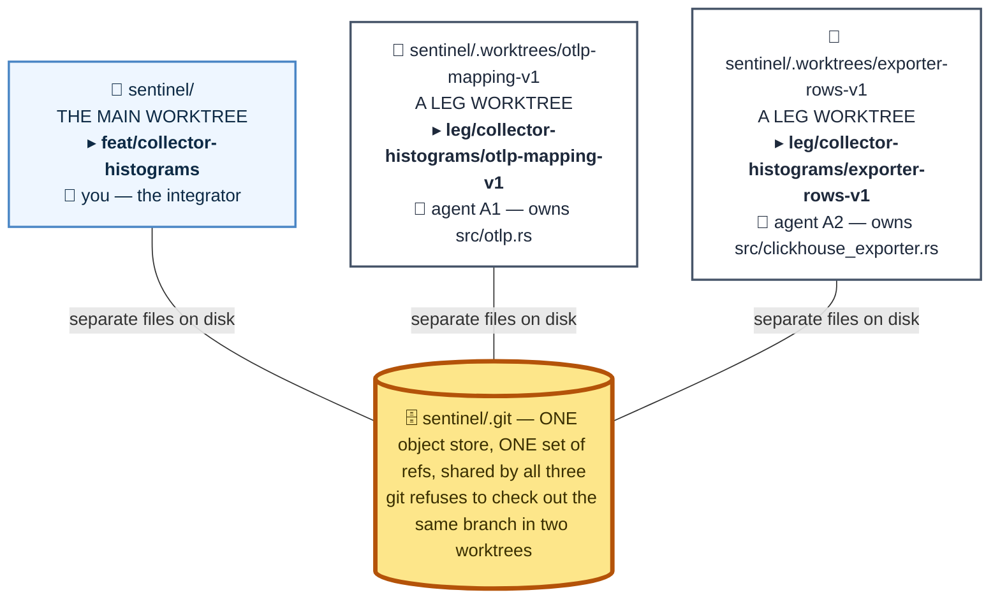
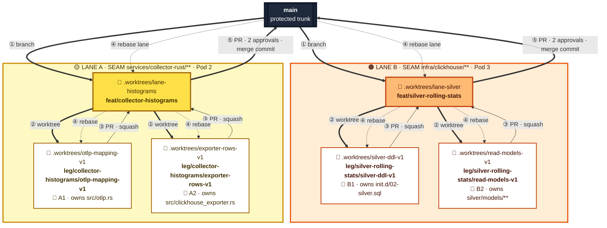

# ADR-0009 · Agentic gitflow — seam → swimlane → leg → task

| Field | Value |
|---|---|
| Status | Proposed — process change; acceptance = Captain + Commander ratification at the sync |
| Date | 2026-08-18 |
| Owners | Crew B (all Pods) |
| Proposer | Victor Urquiola (from the Commander's whiteboard sketch) |
| Supersedes | — (amends the WoW branching + merge rules; see [Trade-offs](#trade-offs)) |
| Related | [ADR-0008](0008-contracts-registry-by-producing-pod.md) (the ownership seams this rides on) · [WoW](../../.claude/kb/process/crew-b-wow/index.md) · practical guide [`.claude/docs/AGENTIC_GITFLOW.md`](../../.claude/docs/AGENTIC_GITFLOW.md) |

> **This is a process ADR, not an architecture one.** It exists because agentic development
> breaks an assumption our WoW was written under: that one contributor works in one checkout
> at a time. When N agents edit files concurrently, branch hygiene stops being style and
> becomes a correctness property.

## Context

Crew B is moving from human-paced contribution to **agent fleets**: several coding agents
working simultaneously inside one repository. Two things break immediately.

1. **One checkout, N writers.** Agents editing the same working tree corrupt each other —
   half-applied edits, races on the index, `git checkout` under a peer's feet. The isolation
   primitive that fixes this is `git worktree`: separate working directories sharing one
   `.git`, so branches are cheap and truly parallel.
2. **Our merge gate does not scale to agent output volume.** The WoW requires 2 approvals
   (peer + Captain) and the CI gates on every PR to `main`. An agent produces many small,
   cheap, disposable changes. Applying the full human gate to each one burns the scarcest
   resource we have — Captain attention — on the lowest-blast-radius diffs.

The Commander sketched a four-level decomposition — **seam → swimlanes → legs → tasks** —
with worktrees fanning out of a feature branch and returning by Pull Request. This ADR
records that shape, resolves the vocabulary, and adds the three rules the sketch left
implicit (path disjointness, sync cadence, per-level gates).

## Decision

**Adopt the four-level decomposition below as Crew B's branching model for agent-assisted work.**

| Level | Is | Git artifact | Lifetime |
|---|---|---|---|
| **Seam** | the **ownership boundary** the work crosses — a Pod's zone or a contract boundary. Not a git object; it is what decides whether two pieces of work can run in parallel | — (`contracts/`, `services/<component>/`, `infra/`) | permanent |
| **Swimlane** | one coherent effort inside a seam, owned by one Pod | `feat/<area>-<short>` | days–weeks |
| **Leg** | one parallelizable chunk of a swimlane, executed by one agent in its own worktree | `leg/<area>/<task>-v<n>` + worktree at `.worktrees/<task>-v<n>` | hours–days, disposable |
| **Task** | a unit of work inside a leg | commits | minutes–hours |

### What a leg physically is

A leg is **two things at once, and that pairing is the whole point**: a *branch* (what git
tracks) and a **separate working directory on disk** (what the agent actually edits). That
directory is a **git worktree** — created with one command, sharing the parent clone's `.git`:

```sh
git worktree add -b leg/collector-histograms/otlp-mapping-v1 .worktrees/otlp-mapping-v1 feat/collector-histograms
#                   ^ new branch                             ^ new directory            ^ branches from here
```

After running it twice, one clone looks like this:



Three directories, three branches checked out simultaneously, **one** `.git`. That is what
makes N agents parallel: agent A1 editing `src/otlp.rs` in one directory
cannot touch agent A2's files in another, because they are different files on disk — while
both still share every commit, ref and object with the parent clone. No second clone, no
`git switch` under a peer's feet, no half-applied edits.

Git enforces one guardrail for free: **the same branch cannot be checked out in two worktrees
at once.** It refuses. That is the feature, not an obstacle.

Two consequences worth internalizing before running a fleet:

- **A worktree is local.** It has no presence on `origin`. To open a PR from a leg you must
  push its branch first (`git push -u origin leg/…`).
- **Each worktree has its own build artifacts** (`target/`, `.venv/`). That is the cost of
  the isolation, and it is why the shared-cache setup in [the guide](../../.claude/docs/AGENTIC_GITFLOW.md)
  is not optional.

### The whole flow — two swimlanes, four agents, one trunk

Everything above, in one picture. Two **real** Sentinel work items that are open right now
(README §9 item 5, and the Pod 3 silver row), each fanned out to two agents:



**Diagram key** — read it vertically. **Swimlane A on top, `main` in the middle, swimlane B
below**: the trunk sits between the two lanes it serves. Inside each lane the flow runs downward
too — the lane's own worktree first, its legs beneath it.

- **Dark** = the protected trunk · **🟡 yellow = swimlane A**, **🟠 orange = swimlane B**, each
  shading its whole seam · **white** = a disposable leg worktree, bordered in its lane's colour.
- **Colour is never the only cue.** Every cluster is also labelled `LANE A` / `LANE B`, and the
  branch name is **bold** inside every box — so this survives greyscale and colour-blind readers.
- **Every box is a directory on disk** (📁) holding exactly one branch and one worker.
- **Solid** = work fanning out and PRs coming back · **dotted ④ = the sync edges**, which the
  original sketch omitted and which are what keep the model from rotting.

Read one lane and you have the whole lifecycle: **① branch** from `main` → **② `git worktree add`**
one directory per agent → **③ PR** back into the lane (1 review + full CI, squash) →
**④ rebase** continuously, both siblings onto the lane and the lane onto `main` →
**⑤ PR** to `main` (2 approvals, merge commit). Steps ③ and ⑤ are rule R3; step ④ is R2.

**Why both lanes can run at the same time:** they sit in **different seams**. Lane A never
leaves `services/collector-rust/`; lane B never leaves `infra/clickhouse/`. Neither can break
the other, so both branch from `main` independently and merge back independently — whichever
lands first, the other rebases.

**This is R1 applied at two levels.** The disjoint-paths test governs *both* fan-outs: the four
legs against each other, and the two lanes against each other. One test, two levels — which is
the reason "seam" sits at the top of the hierarchy rather than being a synonym for `main`.

**When lanes are *not* independent, the seam says so — and orders them.** Histogram support is
the honest example: the collector cannot emit a histogram the input contract has no type for,
so the work also touches `contracts/generator/`, a **third seam jointly owned by Pod 1 and
Pod 2**. That crossing is not a leg and not a sibling lane — it is a *predecessor*. The
contract bump lands as its own swimlane first; `feat/collector-histograms` rebases onto it and
only then can finish. **Work that crosses a seam is sequenced, never fanned out.**

A command-by-command walkthrough of exactly these two lanes — including the `git worktree list`
output and the cleanup — is in
[`.claude/docs/AGENTIC_GITFLOW.md`](../../.claude/docs/AGENTIC_GITFLOW.md#worked-example--two-swimlanes-end-to-end).


Four rules make it work. The first three were implicit in the sketch:

**R1 · Legs declare disjoint paths.** Every leg names the paths it owns before it opens. Two
open legs in a swimlane **may not** declare overlapping paths. If they must overlap, they are
one leg — or the shared part is extracted into a leg that lands first. This is what makes
"seam" load-bearing rather than decorative: parallelism is bounded by *ownership*, not by how
independent the tasks sound in prose. Sentinel already has these seams from
[ADR-0008](0008-contracts-registry-by-producing-pod.md) — `contracts/`, `infra/`,
`services/collector-rust/`, `services/generator-python/` are disjoint by construction.

**R2 · Sync flows both ways.** The lane rebases onto `main` after every merge to `main`.
Surviving legs rebase onto the lane after every fan-in. Without this, the lane drifts and the
swimlane→main PR becomes a big-bang merge — precisely the diff our 2-approval gate reviews
worst.

**R3 · Gates differ by level.** Human attention concentrates where blast radius is.

| PR | Review | CI | Merge style |
|---|---|---|---|
| leg → swimlane | 1 reviewer (may be the `code-reviewer` agent) | full gates | **squash** — one commit per leg |
| swimlane → main | 2 approvals: peer + Captain | full gates | **merge commit** — preserves one commit per leg |

**R4 · Legs are disposable, branches are not named after tools.** A failed leg is closed and
reopened as `-v2`; nothing is salvaged from it. Branch names describe the *work*
(`leg/collector-histograms/otlp-mapping-v1`), never the mechanism — the branch outlives the worktree,
and a name like `worktree/…` lies the moment the same task runs without one. The worktree
*directory* lives at `.worktrees/<task>-v<n>` (gitignored).

**When not to use legs.** The structure costs a branch, a worktree, a PR, a review and a
rebase each. It pays only when ≥2 agents work simultaneously on disjoint paths. A single
sequential task works directly in the swimlane. **Dependent** work does not fan out at all —
it stacks (leg B branches from leg A, PR B targets branch A). Forcing dependent work into a
parallel fan-out is the primary way this pattern produces garbage.

## Options considered

| # | Option | Verdict |
|---|---|---|
| A | **Agents share one checkout, serialize by lock** | Rejected. Serializes exactly the work we parallelized; a crashed agent holds the lock. |
| B | **One clone per agent** | Rejected. Full object-store copy per agent, no shared refs, expensive at Rust build sizes. Worktrees give the same isolation for a fraction of the cost. |
| C | **Legs branch from `main`, PR straight to `main`** | Rejected. Every agent's WIP hits the protected trunk and the full 2-approval gate; no place to integrate a multi-leg effort before human review. |
| D | **Legs branch from the swimlane, PR to the swimlane** (the sketch) | **Adopted**, plus R1–R4. |
| E | **Stacked PRs throughout** | Rejected as the default — it serializes review. Retained as the prescribed shape for *dependent* legs. |

## Trade-offs

- **This ADR amends the WoW.** The WoW says "squash-merge to main". R3 keeps squash at
  leg→swimlane but requires a **merge commit** at swimlane→main. Reason: squashing twice
  flattens the `Co-Authored-By` attribution trailers our WoW mandates, and we lose which agent
  authored what. Attribution is a stated Crew B value, so the merge style bends to it rather
  than the reverse. **This is the change most in need of explicit ratification.**
- **The 2-approval gate is relaxed at leg level** (1 reviewer, possibly an agent). We trade
  per-leg human scrutiny for scrutiny concentrated on the integration PR. The counter-argument
  — that a bad leg reaches `main` with only one human look — is real, and is why the
  swimlane→main gate keeps both approvals and why R1 keeps legs small and bounded.
- **Longer-lived integration branches** are a known smell. R2 is the mitigation, not a cure;
  a swimlane open for more than ~2 weeks should be split.

## Consequences

- Agents get a mechanical, checkable definition of "can these two run in parallel?" — do their
  declared paths intersect? — instead of a judgement call.
- `main` history becomes one commit per leg, each carrying its attribution trailers, grouped
  under a merge commit per swimlane. Reading `main` tells you what was built and by whom.
- `.worktrees/` must be gitignored, and **shared build caches become mandatory**: each worktree
  otherwise gets its own `services/collector-rust/target/` (multiple GB, cold rebuild). With 6
  agent worktrees and no shared `CARGO_TARGET_DIR`, parallel agents are *slower* than serial.
  Same for the `uv` cache on the Python side. Mechanics in
  [`.claude/docs/AGENTIC_GITFLOW.md`](../../.claude/docs/AGENTIC_GITFLOW.md).
- Leg branches must be pushed to `origin` to open a PR — worktrees are local-only.

## Risks

| Risk | Mitigation |
|---|---|
| Path disjointness (R1) is declared but not enforced; two legs overlap anyway | Start as a checklist item in the leg PR template. Escalate to a CI check comparing open legs' declared paths if it bites twice. |
| Relaxed leg review lets a defect reach the integration branch | Legs are small and bounded by R1; the swimlane→main gate is unchanged; a bad leg is revertible as one squashed commit. |
| Merge-commit-to-main makes `main` history noisier than today | Accepted deliberately in exchange for attribution fidelity. |
| Vocabulary collision: "seam" already means *ownership seam* in `kb/communication/architecture-diagramming` | Resolved by using it in exactly that sense here. **Open point for the sync:** the original sketch may have meant seam = `main`. If so, this ADR renames the top level and the rest stands unchanged. |
| The four levels become ceremony for one-agent work | The "when not to use legs" rule above; legs are opt-in above 2 concurrent agents. |

## Next steps

1. Ratify at the sync — specifically the **merge-commit-to-main** amendment and the **seam** vocabulary.
2. Land the practical guide [`.claude/docs/AGENTIC_GITFLOW.md`](../../.claude/docs/AGENTIC_GITFLOW.md) and gitignore `.worktrees/`.
3. Add a leg-PR template carrying the declared-paths checklist (R1).
4. Add the shared build-cache bootstrap to the worktree setup.
5. Re-evaluate after one full swimlane runs under it; amend rather than replace.

## References

- The Commander's whiteboard sketch, *Seam ⇒ Swimlanes ⇒ Legs ⇒ Tasks*
- [ADR-0008](0008-contracts-registry-by-producing-pod.md) — the ownership seams R1 rides on
- [Crew B WoW](../../.claude/kb/process/crew-b-wow/index.md) — the branching + merge rules this amends
- `git worktree` — <https://git-scm.com/docs/git-worktree>
