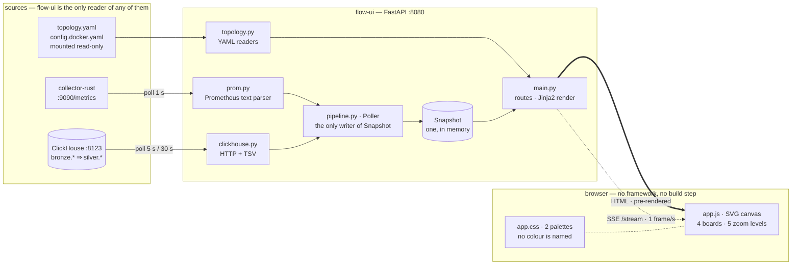
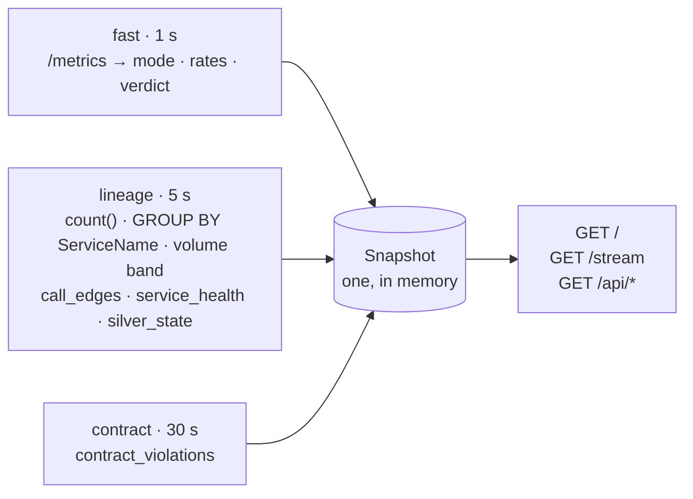
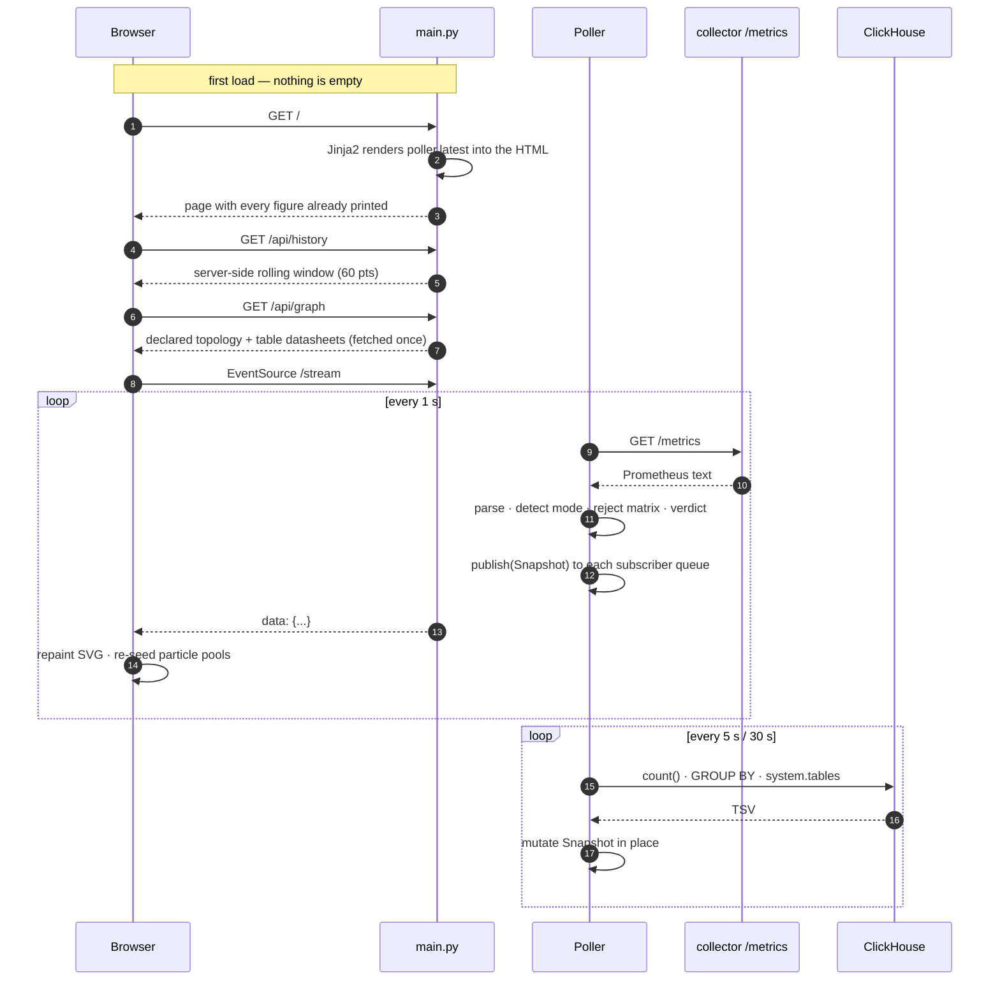
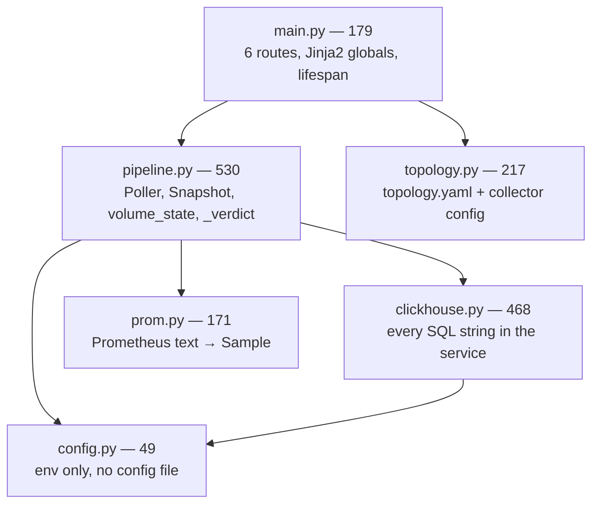
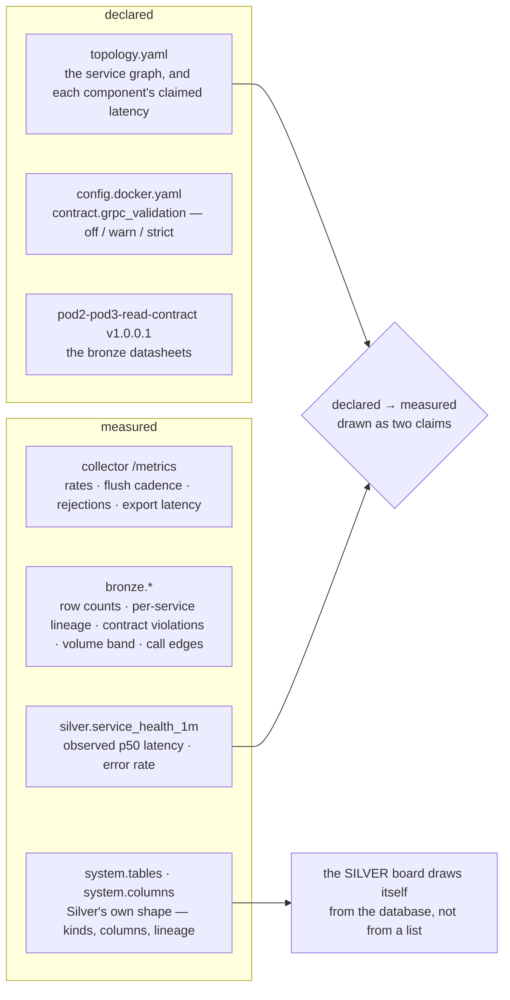
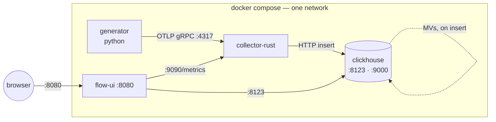

# flow-ui — architecture

What this service is made of, and how a number gets from the pipeline to the screen.

For *what the page shows and why it shows it that way*, see [DESIGN.md](DESIGN.md). This
document is the machinery under it.

## In one sentence

A **FastAPI** process that polls two sources on three cadences, keeps one in-memory snapshot,
renders it into HTML server-side, and pushes each subsequent tick over **SSE** to a
**dependency-free** browser page that redraws an SVG.

## The stack, and what is deliberately absent

| Layer | Choice | Why this and not the obvious alternative |
|---|---|---|
| Language | Python 3.12 | Pod 1 is already Python; this is a *reader*, not a hot path. The 730–18,000 signals/s never pass through here — only counters do |
| Web | FastAPI + Uvicorn | Async is the requirement: one SSE connection per viewer, held open, while two pollers run |
| Templating | Jinja2 | Every figure is in the HTML **before any script runs**. A blocked script costs the motion, never the reading |
| Transport | SSE (`text/event-stream`) | One-directional, server→client. WebSockets buy a return channel this page has no use for, and cost reconnection logic the browser gives SSE for free |
| HTTP client | httpx (async) | Both sources speak HTTP: the collector's `/metrics`, ClickHouse's `:8123` |
| Config | PyYAML | Reads Pod 1's `topology.yaml` and the collector's `config.docker.yaml` — *read*, never redrawn, so the picture cannot drift from what emits the telemetry |
| Front end | **none** | ~1.7k lines of plain ES2020 + SVG. No React, no D3, no bundler, no `package.json`, no build step |
| Styling | one hand-written stylesheet | Two palettes switched by one attribute. **Nothing in the CSS names a colour** — every value is a token, so the switch re-tests every colour decision against a second ground |

**Why no front-end framework.** The page is one graph that is never replaced — boxes grow in
place and the particles keep flowing through. React's model is to re-render a tree; this
page's core invariant is that the SVG elements carrying `animateMotion` **must not be
recreated**, or every dot restarts from the mouth of its pipe. Working against that is more
code than the DOM calls it replaces. `asset_v()` cache-busts on file mtime, so there is a
dev loop without a bundler.

## Components

**The browser never talks to the collector or to ClickHouse.** Not a preference — a
constraint. The collector's `/metrics` server sets exactly one response header
(`Content-Type`; see `collector-rust/src/metrics_server.rs`) and ClickHouse has no CORS header
configured under `infra/`, so a cross-origin fetch from the page is blocked with no visible
error. This service is the only reader of either, which also means the page works unchanged
wherever those two move to. A test pins it.

## Three cadences, because the queries cost three different things

The Poller runs one fast loop and two slow tasks. They are separate because sharing a cadence
would make the cheapest reading wait on the most expensive one.

| Lane | Env | Cost |
|---|---|---|
| fast · 1 s | `FLOW_UI_POLL_INTERVAL` | counters only — constant |
| lineage · 5 s | `FLOW_UI_LINEAGE_INTERVAL` | `count()` and `system.tables` read part metadata; no scan |
| contract · 30 s | `FLOW_UI_CONTRACT_INTERVAL` | probes the **unindexed** `ResourceAttributes` Map — 1.26 s measured |

Each slow task owns its own `while True` and swallows its own exceptions, so a failing
ClickHouse degrades the boards it feeds and never stops the tick. `stop()` cancels and awaits
both, so a reload does not leak them.

**Why the contract lane is 30 s and alone.** `contract_violations()` counts rows missing each
required `sentinel.*` key across every live table. The `ARRAY JOIN` form multiplies every row
by five before filtering — 6.4 s against 1.26 s for `countIf`, over the same ~6M rows. Even at
1.26 s it must not share the 5 s lane.

**Why bronze growth is `count()` deltas and never a time window.** Bronze stores *event* time
— the read contract (§2) defines `Timestamp` as the signal's own timestamp and there is no
ingest-time column. In backfill the generator writes five minutes of history in thirteen
seconds, so `WHERE Timestamp > now() - INTERVAL 10 SECOND` answers "what *happened* recently",
which is a different question. It is also 40,000× the rows: bare `count()` reads 1 row of part
metadata (3.7 ms measured); the windowed form scans the table.

## A tick, end to end

**A full subscriber queue drops its own frames, never the publisher's tick.** One slow tab
must not stall the poll loop or the other viewers; `publish()` discards into a full queue and
moves on. A test pins that too.

## Modules

The split is by **source**, not by feature: one module per thing that can be unreachable.
`prom.py` and `clickhouse.py` each own their failure mode, and `pipeline.py` decides what an
unreachable source means for the verdict.

Two parsing rules worth knowing before changing either reader:

- **An absent metric family is a normal state, not an error.** The collector's labelled
  counters are `IntCounterVec`s, and a `*Vec` exposes nothing until a label combination is
  instantiated. A freshly started collector serves three families; the other five appear when
  traffic does. `Sample.value()` returns `0.0` for anything absent.
- **`Sample.sum_over_pair`, because two separate reads cannot recover a cross-product.**
  `signals_rejected_total` is labelled by both `signal` and `reason`. Reading it once by
  `signal` and once by `reason` loses which type failed which way — which is exactly what
  colours the dot leaving the chain.

## Where the data comes from

The whole point of the ORIGIN board is that seam: `topology.yaml` says what a component's
latency *should* be, `silver.service_health_1m` says what its operations *took*. The two
agreeing is the baseline; the two diverging is the finding. Declared-but-never-traced edges
are drawn dashed rather than at a width that would imply traffic they do not carry.

## Deployment

One container, one process, no state on disk.

Configuration is environment only — there is no config file for this service:

| Env | Default |
|---|---|
| `COLLECTOR_METRICS_URL` | `http://localhost:9090/metrics` (compose: `http://collector:9090/metrics`) |
| `CLICKHOUSE_URL` | `http://localhost:8123` (compose: `http://clickhouse:8123`) |
| `CLICKHOUSE_DATABASE` | `bronze` |
| `GENERATOR_CONFIG_DIR` | `/app/generator-config` — Pod 1's config, mounted read-only |
| `FLOW_UI_POLL_INTERVAL` | `1.0` — matches the stream-mode flush cadence |
| `FLOW_UI_LINEAGE_INTERVAL` | `5.0` |
| `FLOW_UI_CONTRACT_INTERVAL` | `30.0` |
| `FLOW_UI_VOLUME_WINDOW_MIN` | `60` |
| `FLOW_UI_HISTORY` | `60` — points in the server-side rolling window |

Scaling note: the Snapshot is **per process**, so more than one replica behind a load balancer
gives two viewers two different pictures a second apart. That is fine for one crew and wrong
for a shared deployment; the fix is a shared store, and nothing here needs it yet.

## What is not tested, and it is the same gap every time

63 tests cover the parsing, the poller's inferences and the pure verdict logic. They cover
**nothing about SVG geometry** — where things land on the canvas is checked by looking, and
that gap has cost real defects: a detail panel drawn over the nodes it described, two header
collisions, and a pipe routed out from under the box it was meant to reach. A geometry test is
on the roadmap in [STATUS.md](STATUS.md).

## See also

- [README.md](README.md) — run it, break it on purpose, endpoints
- [DESIGN.md](DESIGN.md) — the visual grammar and the rules it holds to
- [STATUS.md](STATUS.md) — what shipped, in order, and what is next
- [`contracts/collector/v1/pod2-pod3-read-contract.md`](../../contracts/collector/v1/pod2-pod3-read-contract.md) — the bronze semantics this reads
- [ADR-0010](../../docs/adr/0010-silver-v1-operational-model.md) — the Silver models and their materialized views
