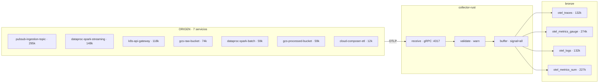

# Direcciones visuales — flow UI

> Cinco mundos candidatos para el visualizador de flujo. Elegir **uno** y recién ahí pulir.
> Las cifras son medidas, no estimadas — ver [§ Datos](#datos-que-usan-las-maquetas).
> *2026-09-01 · Pod 2 · pendiente de elección*

## Por qué esto existe

La v0 funciona y no emociona. El problema no son los colores: es que **no hay un mundo
detrás**. Todo pesa lo mismo, seis tiles idénticas, un diagrama con la mitad de aire muerto
y nada que decir en reposo.

Buscar referencias sueltas y copiar pedazos da un collage. Lo que funciona es elegir un
mundo y derivar todo de ahí — paleta, tipografía, movimiento y jerarquía salen solos cuando
el mundo está decidido.

**Las cinco direcciones muestran el mismo DAG, los mismos siete servicios y las mismas
cifras.** Lo único que varía es el lenguaje visual, que es exactamente la decisión.

---

## El DAG — común a las cinco

Reemplaza la lista de tablas y las barras de lineaje de la v0. Cada caja se despliega.



Tres carriles entran al collector (logs / traces / metrics se distinguen sólo en el borde de
recepción); **del buffer en adelante hay uno solo**, porque el `BufferedExporter` mezcla todo
en un lote y etiqueta `signal="all"`. El diagrama se angosta ahí porque las métricas también.

### El inspector: la documentación ya existe

Al desplegar un nodo se abre su ficha. **No hay que escribir esa documentación** — sale
entera del contrato de lectura Pod 2 → Pod 3 `v1.0.0.1`. Ejemplo real de `bronze.otel_logs`:

| Columna | Tipo | Garantía |
|---|---|---|
| `Timestamp` | `DateTime64(9)` | event time, UTC, precisión ns |
| `ServiceName` | `LowCardinality(String)` | siempre presente · **única columna indexada** |
| `SeverityText` | `LowCardinality(String)` | `INFO`, `ERROR`, … |
| `SeverityNumber` | `UInt8` | 0–24 |
| `Body` | `String` | texto del log |
| `TraceId` | `String` | hex de 32, **`''` si ausente — nunca `NULL`** |
| `SpanId` | `String` | hex de 16, `''` si ausente |
| `LogAttributes` | `Map(LowCardinality(String), String)` | atributos de registro |
| `ResourceAttributes` | `Map(LowCardinality(String), String)` | incluye las 6 claves `sentinel.*` |

```
ORDER BY (ServiceName, TimestampDate, TimestampTime)
PARTITION BY toYYYYMM(TimestampDate) · TTL 30d
Sin escribir (default por diseño): TraceFlags · Scope* · ResourceSchemaUrl
```

Eso convierte el contrato en **documentación viva dentro del producto**: abrís la caja y leés
qué hay adentro, quién lo escribe y qué podés asumir, en el mismo lugar donde ves pasar el
dato. Ninguna de las cinco direcciones cambia esto; sólo cambia cómo se ve.

---

## 01 · Centro de mando

> **La sala donde alguien está mirando.**

Instrumentación densa, fósforo sobre negro, todo en pantalla es un *readout*. La credibilidad
viene de la densidad: el tablero dice *acá hay gente operando esto en serio* antes de que
leas un número. El DAG se lee como esquemático de sistema; el inspector es una ficha técnica.

**Mundo:** la FCR de Houston, consolas Soyuz, terminales de control de vuelo. Nada es
decorativo porque en ese mundo nada puede serlo.

| Token | Hex | Rol |
|---|---|---|
| fondo | `#080A07` | negro cálido con veladura de scanline |
| fósforo | `#7FE04A` | caudal, vivo, OK |
| ámbar | `#FFB000` | atención, nodo seleccionado |
| texto | `#CFE8C0` | lectura |

**Tipografía** — IBM Plex Mono en todo, una sola familia. Mayúsculas con tracking para
etiquetas; los números mandan.

**Movimiento** — cursor de barrido cada 4 s, valores que tickean dígito a dígito, un punto
discreto por señal en cada arista. En batch el barrido acelera.

**Costo** — la densidad exige disciplina. Con pocos datos se ve vacía y en reposo hay que
darle algo que decir. **Es la más difícil de mantener elegante a medida que crece.**

---

## 02 · Sustrato

> **Los datos son corriente, y esto es el chip.**

El pipeline como sustrato de silicio: trazas finas, nodos como encapsulados, corriente que se
ve pasar. **La de mayor impacto inmediato** — la que hace que alguien se acerque a la
pantalla. El brillo de cada traza sube con el caudal real, así que la intensidad es un dato,
no un efecto.

**Mundo:** *die shots* de procesadores, serigrafía de PCB, macro de placas. Belleza que ya
existe y que nadie asocia con un dashboard.

| Token | Hex | Rol |
|---|---|---|
| sustrato | `#04060B` | fondo con grilla de 24px |
| corriente | `#22D3EE` | caudal principal, glow |
| traza 2 | `#F0ABFC` | segundo carril |
| pad | `#FFC53D` | contactos, valores |

**Tipografía** — Plex Mono chico y con mucho tracking, como serigrafía. Números en peso más
alto para que floten sobre el glow.

**Movimiento** — pulsos recorriendo las trazas; el glow modula con el caudal. Los flushes son
descargas que iluminan la línea entera un instante.

**Costo** — **el glow es lo que más rápido envejece.** Dosificado se ve caro; pasado de rosca
se vuelve estética gamer. Necesita mano firme y probablemente un modo sobrio para proyector.

---

## 03 · Tránsito

> **Un mapa de metro que resulta ser tu pipeline.**

La metáfora más legible que existe para *cosas que van de A a B*. Líneas de color, estaciones
con contadores, transbordos donde los carriles convergen. Nadie necesita que se lo expliquen.
Es la única que funciona igual impresa, en un slide y en un monitor — y hereda la paleta
Okabe-Ito, así que es accesible por construcción.

**Mundo:** el Tube map de Beck, el NYC de Vignelli, señalética de aeropuerto. Un siglo
resolviendo exactamente este problema de lectura.

| Token | Hex | Rol |
|---|---|---|
| papel | `#F4F2ED` | fondo claro |
| logs | `#0072B2` | línea 1 |
| traces | `#CC79A7` | línea 2 |
| metrics | `#E69F00` | línea 3 |

**Tipografía** — Plex Sans Condensed: señalética, peso alto, mucho aire. Mono sólo para las
cifras.

**Movimiento** — los trenes salen con la frecuencia real del flush: uno por segundo en
stream, siete en batch. **La animación *es* el horario del servicio.**

**Costo** — **la más clara y la menos espectacular.** Brilla en proyector y documentación;
en una demo a oscuras no arranca el *wow*. Cambiás impacto por legibilidad.

---

## 04 · Observatorio

> **Exposición larga sobre un cielo de señales.**

Campo oscuro, partículas con estela, tipografía fina y espaciada. La calma como declaración:
*el sistema está bien, mirá qué tranquilo respira*. Cuando algo se rompe, el cielo se altera.
La más adulta de las cinco y la que mejor envejece: no depende de ningún efecto de moda.

**Mundo:** astrofotografía de larga exposición, espectrogramas, cartas celestes grabadas. El
dato como fenómeno observado, no como métrica.

| Token | Hex | Rol |
|---|---|---|
| cielo | `#05060D` | fondo con halo violeta inferior |
| violeta | `#8B7FD4` | acento, tercer carril |
| estela | `#C6CDE6` | trazas de partícula |
| figura | `#EDF0FA` | cifras |

**Tipografía** — Plex Sans en peso 200–300, tracking amplio en etiquetas, cifras grandes y
livianas. La tipografía casi no pesa: el campo manda.

**Movimiento** — estelas que persisten unos segundos, como exposición larga. En batch el
cielo se llena y la estela se acorta: la misma escena, otra energía.

**Costo** — **riesgo real de que no se lea nada a dos metros.** Necesita una capa de cifras
legibles que no se puede escatimar, y eso tensiona con la calma. La más elegante y la más
fácil de arruinar.

---

## 05 · Fundición

> **Caudal con temperatura.**

Tubos pesados, manómetros, flujo incandescente. El caudal deja de ser abstracto: tiene masa y
tiene calor. Cuando el pipeline se satura, la línea se pone al rojo — literalmente. Es la que
mejor comunica **presión**, que es justo lo que un pipeline de ingesta tiene y un dashboard
normal no sabe mostrar.

**Mundo:** esquemas de refinería, tableros SCADA, alto horno. Instrumentación industrial con
décadas mostrando caudal y presión.

| Token | Hex | Rol |
|---|---|---|
| hollín | `#100D0A` | fondo cálido |
| incandescente | `#FF6B1A` | caudal alto |
| latón | `#C9A227` | instrumentos, selección |
| acero | `#8A929B` | estructura |

**Tipografía** — Plex Sans Condensed para rótulos de planta, Mono para instrumentos. Nada
redondeado.

**Movimiento** — la temperatura del color sube con el caudal, agujas de manómetro que
responden a la latencia, el lote viaja como colada por el tubo.

**Costo** — **conflicto semántico a resolver.** En observabilidad el rojo es error, y acá el
naranja intenso significa *mucho caudal*, que es bueno. O se resuelve con una segunda señal
para el error, o confunde.

---

## Comparación rápida

| | Impacto en demo | Legibilidad | Envejece bien | Riesgo |
|---|---|---|---|---|
| **Centro de mando** | alto | alta | bien | se vacía con pocos datos |
| **Sustrato** | **el más alto** | media | **regular** | el glow se pasa de moda |
| **Tránsito** | bajo | **la más alta** | **muy bien** | poco *wow* a oscuras |
| **Observatorio** | alto | **baja** | **muy bien** | ilegible a distancia |
| **Fundición** | alto | media | bien | rojo = caudal vs rojo = error |

---

## Bugs de geometría de la v0

Van igual, sea cual sea la dirección. No son estilo.

1. **ClickHouse cortado** — el nodo va de `x=894` a `1006` en un viewBox de `1000`.
2. **Generador suelto** — su caja termina en `x=118`, los carriles arrancan en `192`.
3. **Carriles bajo el collector** — se leen como tubos cortados flotando.
4. **Curvas tapadas por el buffer** — ambas ocupan `x=698–802`; de ahí el blob raro.

---

## Datos que usan las maquetas

Medidos el 2026-08-31 contra el pipeline real, no inventados.

| | stream | backfill |
|---|---|---|
| señales/s | ~730 | ~18.000 |
| flushes/s | **1,03** | **6,6** (min 4, max 8) |
| registros por lote | 500–1.000 | ~2.534 |
| latencia export | — | 45,3 ms |

`bronze`: 764.568 filas · 7 servicios · `otel_logs` 132k · `otel_traces` 132k ·
`otel_metrics_gauge` 274k · `otel_metrics_sum` 227k.

---

## Próximos pasos

1. **Elegir una dirección** — o pedir un cruce entre dos, que también es respuesta válida.
2. Arreglar los **cuatro bugs de geometría**.
3. Construir el **DAG desplegable con inspector**, alimentado por el contrato.
4. Recién ahí, **impeccable** sobre la dirección elegida: tokens, jerarquía,
   micro-interacciones, y un `DESIGN.md` que deje el mundo por escrito.
